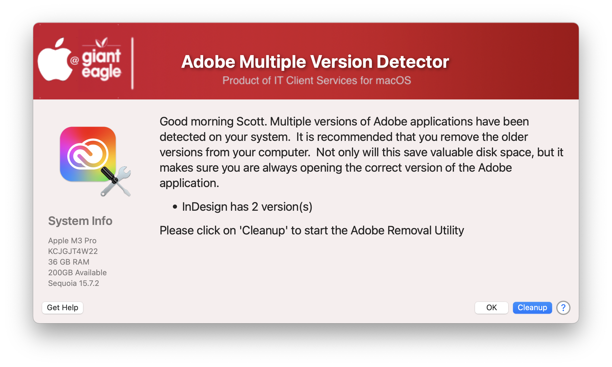

## Adobe Multiple Version Detector

Managing Adobe apps on the mac can be very frustrating.  You might find multiple versions of Adobe apps on a user's mac, taking up valuable disk space.  This script will scan the user's system for multiple versions of all Adobe apps and then present the user with a nice GUI display with multiple options.  

The is designed to work in tandem with a removal script that a user can call via the 'Cleanup' button and start the remove/cleanup process.  My script for that can be found [here](https://github.com/ScottEKendall/JAMF-Pro-Scripts/tree/main/RemoveAdobeApps)

##### _v1.0 - Initial Commit_

