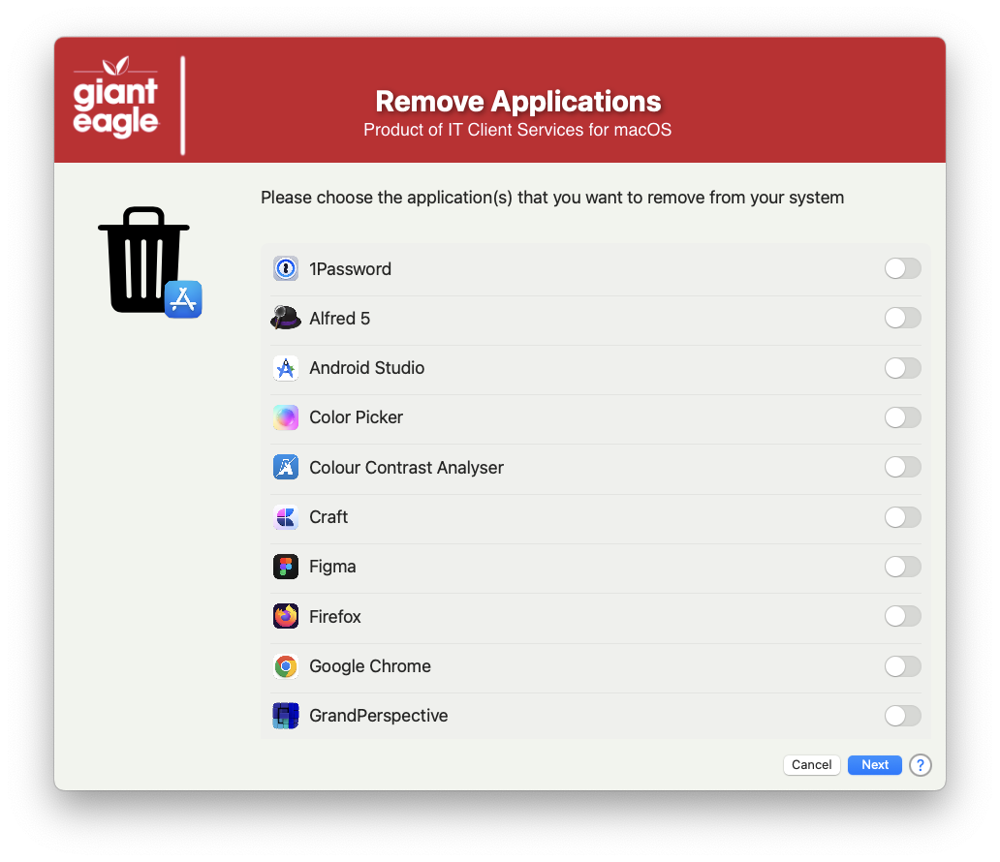

## App Delete

This script is designed to allow non-admin users the ability to remove applications from the /Applications folder.  You can control what applications they are not allowed to remove by putting items into the _MANAGED_APPS_ array.  It automaticaly excludes the preinstalled items that come with the OS.

Picture of what the end users see when they run it:

The script will have them confirm their choices before the actual deletion occurs

##### _v1.0 - Initial Commit_

##### _v1.1 - Major code cleanup & documentation / Structred code to be more inline / consistent across all apps_
