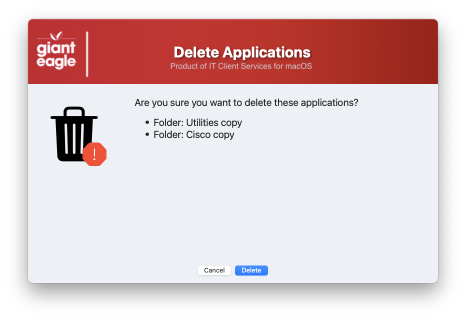
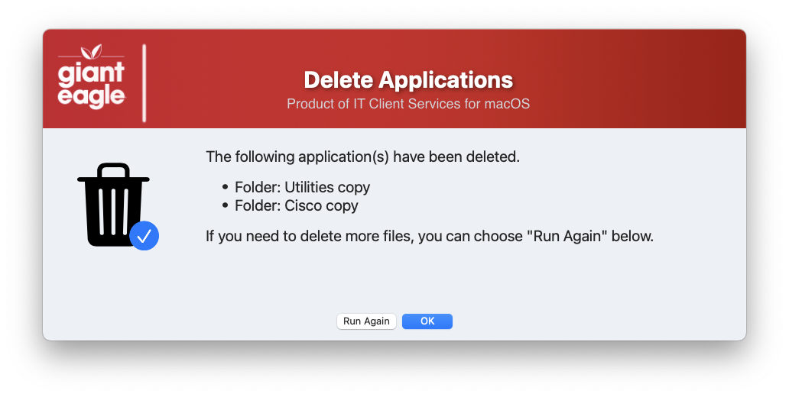

## App Delete

This script is designed to allow non-admin users the ability to remove applications and folders from the /Applications folder. 

You can control what applications they are not allowed to remove by putting items into the ```MANAGED_APPS``` array.  

You can also include folders that are allowed to be deleted, by putting them into the ```ALLOWED_FOLDERS``` array.

It automatically excludes the preinstalled items that come with the OS _[SIP Protected]_.

### Screenshots ###
Picture of what the end users see when they run it:


The script will have them confirm their choices before the actual deletion occurs



and give them an option to do it again (and again)




#### 1.0 - Initial Release
#### 1.1 - Major code cleanup & documentation
####		Structured code to be more inline / consistent across all apps
#### 1.2 - Remove the MAC_HADWARE_CLASS item as it was misspelled and not used anymore...
#### 2.0 - Bumped Swift Dialog min version to 2.5.0
####		NEW: Added option to allow folders to be deleted (ALLOWED_FOLDERS)
####		Put shadows in the banner text
#### 		Reordered sections to better show what can be modified
#### 2.1 - Added option to sort array (case insensitive) after the application scan & folders added 
#### 2.2 - Code cleanup
####       Added feature to read in defaults file
####       removed unnecessary variables.
####       Fixed typos
