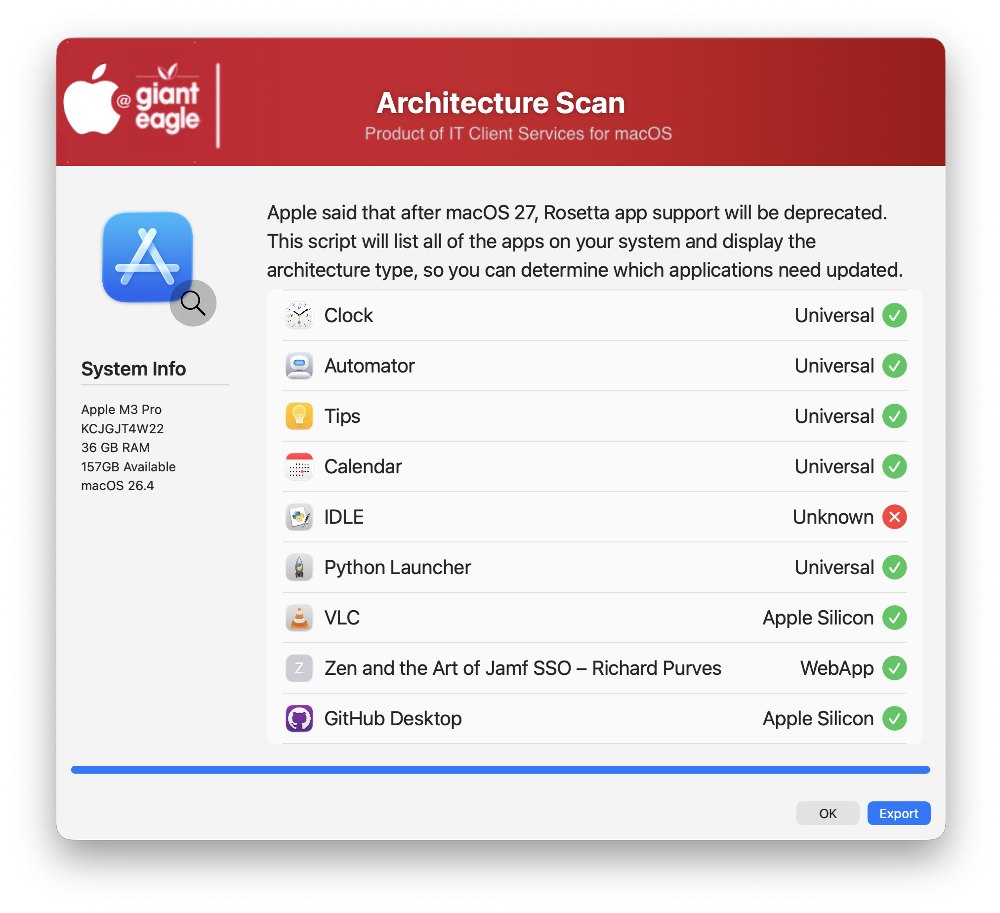

## Architecture Scan

Apple said that after macOS  26 (Tahoe), Rosetta apps will no longer be supported. This script will list all of the apps on your system and display the architecture type, so you can determine which applications need updated.



If you choose to export the list, it will be stored in the User's Desktop Folder

You can customize which folders to scan and also to display .app extension in the list

| **Version**|**Notes**|
|:--------:|-----|
| 1.0 |  Initial Release |
| 1.1 | Changed the -trigger keyword to -event for JAMF policy commands
| 1.2 | Added check for the ```lipo``` command (part of Xcode Developer)
| 1.3 | Put in fallback option of using the 'file' command if 'lipo' is not found.  Thanks @Abhik Saha
||       Added fallback option to use plistbuddy if the "defaults read" command doesn't return location
||       check for "shell script" and mark it as successful
||       Add option to not display .APP in the file list