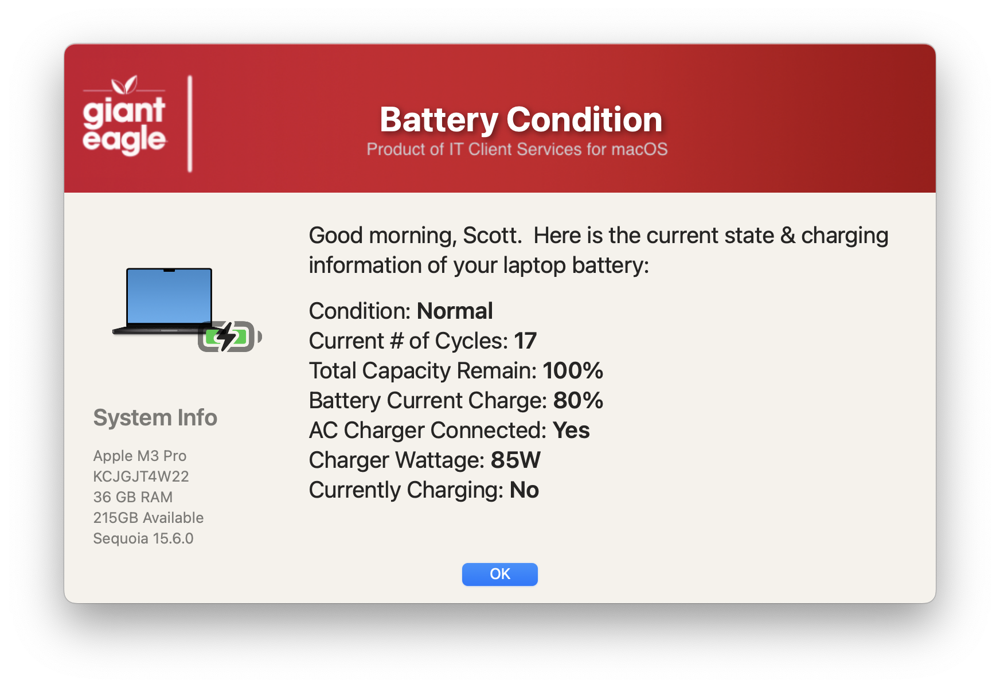

## Battery Info

This dialog can display either the current battery status or the critial warning depending on the results of the battery inspection

_If the battery condition is normal_

_and if the battery is bad (critical)_

#### 1.0 - Initial
#### 1.1 - Code cleanup to be more consistent with all apps
#### 1.2 - fix the SD_ICON reference in the display prompt
#### 1.3 - Remove the MAC_HADWARE_CLASS item as it was misspelled and not used anymore...
#### 1.4 - Changed the icon(s) and wording / Add Help Desk button if battery critical
#### 1.5 - Swift dialog min requirements now 2.5.0 / Changed wording on critical message / New icons / Added display item for currently charging.
#### 1.6 - Code cleanup
####       Added feature to read in defaults file
####       removed unnecessary variables.
####       Bumped min version of SD to 2.5.0
####       Fixed typos
