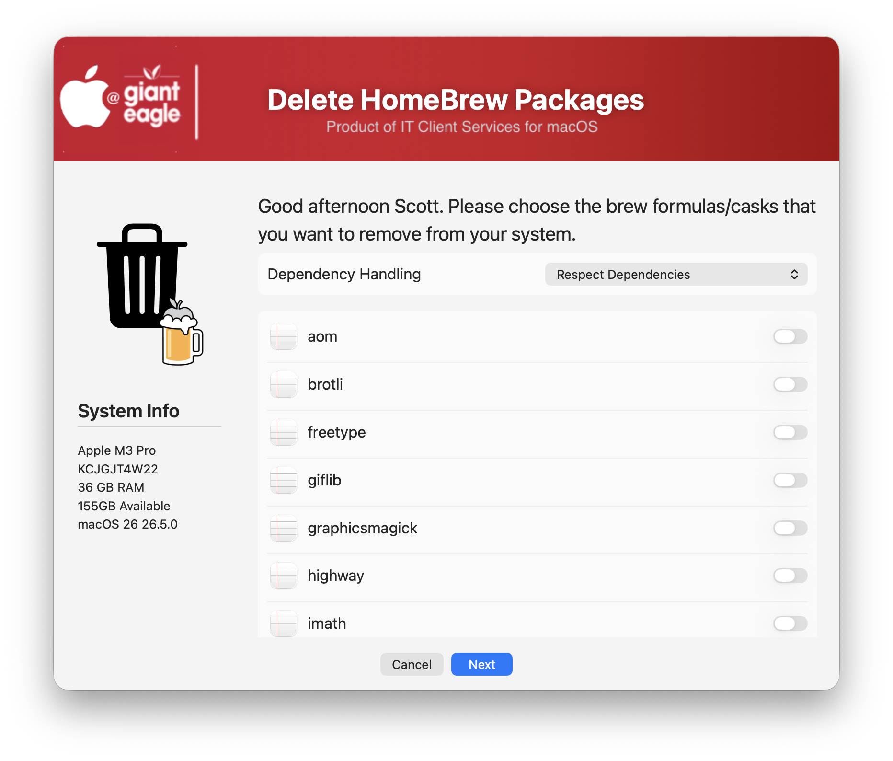
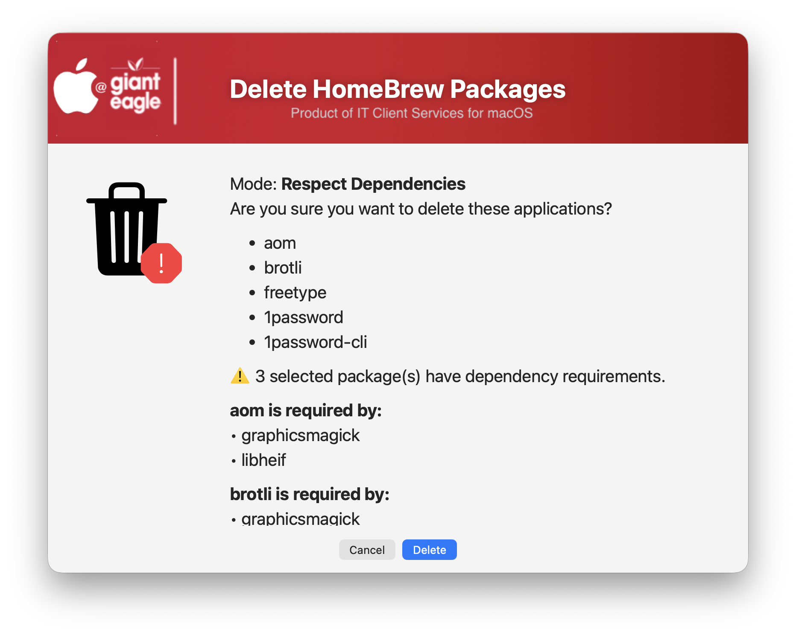
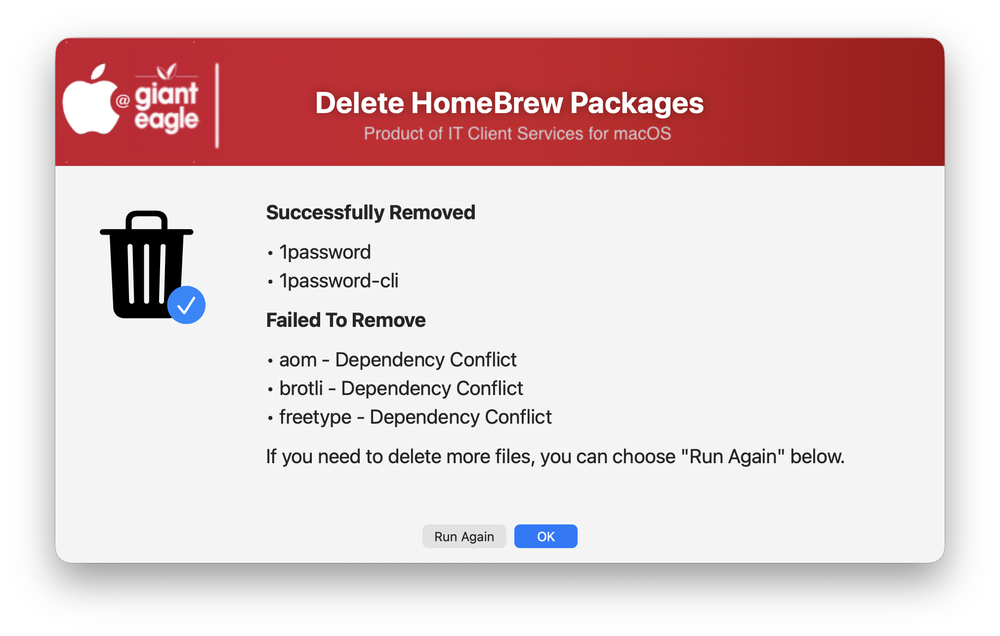

## Brew Package Removal ##

I designed a graphical method to remove Homebrew packages (Casks/Formulas) so you don't have to do this from the command line.  This script can can be used in JAMF Self service so users can delete their own packages. Even thought it needs to be run from a 'sudo' account, it will perform tasks based on the currently logged in user. 

This script will allow you to ignore dependencies (force removal) & show you a list of dependencies before deletion.

Choices option...shows all casks & formulas and option to ignore/respect dependencies

Confirm before removal (with dependicy alert)

Confirmation of delete (or failed) files

| **Version**|**Notes**|
|:--------:|-----|
| 1.0 |  Initial Release |

