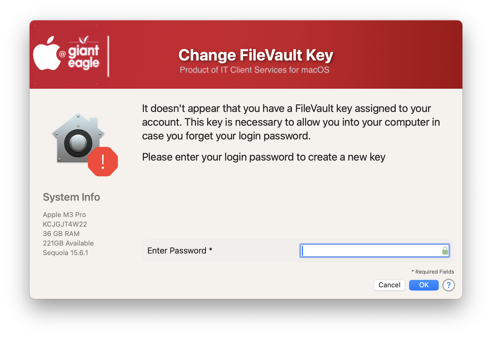
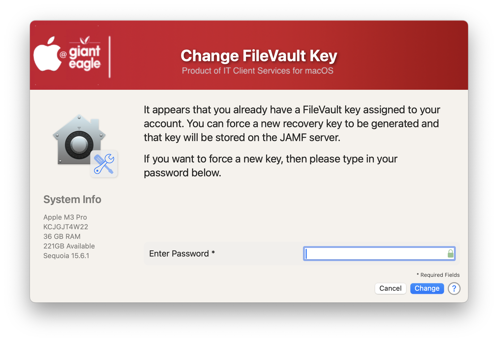
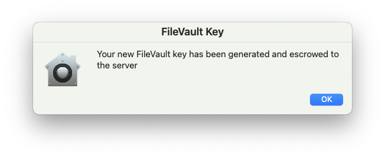

## Create / Change FileVault Recovery Key

 If your MDM server shows that a user doesn't have a key assigned, you can have the user run this script and it will create (or change) the key and escrow it to the server.

Message if a user doesn't have a FV Key

Message if a key exists, with the option to change it

Successful completion

#### 1.0 - Initial
#### 1.1 - Code cleanup
####       Added feature to read in defaults file
####       removed unnecessary variables.
####       Bumped min version of SD to 2.5.0
####       Fixed typos
