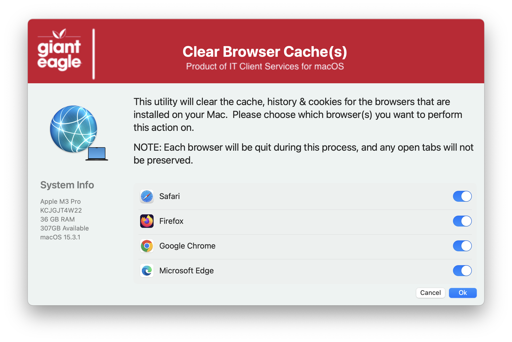

## Clear Browser Cache

This one grew out of necessity at my old job.  The higher level VPs didn't want to go into each browser settings and clear their cache/cookies/history when asked to do so, so I tried to create a "one stop shop" to work on all installed browsers with a single click.  The goal was to keep their bookmarks, extensions & tabs intact...and it works "for the most part".

##### _1.0 - Initial Commit_
##### _1.1 - Remove the MAC_HADWARE_CLASS item as it was misspelled and not used anymore._
##### _1.2 - Code cleanup / Added feature to read in defaults file / removed unnecessary variables._
##### _1.2 - Code cleanup_
#####       _Added feature to read in defaults file_
#####       _removed unnecessary variables._
#####       _Fixed typos_

