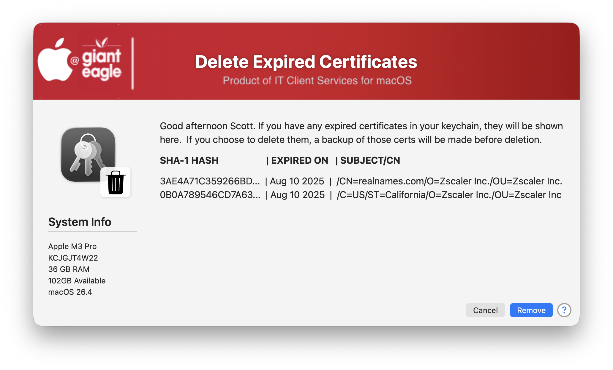

## Delete Expired Certificates

 it is generally recommended to remove expired certificates from your macOS keychain to prevent authentication errors, clear up clutter, and avoid security risks. While expired certificates are technically "safe" because they are no longer usable, leaving them could cause various system issues.

 This script can be run in either a Verbose mode (default) or Silent mode.  You can use the Silent mode in your MDM environment to remove a user's expired certificates during their MDM check-in period.

 You can also control which certificates types will be excluded from the removal process.  You can exclude:

 * Apple
 * Root CA
 * Self-Signed
 * Intermediate

 Verbose mode will present the user with the following screen...

| **Version**|**Notes**|
|:--------:|-----|
| 0.1 | Initial Release |

