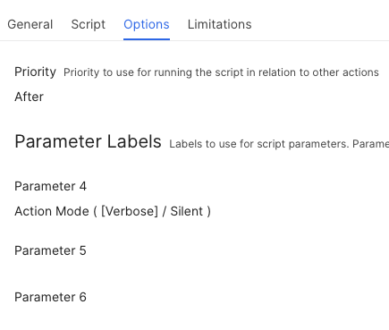

## Delete Expired Certificates

 it is generally recommended to remove expired certificates from your macOS keychain to prevent authentication errors, clear up clutter, and avoid security risks. While expired certificates are technically "safe" because they are no longer usable, leaving them could cause various system issues.

>**Why You Should Remove Them**
>
>**Prevent Connection Failures:** Systems like Kerberos or Wi-Fi login services may mistakenly try to use an expired certificate as an identity, leading to login failures.
>
>**Avoid Security Alarms:** Unnecessary expired certificates can trigger false security alarms in management environments.
>
>**Reduce Clutter:** Periodic cleanup of "Keychain Access" ensures that reputable software only attempts to authenticate using valid, current certificates.
>
>**Compliance & Trust:** In enterprise or developer settings, removing expired certificates is a best practice to maintain security standards and avoid accidental deployment of invalid credentials.

 This script can be run in either a Verbose mode (default) or Silent mode.  You can use the Silent mode in your MDM environment to remove a user's expired certificates during their MDM check-in period.

 You can also control which certificates types will be excluded from the removal process.  You can exclude:

 * Apple
 * Root CA
 * Self-Signed
 * Intermediate

 Verbose mode will present the user with the following screen...


## Silent / Verbose Mode ##

By default, the script will run in VERBOSE mode, but if you want to run it in SILENT mode, that is Script Param #4




## Certificate Exclussion ##

You can optionally choose which certificates are NOT allowed to be deleted, by adjusting this line:

```Line #85 - EXCLUDE_PATTERNS=("Apple" "Root CA" "Self-Signed" "Intermediate")```

Edit the pattern to EXCLUDE what you do not want the script to remove


| **Version**|**Notes**|
|:--------:|-----|
| 1.0 | Initial Release |
| 1.1 | Added support to delete expired certificates in system keychain as well as user keychain
||       More logging
| 1.3 | Changed JAMF 'policy -trigger' to JAMF 'policy -event'
