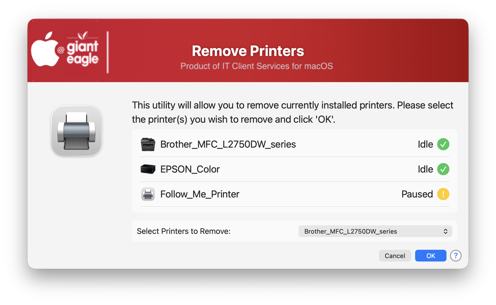
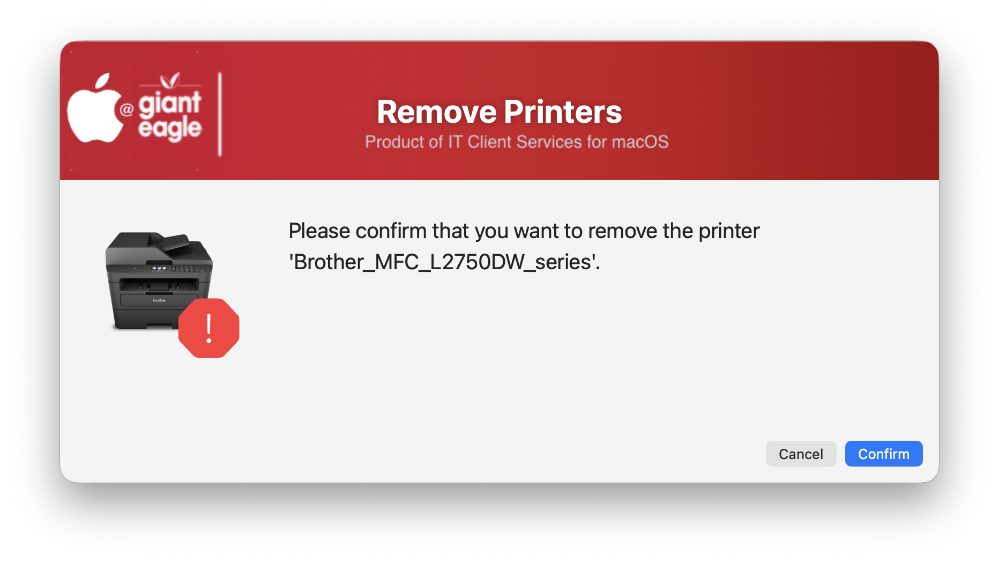

## Delete Printers

We have removed admin rights from users, but if they want to delete an individual printer, they will still need elevated rights to do that, so I wrote this handy utility that can be run from JAMF Self Service (or any MDM) from a controlled environment, so that the users don't need elevated rights.

Welcome Screen

Confirmation Screen

## History ##

| **Version**|**Notes**|
|:--------:|-----|
| 1.0 |  Initial Release |

