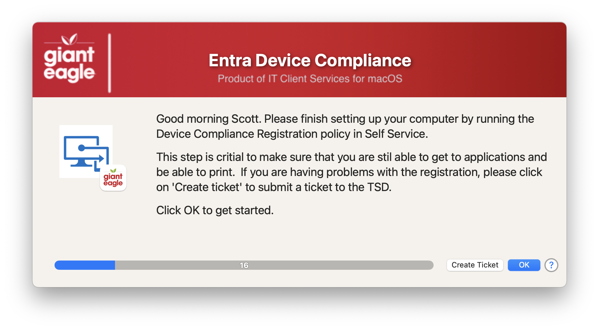

## Device Compliance

We use Azure/Entra at our facility.  This dialog will be displayed if the user's doeesn't have the WorkplaceJoin (WPJ) Key in their Keychain

To scope this in JAMF, we used the following SmartGroup, it runs on a daily basis for us, but you can set it to run however you see fit.

#### 1.0 - Initial rewrite using Swift Dialog prompts
#### 1.1 - Merge updated global library functions into app
#### 1.2 - Remove the MAC_HADWARE_CLASS item as it was misspelled and not used anymore...
#### 1.3 - Refresh library calls / Add shadow on banner title / Increased timer / Adjusted window height
#### 1.4 - Code cleanup
####       Added feature to read in defaults file
####       removed unnecessary variables.
####       Fixed typos
