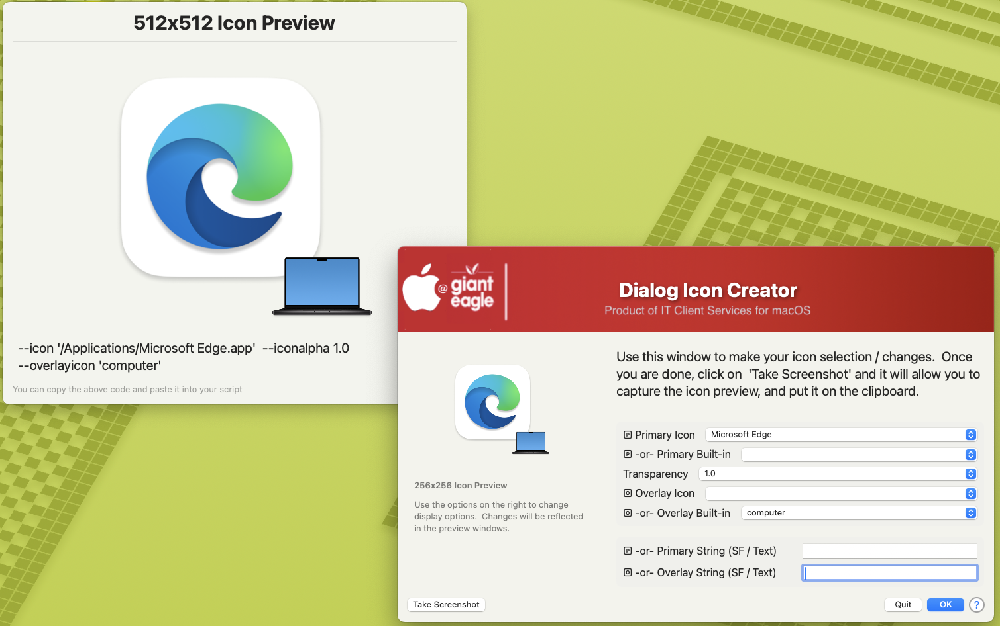

## Dialog Icon Creator

I enjoy making custom icons for JAMF Self Service, and I also love the flexibility of SwiftDialog's icon possibilities, so I decided to write a very simple (ie, not very powerful) app to assist in making custom icons from inside of Swift Dialog. 

This script gives you the flexibility of choosing apps, built-in icons, transparencies, custom icons with the SF & text feature, and shows you preview windows of you what your creation will look like as well as the strings necessary to implement the icons inside of your own scripts.

Have fun making your own creations!

### Examples ###

##### _v1.0 - Initial Commit_
##### _1.1 - Added option for custom app & icns file locations to be scanned in_
##### _1.2 - Added option to read in variables from defaults file_
##### _Fixed typos_
