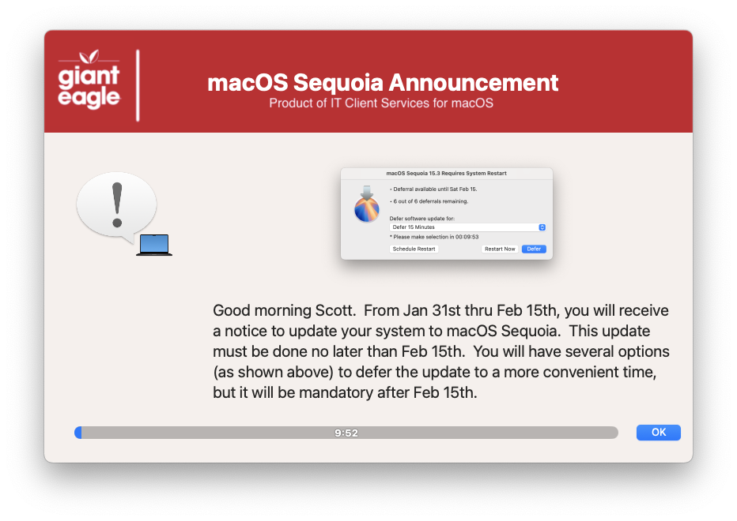
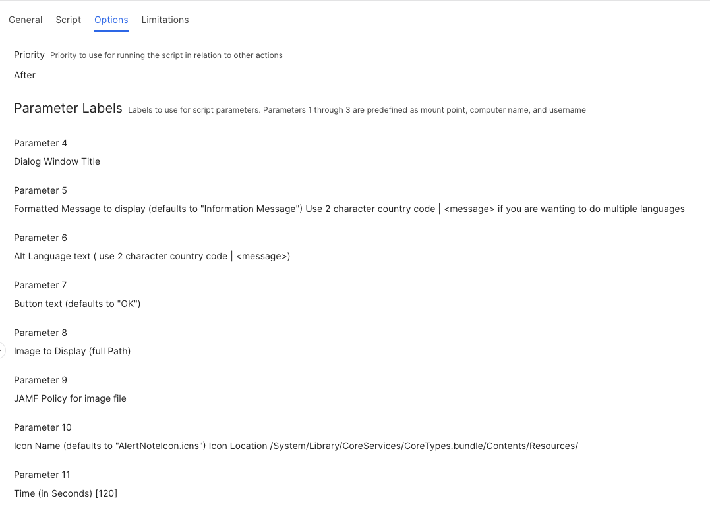

## Dialog Message

I created a "generic" dialog message that can be used to send out message to JAMF users.  Great for announcing items like upcoming OS releases... The timer was put it to make sure that the dialog gets dismissed and doesn't hang up any policies from being run.  




The parameters page of the system script allows for a wide variety of customization




Language Support

This script will now support a 2nd display language.  If you are going to use a dual language notification, then you will need to do the following:

Parameter 5 message should be formatted as such "[2 Character country code] | (message)"<br>
Parameter 6 will be your alternate language with the same format

for example:

```EN | Apple has released macOS Sequoia for installation at this time.  Your system will prompt you to upgrade to Sequoia after it has downloaded the installer to your Mac.```

```DE | Apple hat macOS Sequoia zur Installation freigegeben. Nach dem Herunterladen des Installationsprogramms auf Ihren Mac werden Sie aufgefordert, auf Sequoia zu aktualisieren.```

The script will determine the country code of the local Mac and display the appropriate message...if it cannot find the appropriate langauge text to display, it will default to EN, but that can be changed with the variable ```SD_DEFAULT_LANGUAGE```

| **Version**|**Notes**|
|:--------:|-----|
| 1.0 | Initial script
| 1.1 | Code cleanup to be more consistent with all apps
| 1.2 | the JAMF_LOGGED_IN_USER will default to LOGGED_IN_USER if there is no name present
|      | Added -ignorednd to make sure that the message is displayed regardless of focus setting
|      | Will display the inbox items if you can the function first
|      | Minimum version of SwiftDialog is now 2.5.0
| 1.3 | Changed variable declarations around for better readability
| 1.4 | Code cleanup
|     | Added feature to read in defaults file
|     | removed unnecessary variables.
|     | Fixed typos
| 1.5 | Fixed typos
|     | Optimized "Common" section for better performance
|     | Fixed Swift Dialog not reporting properly

