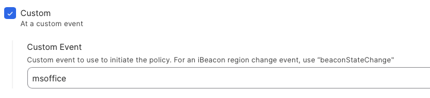
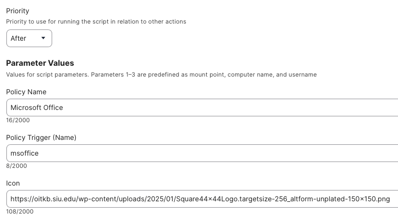
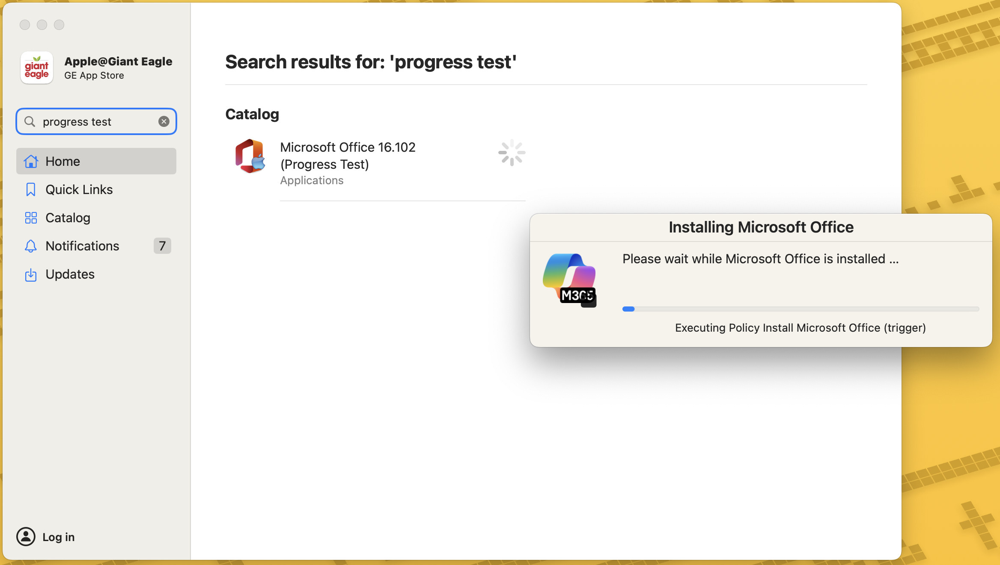

## Dialog Progress ##

This script comes in handy to show a progress window when you have a lengthy download (ie. MS office, xcode, Adobe apps, etc).  You will need to create two policies to allow this dialog window to work

1.  Create a policy that will do the actual install of the application and make sure to assign it a trigger name:

2.  Create another policy that runs the Dialog Progress indicator and when configuring this policy, you will tell it when policy trigger to run

3.  Customize the progress display window with a title & icon.
4.  In your Self service policy, call the policy that you created in Step #2

## Results ##

##### _v1.0 - Initial Commit_

