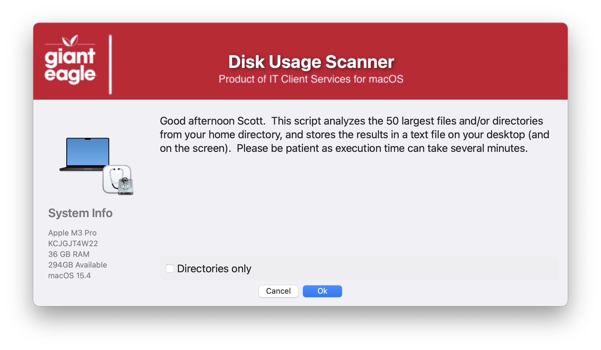

## Disk Usage Scanner

Quick script to display the largest files & folders in the User's home folder.  The starting location & scanning depth are set by script variables (or can be imported via script parameters).  Optionally, if you have Grand Perspective installed, it will notify the user and give them the option to launch that app.

##### _v1.0 - Initial Commit_
##### _v1.1 - Major code cleanup & documentation / Structred code to be more inline / consistent across all apps_
##### _v1.2 - Fix issued with Grand Perpective option not showning correctly_
##### _v1.3 - Remove the MAC_HADWARE_CLASS item as it was misspelled and not used anymore..._
##### _v1.4 - Code cleanup_
##### _Add verbiage in the window if Grand Perspective is installed._
#####       _Added feature to read in defaults file_
#####       _removed unnecessary variables._
#####       _Fixed typos_

