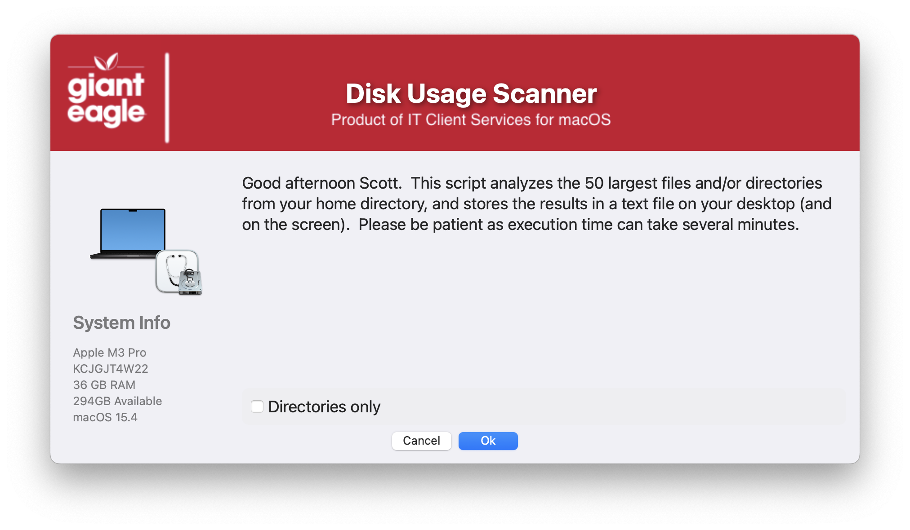

## Disk Usage Scanner

Quick script to display the largest files & folders in the User's home folder.  The starting location & scanning depth are set by script variables (or can be imported via script parameters).  Optionally, if you have Grand Perspective installed, it will notify the user and give them the option to launch that app.

| **Version**|**Notes**|
|:--------:|-----|
| 1.0 | Initial
| 1.1 | Major code cleanup & documentation / Structred code to be more inline / consistent across all apps
| 1.2 | Fix issued with Grand Perpective option not showning correctly
| 1.3 | Remove the MAC_HADWARE_CLASS item as it was misspelled and not used anymore...
| 1.4 | Code cleanup
|| Add verbiage in the window if Grand Perspective is installed.
|| Added feature to read in defaults file
|| removed unnecessary variables.
|| Fixed typos
| 1.5 | Changed JAMF 'policy -trigger' to 'JAMF policy -event'
||       Optimized "Common" section for better performance
||       Fixed variable names in the defaults file section

