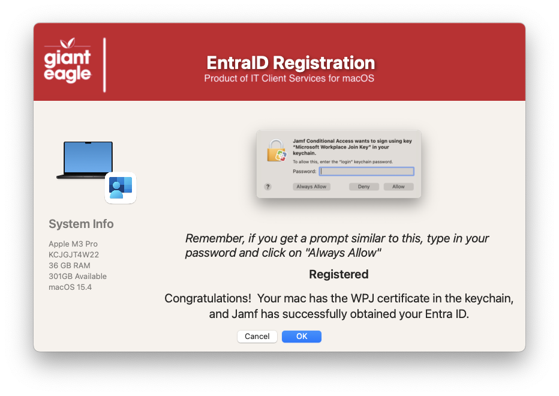
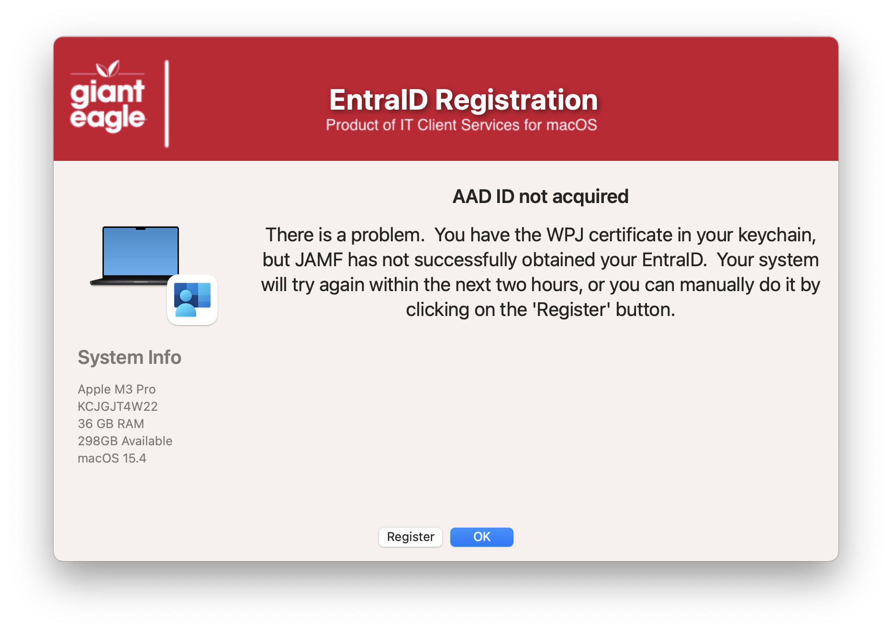
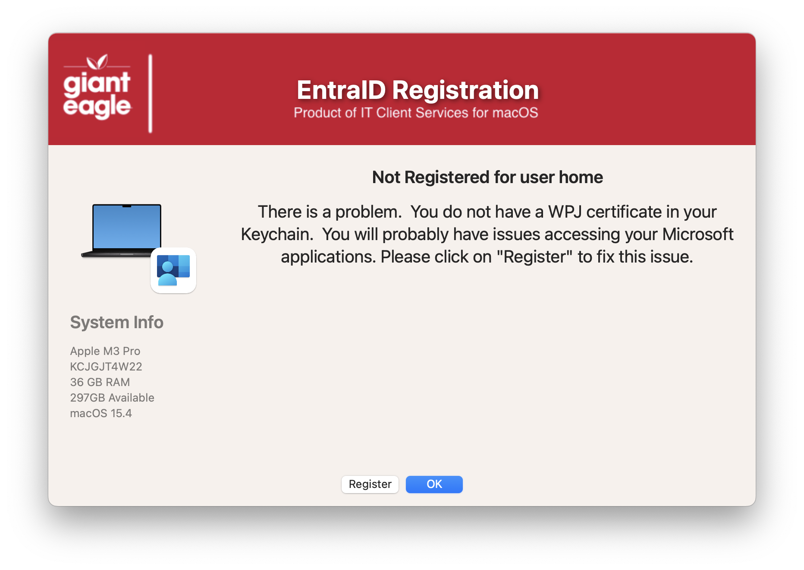

## EntraID Registration

We are using Azure/EntraID & JAMF exclusively in our environment, so this script is designed to show the end user the status of their EntraID Registration on their Mac

The user will get the following screens depending on their registration status

If successful

User registered (WPJ Key in Keychains), but no AAD Plist found

User Registered (WPJ Key in Keychains), but AAD ID Not Acquired

User not registered at all

| **Version**|**Notes**|
|:--------:|-----|
| 1.0 | Initial
| 1.1 | Code cleanup to be more consistent with all apps
| 1.2 | Fixed issue of Register button not running the JAMF policy
| 1.3 | Removed debug code and fix incorrect message on failure dialog
| 1.4 | Remove the MAC_HADWARE_CLASS item as it was misspelled and not used anymore...
| 1.5 | Code cleanup
|     | Added feature to read in defaults file
|     | removed unnecessary variables.
|     | Bumped min version of SD to 2.5.0
|     | Fixed typos
| 1.6 | Optimized Common section
|     | Added options to check for logged in user and system awake
