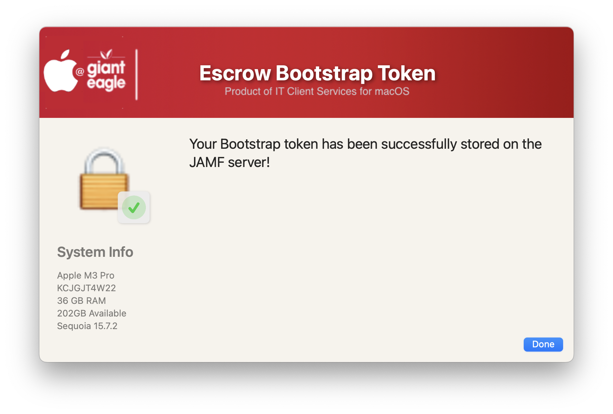
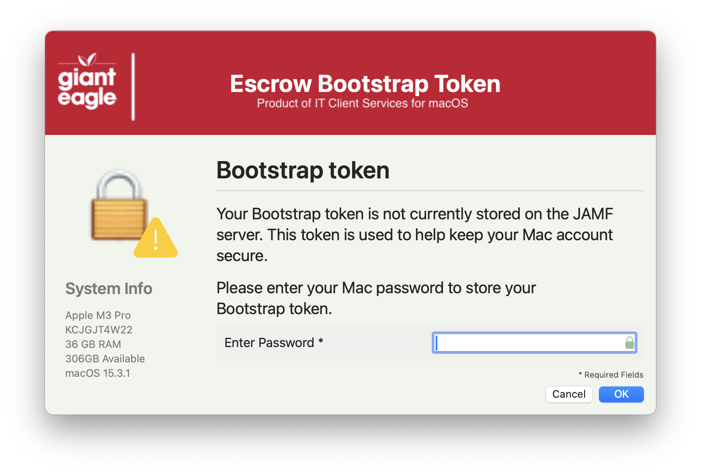
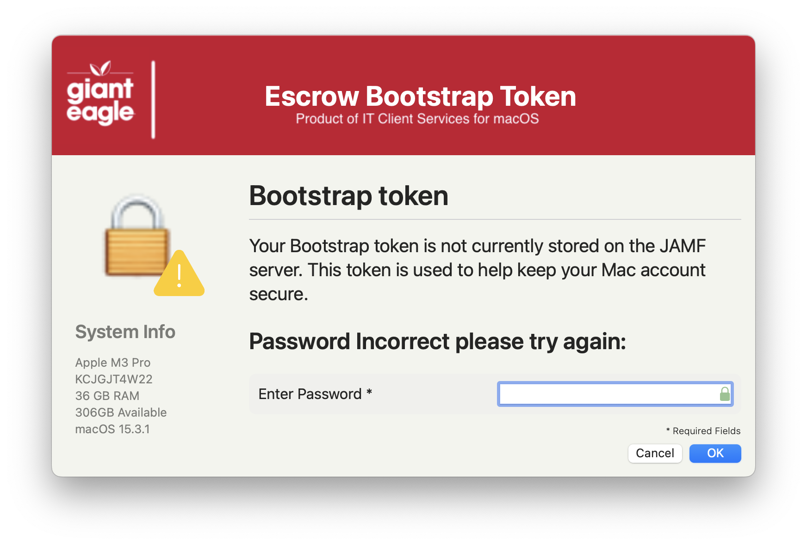
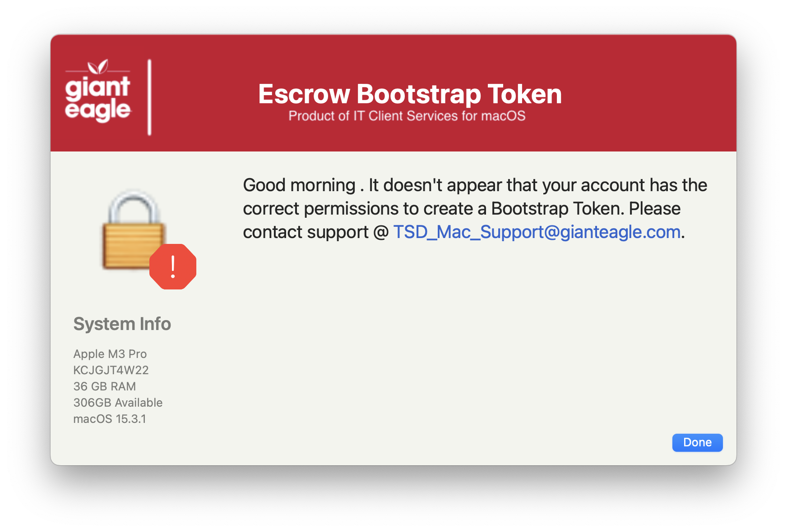

## Escrow BootStrap Token

Bootstrap token is an MDM-only feature that helps with granting secure token and, on modern Macs with Apple silicon, something called volume ownership. 

The first secure token is granted to the account that logs into a Mac first at the login window (regardless of type, except for true network accounts) or is created in Setup Assistant, or to the first user to have the password set programmatically in plain-text using a tool like dscl or sysadminctl. If that first user is an admin, they can then grant secure token to other users.

When the first secure token is granted on a computer, and if your MDM system supports it (as JAMF does), macOS sends a message to the MDM server asking it to store a bootstrap token. You can think of bootstrap token as a special password for a special user that has secure token.

Once the bootstrap token is in place, macOS has access to a credential that can be used to authorize most actions on the system requiring a secure token, including granting one to other users. And it all happens behind the scenes: macOS silently asks MDM for it whenever it’s needed. This is far more seamless than needing your (or another user’s) password to be entered manually.

This script will determine the status of the user's BootStrap Token and try to set the token if possible.

Welcome Screen (If user has a valid token already)

Process if the user needs a token

Password Entry

Problems updating the token (with error message)

[JAMF Documentation on BootStrap Tokens](https://learn.jamf.com/en-US/bundle/technical-articles/page/Manually_Leveraging_Apples_Bootstrap_Token_Functionality.html)

##### _v1.0 - Initial Commit_
##### _v1.1 - Major code cleanup & documentation / Structured code to be more inline / consistent across all apps_
##### _v1.2 - Remove the MAC_HADWARE_CLASS item as it was misspelled and not used anymore..._
##### _v1.3 - Code cleanup / Add verbiage in the window if Grand Perspective is installed. / Added feature to read in defaults file / removed unnecessary variables. / Fixed typos_
