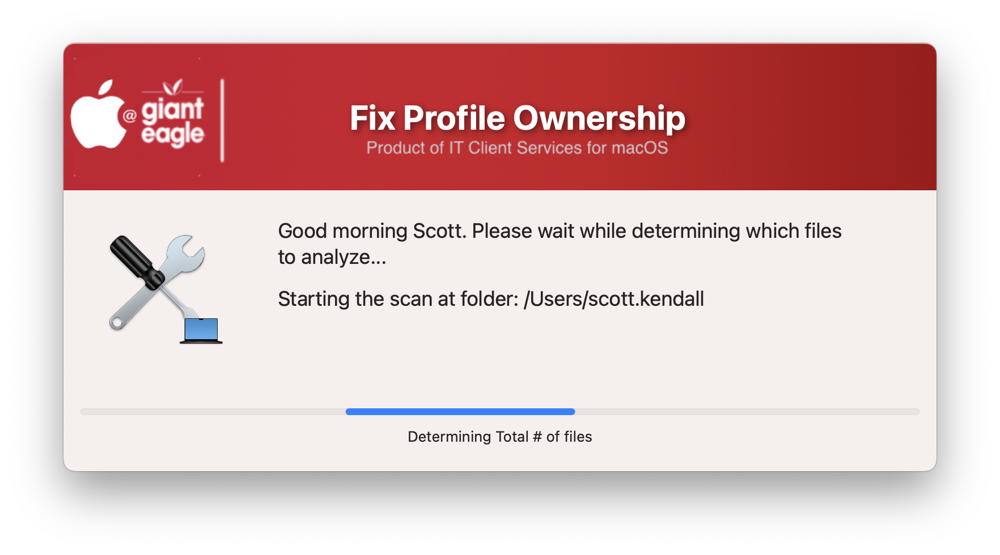
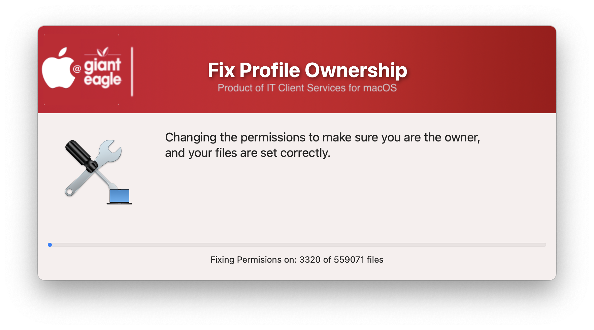

## Fix Profile Ownership

If users find issues saving / deleting files in their own home directory, this script will set them as the owner of the files inside their home directory.  You can the starting folder location with the variable `USER_SCAN_START_DIR`

Initial Scan

Progress during repair

#### 1.0 - Initial rewrite using Swift Dialog prompts
#### 1.1 - Code cleanup to be more consistent with all apps
#### 1.2 - Changed logic in get_total_app_count function to use find | wc (much faster)
#### 1.3 - Remove the MAC_HADWARE_CLASS item as it was misspelled and not used anymore...
#### 1.4 - Code cleanup
####       Added feature to read in defaults file
####       removed unnecessary variables.
####       Bumped min version of SD to 2.5.0
####       Fixed typos
