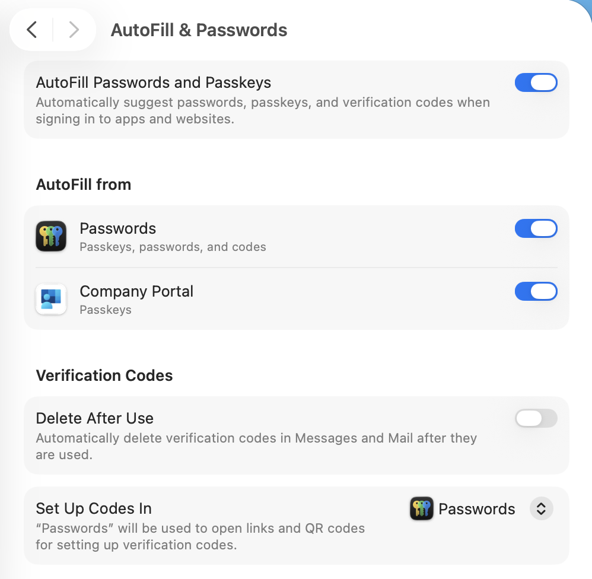

## Force Platform SSO Prompt

This script is designed to force the prompt for Platform SSO on the users desktop. It does this by: 

* Determining if the Platform SSO profile is installed on their Mac
* Removing the user out of the MDM profile group for the Platform SSO (if necessary)
* Re-adding the user to the same Platform SSO group again
  
 The script is focus mode aware and can display the apropriate message accordingly.

_This is designed to use JAMF static groups for Configuration Profile deployment_

It should force the pSSO register prompt to reappear.  Once the prompt reappears, it will display a nicely formatted Swift Dialog prompt informing the user what to do.

Script was inspired by the work done by Howie Canterbury.

If the user has focus mode turned on, they will get a slightly different message

During the registration of pSSO into Entra, the user will be asked to verify that the Company Portal extension is enabled in the Autofill & Password section of System Settings - This script will auto-enable that feature in case the user doesn't.

## Setup / Configuration ##

If you are using the Modern JAMF API credentials, you need to set:

    Update Static Computer Groups
    Read Computers
    Read Static Groups

To configure this script, you will need the following:

1.  Your JAMF credentials (Classic or Modern API)
2.  The Config Profile (name) of your Platform SSO extension.  I scope this to users that are part of a static group
3.  The Static Group (name) that you add users to, which installs the pSSO Config Profile
4.  Optional -  Attempt to fix the JAMF registration if `jamfAAD gatherAADInfo` command shows that the device is not registered.
5.  Optional - You can force the TouchID registration on system that have it available.
   

Once you configure these variables inside of your policy, you can scope this policy to your users.

## Release Notes ##

| **Version**|**Notes**|
|:--------:|-----|
| 1.0 | Initial
| 1.1 | Made MDM profile and JAMF group name passed in variables vs hard coded
||      Make sure that all exit processes go thru the cleanup_and_exit function
||      Made the psso command run as current user (Thanks Adam N)
||      Perform a gatherAADInfo command after successful registration
| 1.2 | Put in the --silent flag for the curl commands to not clutter the log
||      changed logic in the detection of SS+...it was not returning expected value
||      Change the gatherAADInfo to RunAsUser vs root
| 1.3 | removed the app-sso -l command...wasn't really needed 
| 1.4 | Added feature to check for focus status and change the alert message accordingly
| 1.5 | Used modern JAMF API wherever possible
||      More logging of events
||      More error trapping of failures
||      Reworked Common section to be more inline with the rest of my apps
||      Fixed Typos
| 1.6 | Added option to check for valid "jamfAAD gatherAADInfo" and attempt to fix if not registered properly
||       Also added parameter to force gatherAADInfo to run if failure detected
||       Fixed issue of runAsUsers not using correct USER_UID variable
| 1.7 | Added option to force a touchID fingerprint if not already set
||       More reporting for focus status & touchID status
| 1.8 | Add section to enable the microsoft Autofill extension automatically
