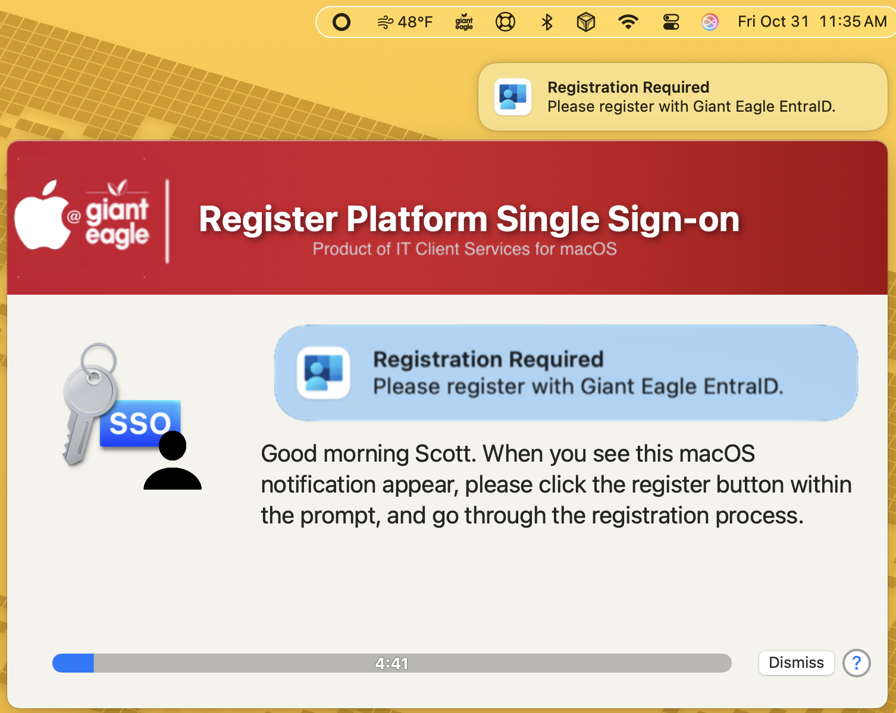
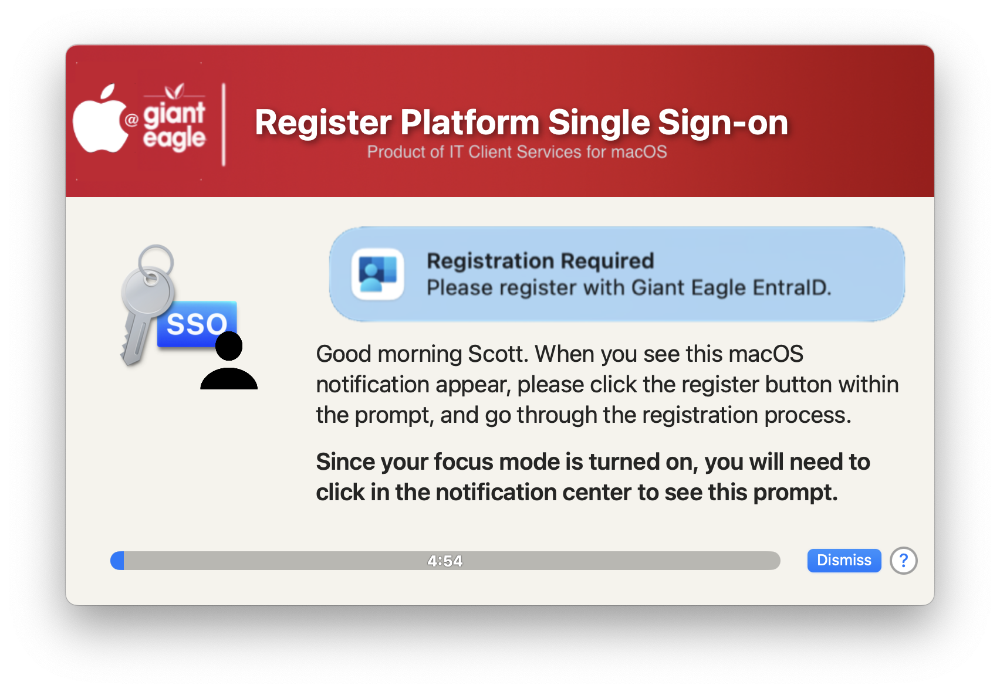

## Force Platform SSO Prompt

This script is designed to force the prompt for Platform SSO on the users desktop. It does this by: 

* Determining if the Platform SSO profile is installed on their Mac
* Removing the user out of the MDM profile group for the Platform SSO (if necessary)
* Re-adding the user to the same Platform SSO group again
  
 The script is focus mode aware and can display the apropriate message accordingly.

_This is designed to use JAMF static groups for Configuration Profile deployment_

It should force the pSSO register prompt to reappear.  Once the prompt reappears, it will display a nicely formatted Swift Dialog prompt informing the user what to do.

Script was inspired by the work done by Howie Canterbury.

If the user has focus mode turned on, they will get a slightly different message

##### _v1.0 - Initial Commit_
##### _1.1 - Made MDM profile and JAMF group mame passed in variables vs hard coded_
* _Make sure that all exit processes go thru the cleanup_and_exit function_
* _Made the psso command run as current user (Thanks Adam N)_
* _Perform a gatherAADInfo command after successful registration_
#### _1.2 - Put in the --silent flag for the curl commands to not clutter the log_
* _Changed logic in the detection of SS+...it was not returning expected value_
* _Change the gatherAADInfo to RunAsUser vs root_
#### _1.3 - removed the app-sso -l command.not sure if it is needed or not_
#### _1.4 - Added feature to check for focus status and change the alert message accordingly_
