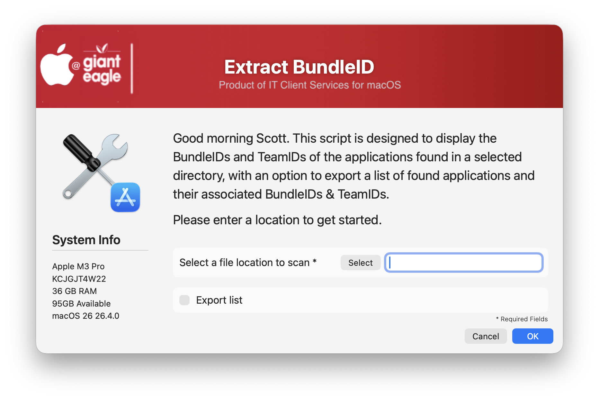
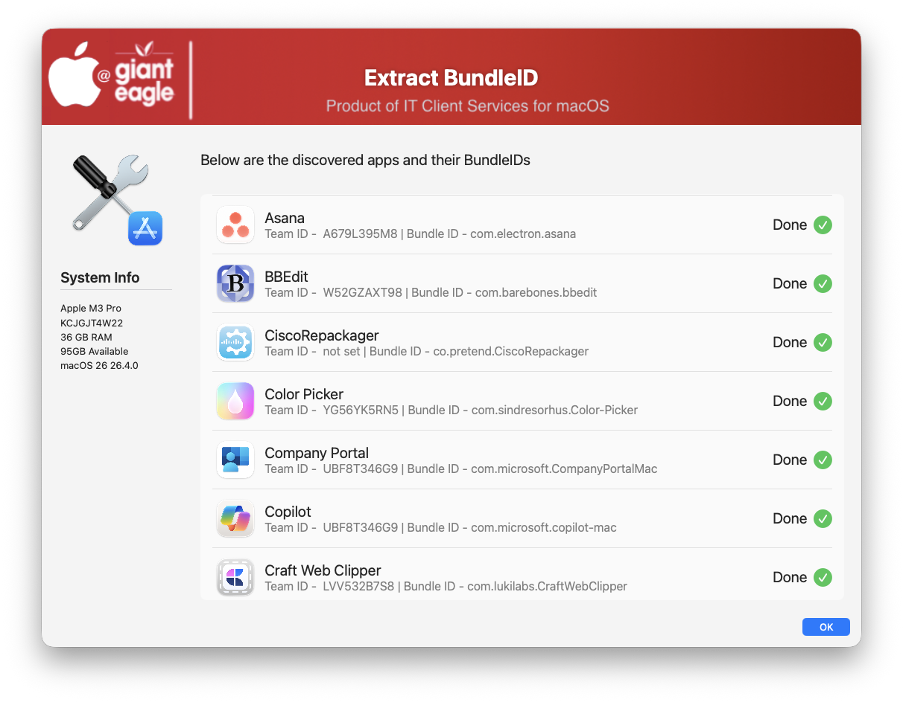

## GetBundleIDs  

Handy little utility to retreive all of the bundleIDs & TeamIDs from a given directory.  If you need to only do one app, I have also included an Automator droplet to extract the BundleID from a single app.  I like to use this app when I am setting up manaaged login items in JAMF.  It needs both the BundleID and the TeamID.

Welcome Screen

Results screen

\| **Version**|**Notes**|
|:--------:|-----|
| 1.0 | Initial
| 1.1 | Code cleanup
||      Added feature to read in defaults file
||      removed unnecessary variables.
||       Fixed typos
| 1.2 | Fixed window layout for Tahoe & SD v3.0
| 1.3 | Changed JAMF 'policy -trigger' to 'JAMF policy -event'
||       Optimized "Common" section for better performance
||       Fixed variable names in the defaults file section
| 2.0 | Now includes TeamID in the listing as well
|| Changed the order of the items in the welcome screen
| 2.1 | Updated SD Version requirements to 3.1.0
||       Added ability to set subtitle, color, and padding from defaults file

