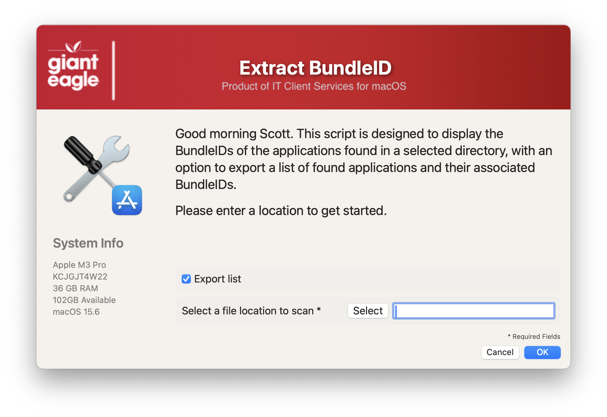
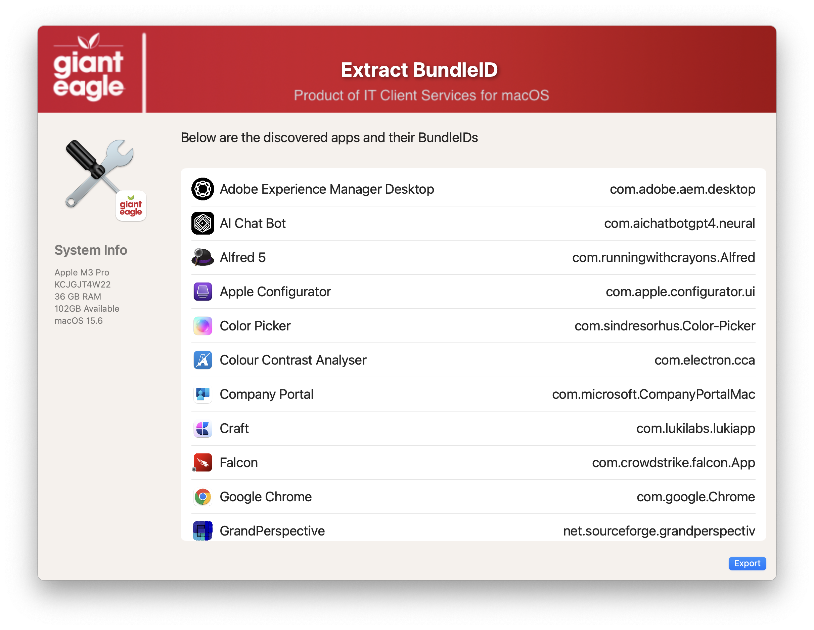

## GetBundleIDs  

Handy little utility to retreive all of the bundleIDs from a given directory.  If you need to only do one app, I have also included an Automator droplet to extract the BundleID from a single app.

Welcome Screen

Results screen

#### 1.0 - Initial
#### 1.1 - Code cleanup
####       Added feature to read in defaults file
####       removed unnecessary variables.
####       Fixed typos
