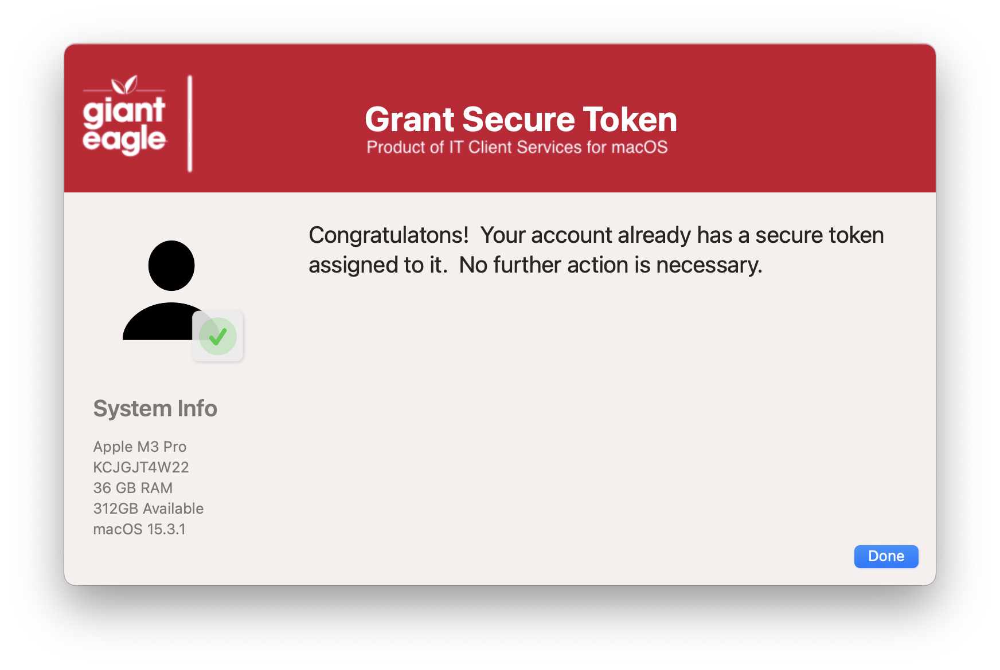

## Grant Secure Token

This script will determine the status of the user's SecureToken.  If there is a user on the system that can grant a secure token, then the logged in user will be able to use that information to assign themselves a secure token.

Secure Tokens on macOS are used to allow users to:

* Perform Software Updates
* Approve Kernel Extensions
* Approve System Extensions
* Enable FileVault

Welcome Screen (If user has a valid token already)

Process if the user needs a token and there is an account on the system that can grant a token

Message if token is successfully granted

Problems updating the token (with error message)

#### 1.0 - Initial
#### 1.1 - Remove the MAC_HADWARE_CLASS item as it was misspelled and not used anymore...
#### 1.2 - Reworked top section for better idea of what can be modified
####       Swift Dialog version is now 2.5.0
####       Added title font shadow to display box
####       Put proper quoting around variables to deal with special characters better
#### 1.3 - Code cleanup
####       Added feature to read in defaults file
####       removed unnecessary variables.
####       Fixed typos
#### 1.4 - Changed output of Dialog to use JSON blob to handle parsing of password with special characters
####       Added logic to make sure jq was installed.
####       Fixed issue of defaults variables not getting set properly
####       Fixed typos
