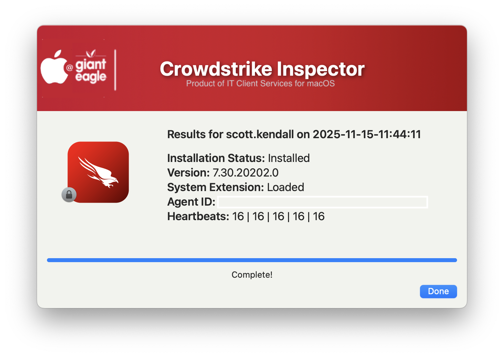

## Inspect Crowdstrike

Simple GUI interface showing Falcon sensor info
based heavily off of Dan Snelson script: (https://snelson.us/2023/04/crowdstrike-falcon-inspector-0-0-2-with-swiftdialog/)

| **Version**|**Notes**|
|:--------:|-----|
| 1.0 | Initial code
| 1.1 | Code cleanup to be more consistent with all apps
| 1.2 | Code cleanup
||       Added feature to read in defaults file
||       removed unnecessary variables.
||       Bumped min version of SD to 2.5.0
||       Fixed typos
| 2.0 | Updated SD Version requirements to 3.1.0
||       Added ability to set subtitle, color, and padding from defaults file
