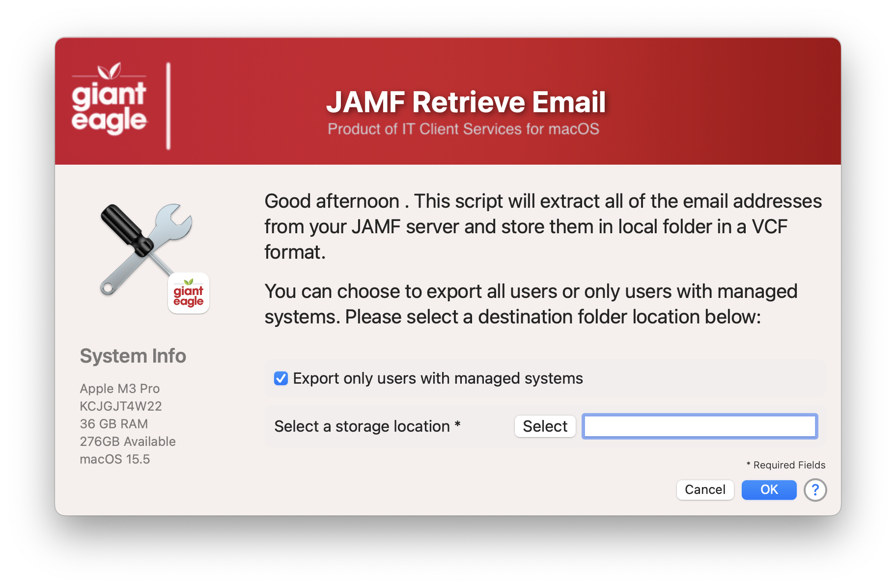
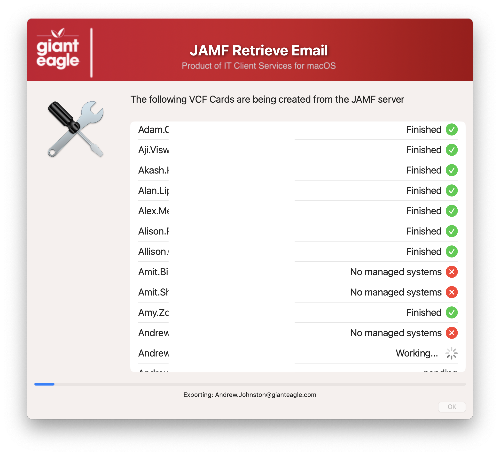

## Export JAMF emails to VCF Cards

This one grew out of necessity in my current role. I needed to export a list of email addresses from JAMF Pro and import them into outlook for a DL. I couldn't find a way to do this in JAMF, so I wrote this script to do it.

Welcome Screen



Progress Screen



## JAMF API Information ##

If you are using the Modern JAMF API credentials, you need to set:

```Read Users```

## History ##

- 1.0 - Initial
- 1.1 - Created a few new functions to reduce complexity
    - document function details
    - renamed all JAMF functions to start with JAMF.
- 1.2 - Verified working agains JAMF API 11.20
    - Added option to detect which SS/SS+ we are using and grab the appropriate icon
    - Now works with JAMF Client/Secret or Username/password authentication
    - Change variable declare section around for better readability
    - Changed to using JSON blobs vs XML Blobs
    - Bumped Swift Dialog to v2.5.0
- 1.3   Add function to check for passed JAMF credentials

