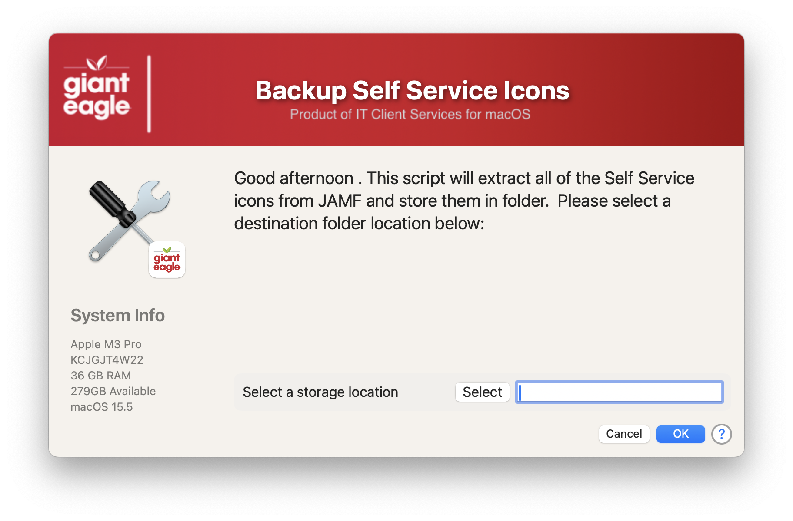
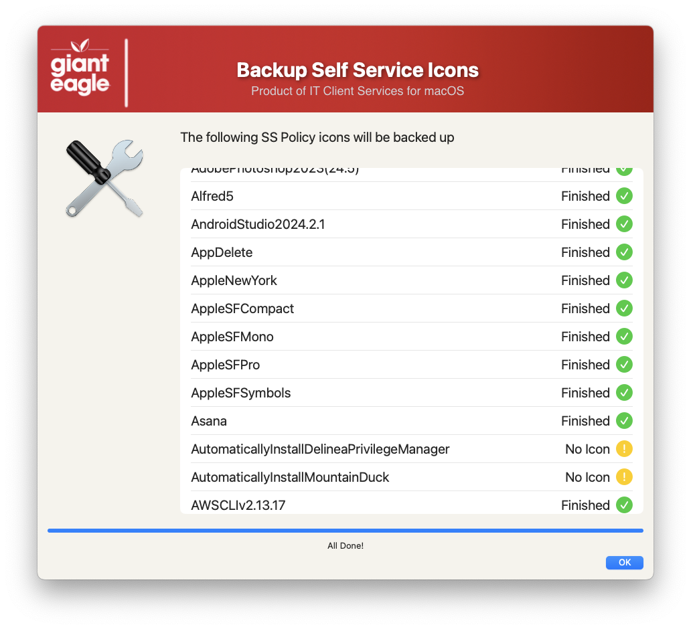
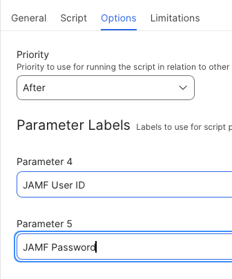

## Backup Self Service Icons

This script is designed to extract all of the icons from all Self Service policies and store them on a local folder.  Great for when Self Service starts to display generic icons...you can restore them with your backup.

Welcome Screen

Process Screen

Script Parameters

The is a heavily modified version from Der Flounder's website: https://derflounder.wordpress.com/2022/01/12/backing-up-self-service-icon-graphic-files-from-jamf-pro/.  
I just updated it with the ability to call it from JAMF, modified for ZSH, and show a status screen during operation.

## JAMF API Information ##

If you are using the Modern JAMF API credentials, you need to set:

* Read Policies

## History ##

- 1.0 - Initial Commit
- 1.1 - Remove the MAC_HADWARE_CLASS item as it was misspelled and not used anymore...
- 1.2 - Created a few new functions to reduce complexity
    - document function details
    - renamed all JAMF functions to start with JAMF.
- 1.3 - Verified working agains JAMF API 11.20
    - Added option to detect which SS/SS+ we are using and grab the appropriate icon
    - Now works with JAMF Client/Secret or Username/password authentication
    - Change variable declare section around for better readability
    - Bumped Swift Dialog to v2.5.0
- 1.4 Add function to check JAMF credentials were passed
    - Fixed logic to determine which SS/SS+ is being used
