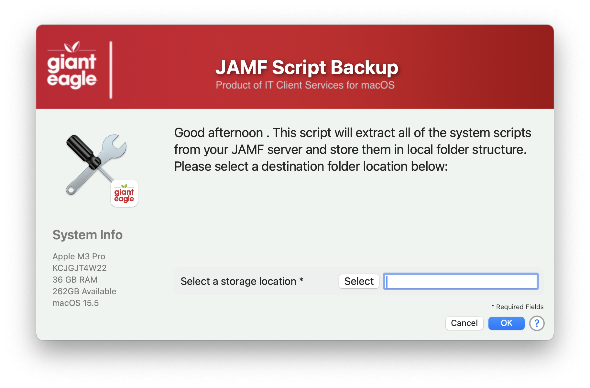
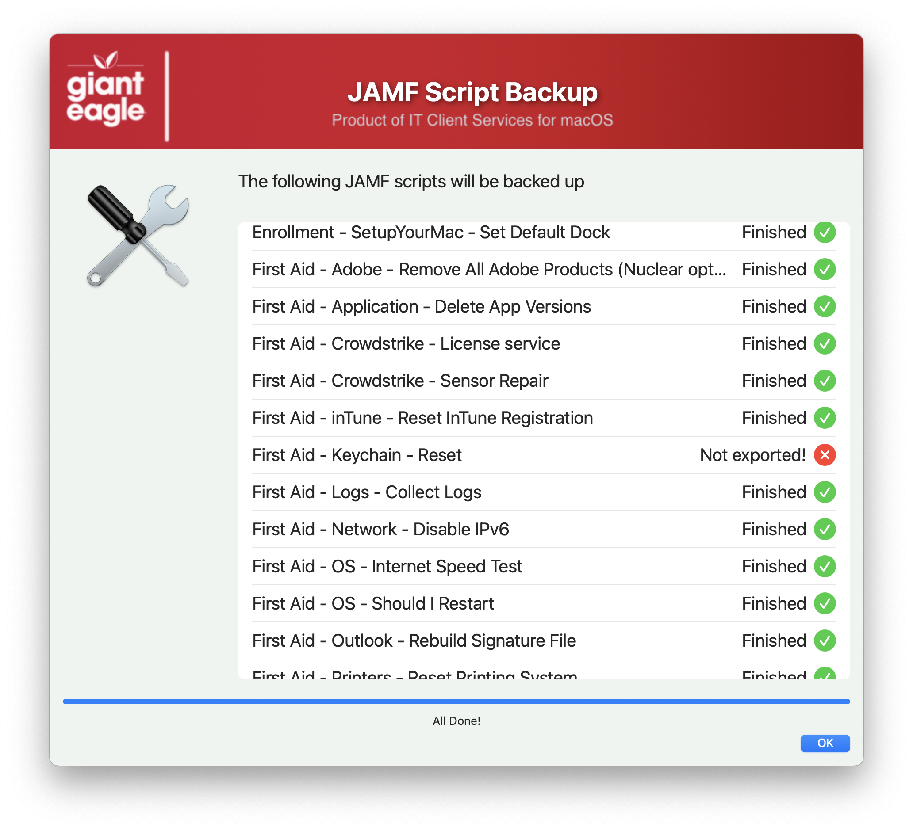
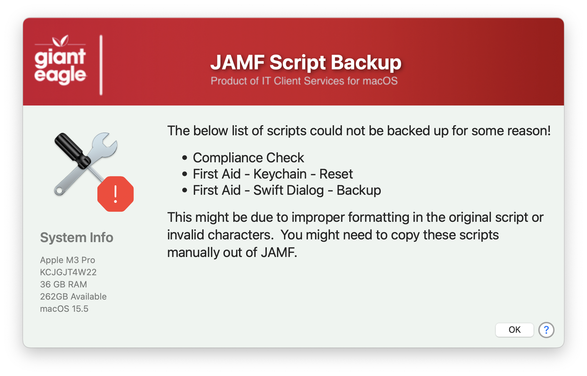

## Backup of JAMF system scripts

This script is designed to extract all of the system scripts from your JAMF server.  Why do you want to do this?

1.  Make a backup of your scripts in case your existing backup files is missing/corrupted (or you don't have one!)
2.  You inhereited a JAMF server from another person, and this can do a "brain dump" so you can review the scripts.
3.  Why not?  It is another example of what you can do with API scripts..

Welcome Screen

Process Screen

Errors window

At some point, I might combine both this script and my [BackupSSscripts](https://github.com/ScottEKendall/JAMF-Pro-Scripts/tree/main/BackupSSIcons) into one and make a "common" JAMF utility..just wanted to get this out now...

## JAMF API Information ##

If you are using the Modern JAMF API credentials, you need to set:

* Read Scripts

## History ##

 - 1.0 - Initial Commit
 - 1.1 - Created a few new functions to reduce complexity
    - document function details
    - renamed all JAMF functions to start with JAMF.
- 1.2 - Add function to check for valid JAMF credentials
    - Fixed function to check which SS/SS+ is being used
    - Reworked top section for better idea of what can be modified
    - Bumped SwiftDialog min version to 2.5.0
