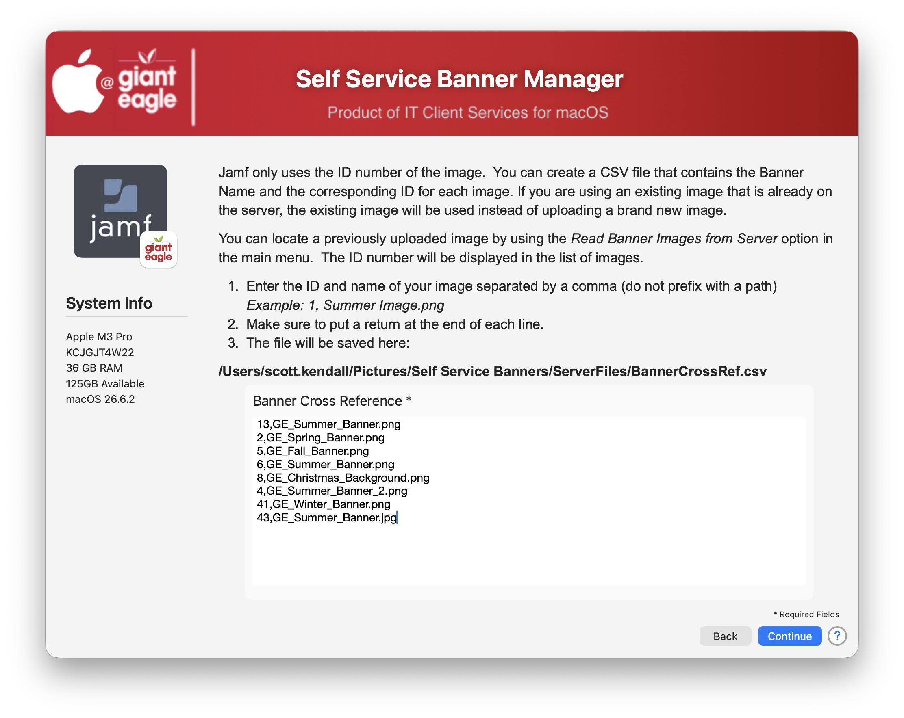
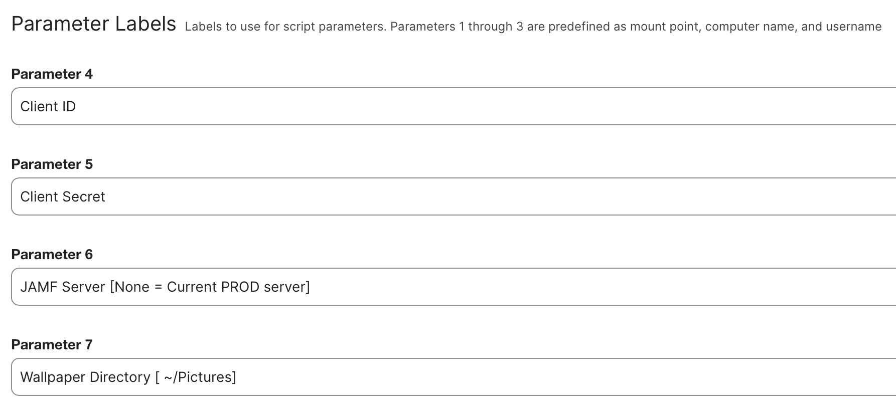

# JAMF Self Service Branding Manager

A macOS administration utility that allows Jamf Pro administrators to manage Self Service branding, banner images, and branding text directly from an interactive SwiftDialog interface.

The application provides an easy way to:

- View existing banner images stored in Jamf Pro
- Download server-stored branding images
- Update Self Service branding text
- Upload new banner images
- Assign existing images to Self Service branding
- Maintain a local image-to-ID cross-reference database
- Eliminate duplicate image uploads


---

## Features

### View & Download Jamf Branding Images

Browse banner images currently stored in Jamf Pro and download them to a local repository for future use.

**Capabilities**

- Preview server-hosted banner images
- Download images directly from Jamf Pro
- Save downloaded images locally
- Display image previews using SwiftDialog


---

### Manage macOS Branding Text

Modify the text displayed throughout Self Service.

**Editable Fields**

- Sidebar Heading
- Sidebar Subheading
- Homepage Heading
- Homepage Subheading

Changes are written directly back to the active Self Service branding configuration using the Jamf Pro API.


---

### Upload & Assign Branding Images

Select local banner images and assign them to Self Service.

The application automatically:

1. Scans a local image repository
2. Displays image previews
3. Checks for existing image ID mappings
4. Uploads new images when needed
5. Updates Self Service branding
6. Maintains image ID tracking information

This greatly simplifies banner rotation for seasonal promotions, company announcements, and internal communications.


---

### Cross Reference Image Database

Jamf Pro branding records use image IDs rather than filenames.

The Branding Manager maintains a simple CSV mapping file:



### Sample layout ###

Sample layout of the CrossRev.csv file

```text
ImageID,ImageName
8,GE_Christmas_Background.png
13,GE_Summer_Banner.png
22,GE_Fall_Banner.png
```

### Script Parameters ###

Pass in the following parameters to your script.  If you are running this from terminal, these paramters start at $4



### API Credentials

If you are using the OAuth credentials, you will need the follow access rights

```
"Read Self Service Branding Configuration"
"Read Self Service"
"Create Self Service Branding Configuration"
"Update Self Service Branding Configuration"
```

## Version History ##

| **Version**|**Notes**|
|:--------:|-----|
| 1.0 | Initial production release
|| View and download Jamf branding images
|| Modify Self Service branding text
|| Upload and assign banner images
|| Maintain image ID cross-reference data