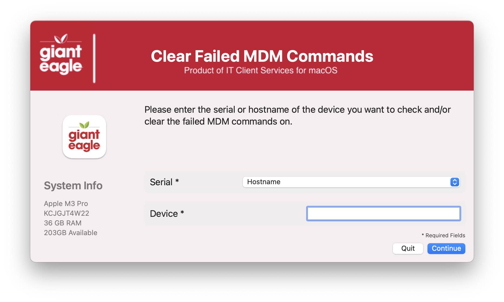
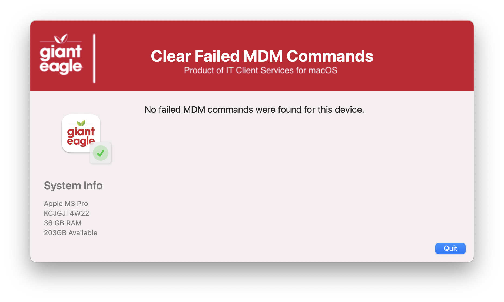
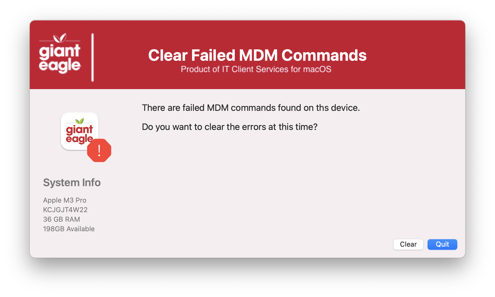

## Clear failed MDM Commands

Nice GUI method of clearing out failed MDM Commands from a machine record.  Sometimes failed commands will prevent JAMF from processing further commands

Initial Welcome screen

Good (Not failures found) results

Failed commands found

Kudos to Karthikeyan Marappan for coming up with the concept.  I just put a nice GUI frontend to it.  
Original source: https://gist.github.com/karthikeyan-mac/4c46121ddd95b43465bd1b5e53ce571c

| **Version**|**Notes**|
|:--------:|-----|
| 1.0 | Initial
| 1.1 | Changed wording of results screen to include device ID
| 1.2 | Added support for jq to pase results.  Also put in logic to install JQ from JAMF if missing
| 1.3 | Remove the MAC_HADWARE_CLASS item as it was misspelled and not used anymore...
| 1.4 | Verified working agains JAMF API 11.20
||       Added option to detect which SS/SS+ we are using and grab the appropriate icon
||       Now works with JAMF Client/Secret or Username/password authentication
||       Change variable declare section around for better readability
||       Bumped Swift Dialog to v2.5.0
| 1.5 | Had to increase window height for Tahoe & SD v3.0
| 1.6 | Changed JAMF 'policy -trigger' to 'JAMF policy -event'
| 1.7 | Fixed incorrect variable name in retreival of the JAMF credentials
||       Fixed issue of not finding Self Service Plus path
||       Adjusted window height after fixing icon issue