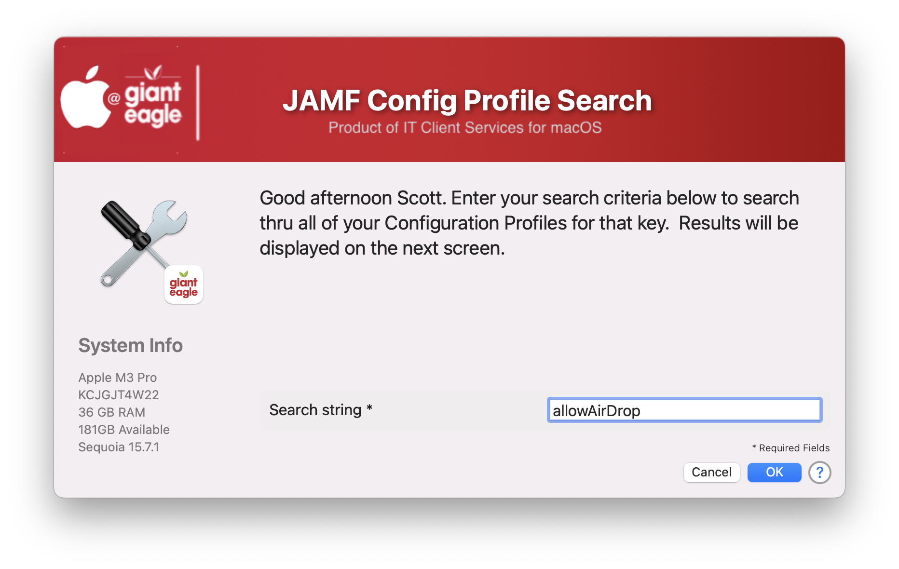
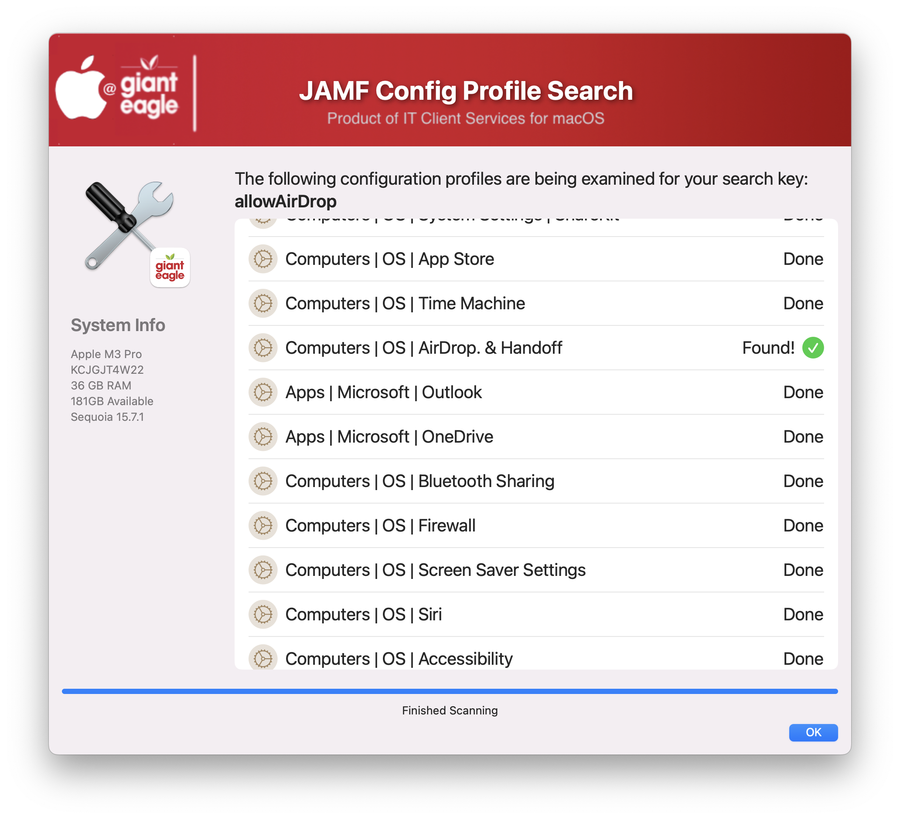

## JAMF Configuration Profile Search

This script is designed to search thru all of your configuration profiles for a particular string (or key).

Whats the need for this?  Say you are a new employee that just took over your MDM from your (previous) co-workers, or your have so many Config Profiles that you don't remember everything that you put in each one.  That is where this utility comes in handy!  Enter your search word/key and it will search thru all of the Config Profiles and let you know where it found that particular string.

Welcome Screen

Results Screen

If you are using the Modern JAMF API credentials, you need to set:

* Read macOS Configuration Policies

## History ##

#### 1.0 - Inital Commit ####
#### 1.1 - Add function to verify passed credentials ####