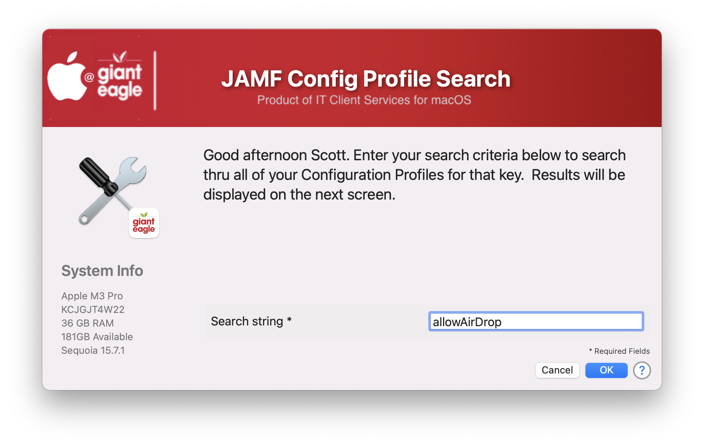
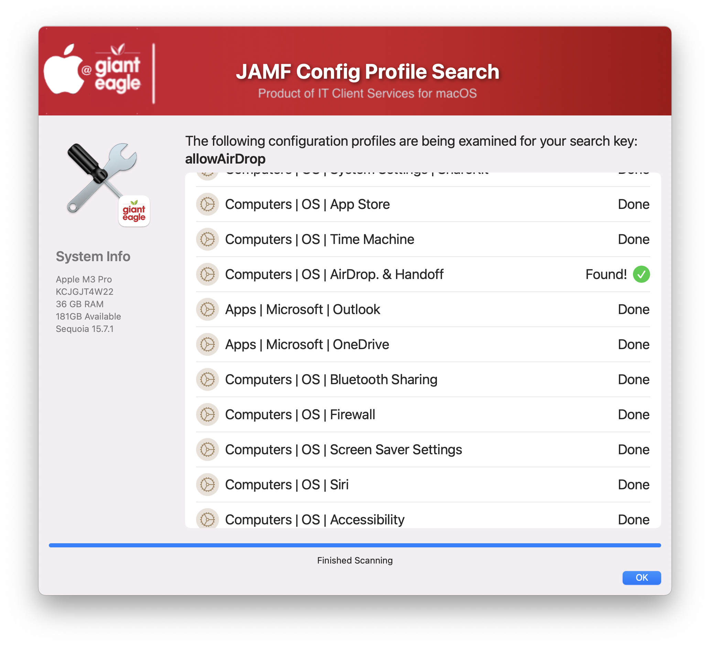

## JAMF Configuration Profile Search

This script is designed to search thru all of your configuration profiles for a particular string (or key).

Whats the need for this?  Say you are a new employee that just took over your MDM from your (previous) co-workers, or your have so many Config Profiles that you don't remember everything that you put in each one.  That is where this utility comes in handy!  Enter your search word/key and it will search thru all of the Config Profiles and let you know where it found that particular string.

Welcome Screen



Results Screen



If you are using the Modern JAMF API credentials, you need to set:

```Read macOS Configuration Policies```

## History ##

| **Version**|**Notes**|
|:--------:|-----|
| 1.0 | Initial
| 1.1 | Add function to make sure Client / Secret are passed into the script
| 1.2 | Made grep search case insenstive
||       Added option to read in config variables from a .plist file if exists
| 1.3 | Changed JAMF 'policy -trigger' to 'JAMF policy -event'
||       Optimized "Common" section for better performance
||       Fixed variable names in the defaults file section
| 2.0 | Updated SD Version requirements to 3.1.0
||       Added ability to set subtitle, color, and padding from defaults file
