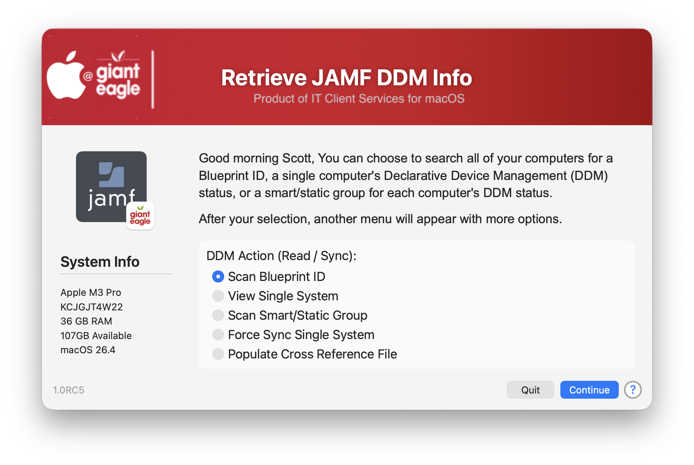
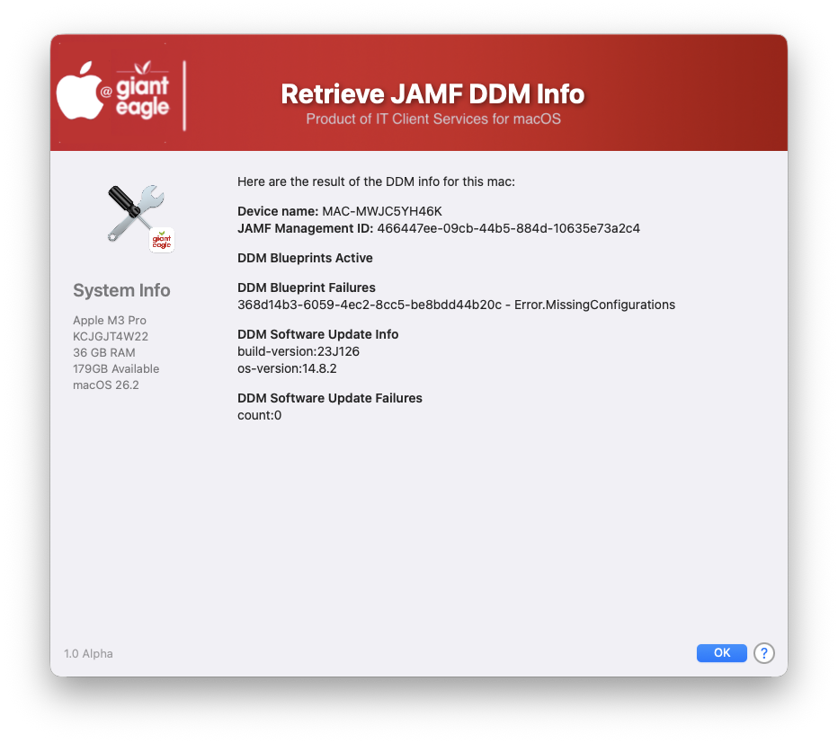
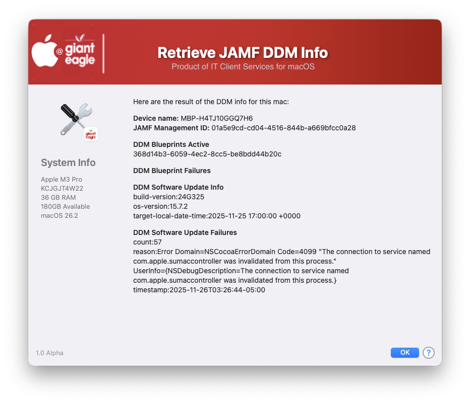

## Get JAMF DDM Info ##

Apple has declared DDM as "The Future" of software delivery and thankfully JAMF does have their new Blueprints functionality for us to use, but JAMFs reporting of Blueprint information is lacking on detailed information about deployments & failures.  This script is designed to extract all DDM information from any given machine and display active & failed blueprints as well as pending software update information.



If there are any blueprint failures the blueprint ID will be listed and the potential cause as to why it failed. 



If there are any potential software update failures, they will be listed in here as well as the reason



As is, the script (in its early Alpha stage) will function on a single system, but I have much more planned for it, such as:

* Select any static/smart group and it will process the DDM reports for all machines in the groups
* Export results via CSV / Email
* Report on failed blueprints from selected systems that you choose
* More DDM Details extracted & reported on
  
If you have any ideas/suggestions on how to improve the DDM reporting ability, please drop me a line!

## History ##

##### _0.1 - Initial Commit (Alpha)_

Gemini results of what can be extracted from JAMF about DDM:

The information you can extract from the Jamf Pro server regarding DDM (Declarative Device Management) contents using the API is granular and device-centric. The API primarily provides status items, declaration identifiers, and raw configuration payloads rather than high-level blueprint definitions.
### Here are the specific types of information you can extract: ###
1. Declaration Status Items (Per Device)
This is the most common and detailed information available. By querying a specific device's status items (```GET /v1/declarative-device-management/{clientManagementId}/status-items```), you can extract:
* **Active/Inactive Status**: Whether a specific declaration is currently active (```active=true``` or ```active=false```) on the device.
* **Validity Status**: Whether the device successfully parsed the configuration (```valid=valid``` or ```valid=invalid```).
* **Server Tokens**: Hashes used internally by DDM to determine if a configuration has been updated on the server.
* **Error Codes/Reasons**: If a declaration is inactive or failed, the API provides the specific ```code``` (e.g., ```Error.MissingConfigurations```) and a human-readable ```description``` of why it failed to apply.
* **Identifiers** (UUIDs): The unique UUIDs that represent the specific declaration components.
1. Raw Declaration Payloads
Once you extract a specific declaration identifier (UUID) from the status items above, you can retrieve the actual configuration data using the dss-declarations endpoint (```GET /v1/dss-declarations/{id}```).
This allows you to extract the raw contents of the DDM configuration, which will be in a YAML or JSON format:
* **Configuration Profile Data**: The specific settings you defined (e.g., Wi-Fi SSID and password, passcode requirements).
* **Asset References**: Pointers to other assets stored on the server that the declaration uses.
* **Predicates (Activation Logic)**: The exact conditions the device is checking to determine if a configuration should be active.
3. **Managed Software Update Plan Declarations**
If you are using Managed Software Updates, you can list all declarations associated with a specific software update plan ID using ```GET /v1/managed-software-updates-plans/{id}/declarations```. From this, you can extract:
* **Target OS Versions**: The specific OS version the plan is targeting (e.g., ```15.7.2```).
* **Target Date/Time**: When the update is scheduled to run (```target-local-date-time```).

### Summary of What You Can't Easily Get ###

It's important to note that the Jamf API does not offer simple endpoints to:
* List all human-readable Blueprint Names in your system in a single list.
* Get a top-level aggregate "Status of Blueprint X" across all devices in one request.
* Manage or edit the blueprint definitions themselves via API calls (this is done in the GUI).

