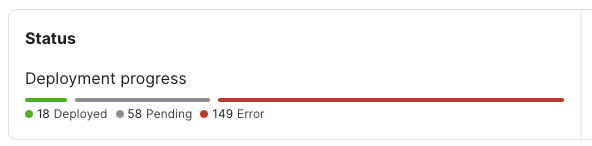
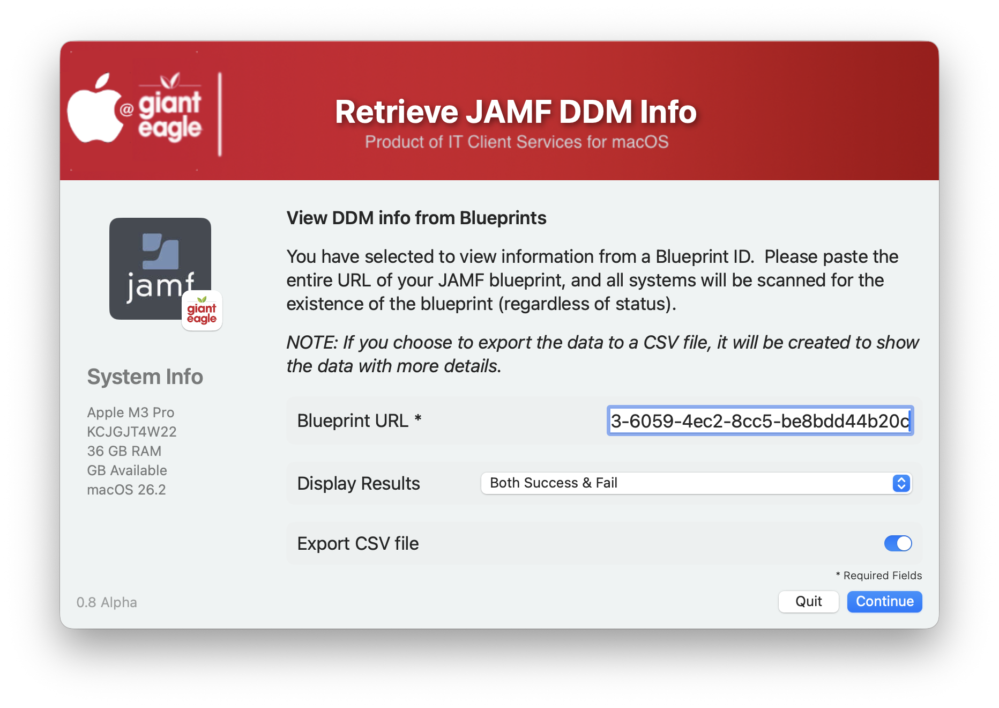
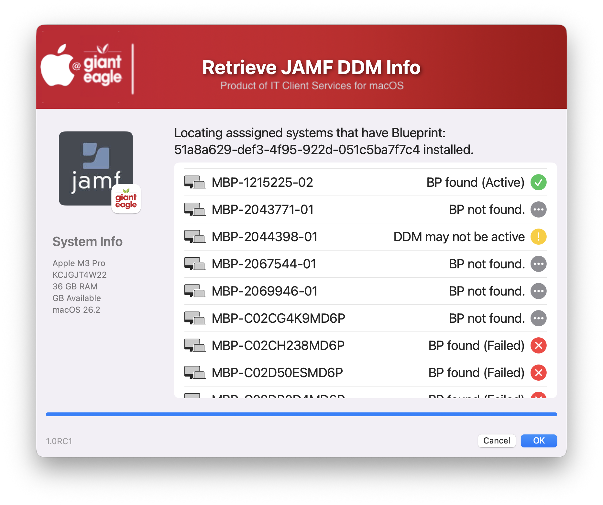
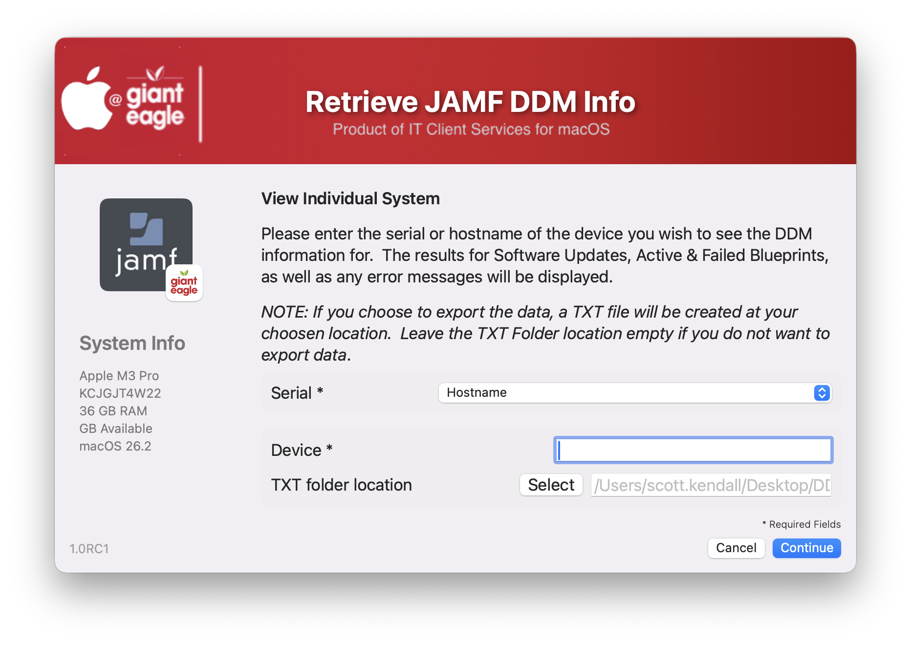
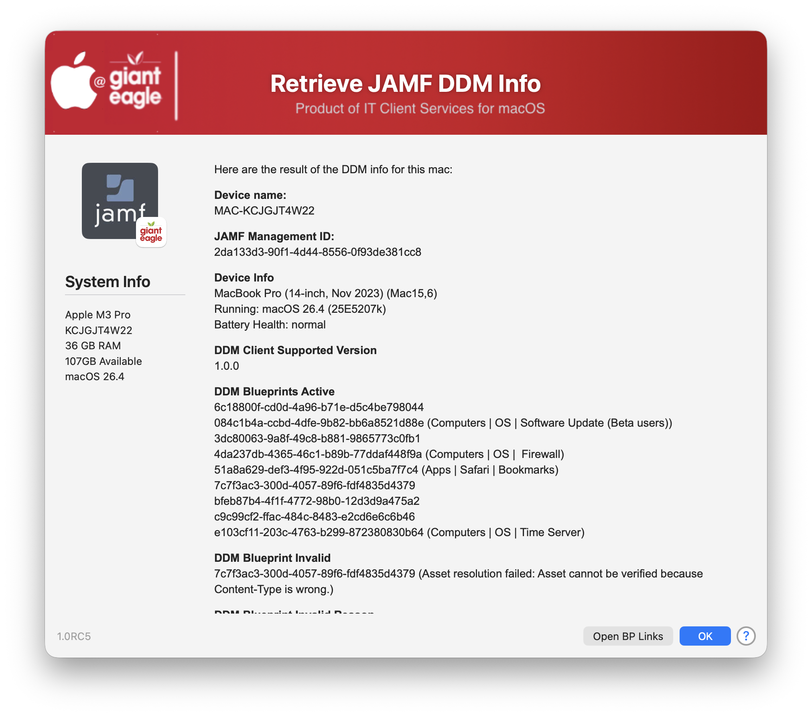
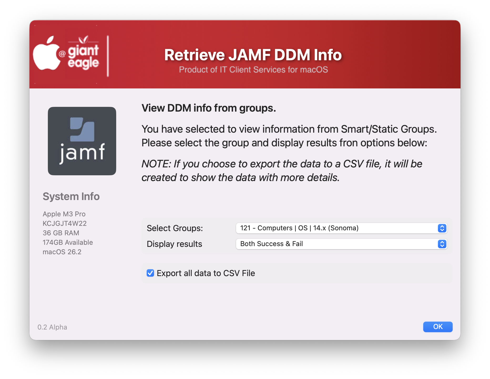
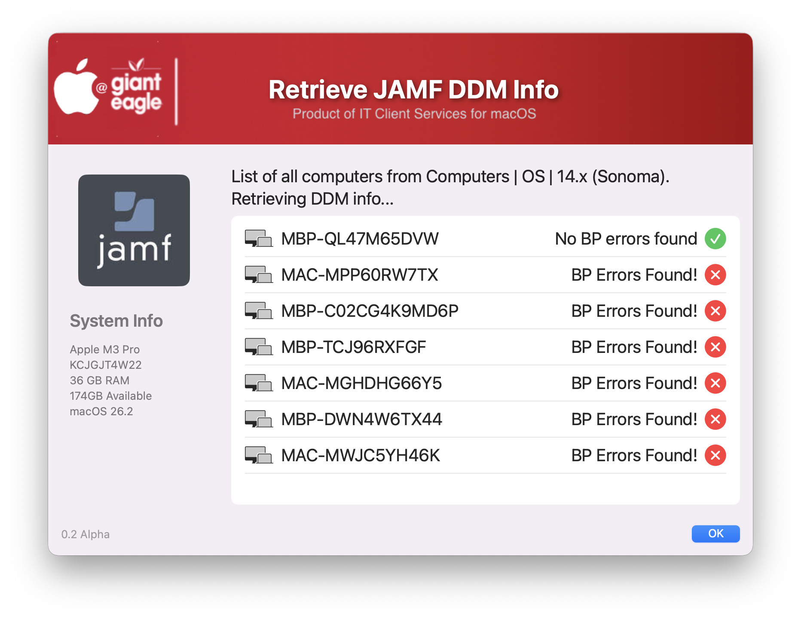

## Get JAMF DDM Info ##

Apple DDM (Declarative Device Management) is a modern, proactive approach for organizations to manage Apple devices, allowing them to autonomously enforce configurations, updates, and security policies by having devices manage themselves based on server-provided "declarations," improving efficiency, responsiveness, and reliability over traditional methods. It shifts from "server-pull" (traditional MDM) to "device-push" logic, where devices independently check their desired state, apply settings, and report back status, making management faster and more scalable. 

When you set your Blueprint settings...get your scoping down...and then deploy, and you get this:



..now what do you do?  How can you figure out what failed and what worked?  

JAMFs reporting of Blueprint information is lacking on detailed information about deployments & failures.  This script is designed to extract all DDM information from any given machine and display active & failed blueprints as well as pending software update information.  You can view information by Blueprints, Individual System(s) or by groups.  The script takes advantage of macOS multitasking, and is optimized for large environments.  Approximately 1000 systems can be scanned in under 2 minutes.


### By Blueprint ID ###

You can view all systems that have the Blueprint ID installed on them and it will report back if it is active or failed.  This is useful if you have the Blueprint scoped to multiple groups.



The results of viewing by Blueprint ID


### Single System ###

You can view information by individual system, and export the info into a TXT file



The results page for individual systems.  All blueprint IDs are listed as well as system info, software update info and any failures



### By Smart/Static Group

If you want to view just the members of one particular group, it will show you the success & failures



The results page of viewing by Smart/Static groups




## JAMF API Privileges

if you are using the Client/Secret account, you will need the following:

```
Read Computers
Read Mobile Devices
Read Smart Computer Groups
Read Static Computer Groups
```
  
If you have any ideas/suggestions on how to improve the DDM reporting ability, please drop me a DM!

## History ##

| **Version**|**Notes**|
|:--------:|-----|
| 0.1 | Initial Release |
| 0.2 | had to add "echo -E $1" before each of the jq commands to strip out non-ascii characters (it would cause jq to crash) - Thanks @RedShirt |
|| Script can now perform functions based on SmartGroups
| 0.3 | Put error trap in JAMF API calls to see if returns "INVALID_PRIVILEGE""
| 0.4 | Optimized some loop routines and put in more error trapping.  
|| Add feature to include DDM Software Failures in CSV report
|| Optimized JAMF functions for faster processing
| 0.5 | Added support for both smart & static groups (had to use the Classic API to do this)
||       Added Verbal description of Blueprint activation failures
||      Took advantage of some AI Tools to optimize the "common" section and optimize more JAMF functions
||      Removed the extra verbiage at the end of the Blueprint IDs
||      Added button to open the Blueprint links in your browser
| 0.6 | Add more safety net around the JQ command to make sure it won't error out.
||       More detailed reporting in CSV file
||       Reported if DDM is not enabled on a system.
| 0.7 | Background processing!  Major speed improvement (can process about 1000 records in less than 2 mins)
||      Progress during list items to show actual progress
| 0.8 | Preliminary support for blueprints
|| Several GUI enhancements, including verbage and typos
|| Ability to choose export location for Individual systems
|| Report on more DDM fields
| 0.9 | Got the scan for blueprints feature working (fully multitasking aware)
||       Added option to show success and/or failed on blueprint scan
||       Made minor GUI changes
||       Show dialog notification during long inventory retrievals
| 1.0RC1 | Added more DDM reporting details (current Model #, Current OS, Security Certificates)
||       More JQ error trapping
| 1.0RC2 | more JQ error trapping
||       Added Current OS to CSV reports
||       Moved JAMF Token process inside of main loop to make sure it gets renewed after each selection
||       Added BP Name (optional) so you can name your CSV file
||       Cleaned up the output TXT file for individual systems


## Gemini results of what can be extracted from JAMF about DDM: ##

The information you can extract from the Jamf Pro server regarding DDM (Declarative Device Management) contents using the API is granular and device-centric. The API primarily provides status items, declaration identifiers, and raw configuration payloads rather than high-level blueprint definitions.
### Here are the specific types of information you can extract: ###
1. #### Declaration Status Items (Per Device) ####
This is the most common and detailed information available. By querying a specific device's status items (```GET /v1/declarative-device-management/{clientManagementId}/status-items```), you can extract:
* **Active/Inactive Status**: Whether a specific declaration is currently active (```active=true``` or ```active=false```) on the device.
* **Validity Status**: Whether the device successfully parsed the configuration (```valid=valid``` or ```valid=invalid```).
* **Server Tokens**: Hashes used internally by DDM to determine if a configuration has been updated on the server.
* **Error Codes/Reasons**: If a declaration is inactive or failed, the API provides the specific ```code``` (e.g., ```Error.MissingConfigurations```) and a human-readable ```description``` of why it failed to apply.
* **Identifiers** (UUIDs): The unique UUIDs that represent the specific declaration components.
2. #### Raw Declaration Payloads ####
Once you extract a specific declaration identifier (UUID) from the status items above, you can retrieve the actual configuration data using the dss-declarations endpoint (```GET /v1/dss-declarations/{id}```).
This allows you to extract the raw contents of the DDM configuration, which will be in a YAML or JSON format:
* **Configuration Profile Data**: The specific settings you defined (e.g., Wi-Fi SSID and password, passcode requirements).
* **Asset References**: Pointers to other assets stored on the server that the declaration uses.
* **Predicates (Activation Logic)**: The exact conditions the device is checking to determine if a configuration should be active.
3. #### Managed Software Update Plan Declarations ####
If you are using Managed Software Updates, you can list all declarations associated with a specific software update plan ID using ```GET /v1/managed-software-updates-plans/{id}/declarations```. From this, you can extract:
* **Target OS Versions**: The specific OS version the plan is targeting (e.g., ```15.7.2```).
* **Target Date/Time**: When the update is scheduled to run (```target-local-date-time```).

### Summary of What You Can't Easily Get ###

It's important to note that the Jamf API does not offer simple endpoints to:
* List all human-readable Blueprint Names in your system in a single list.
* Get a top-level aggregate "Status of Blueprint X" across all devices in one request.
* Manage or edit the blueprint definitions themselves via API calls (this is done in the GUI).

