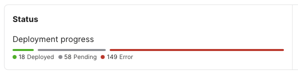
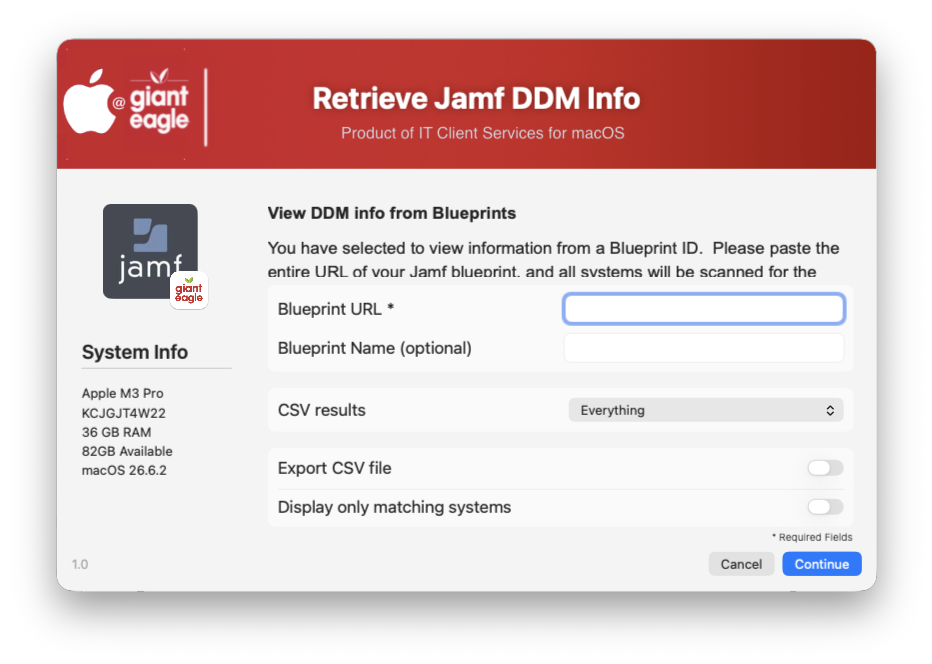
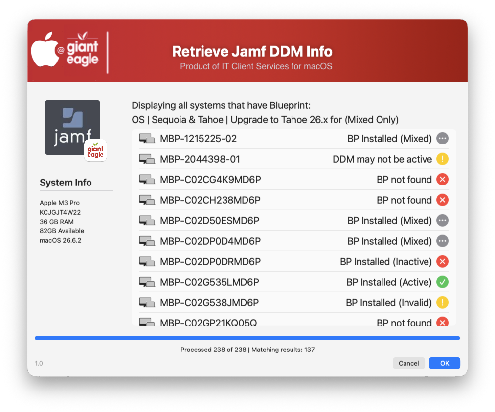
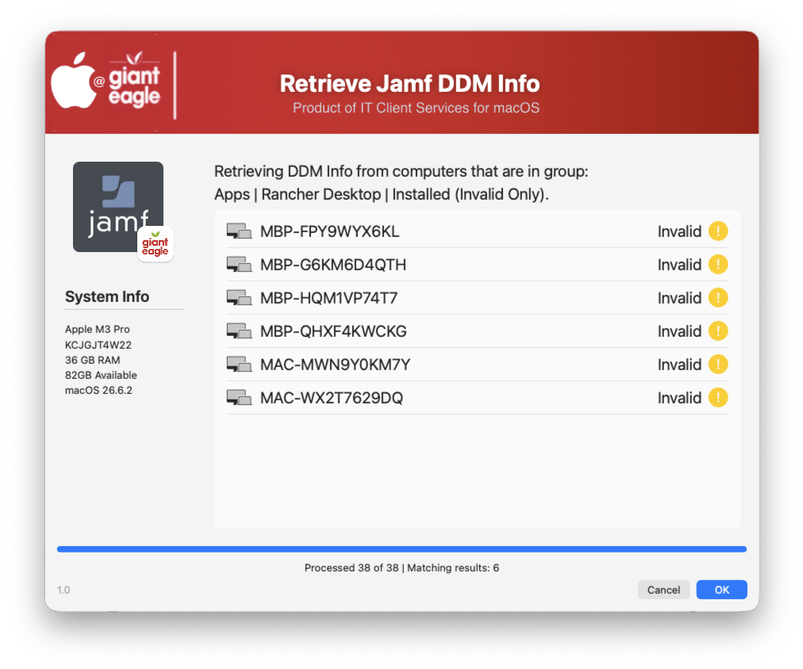
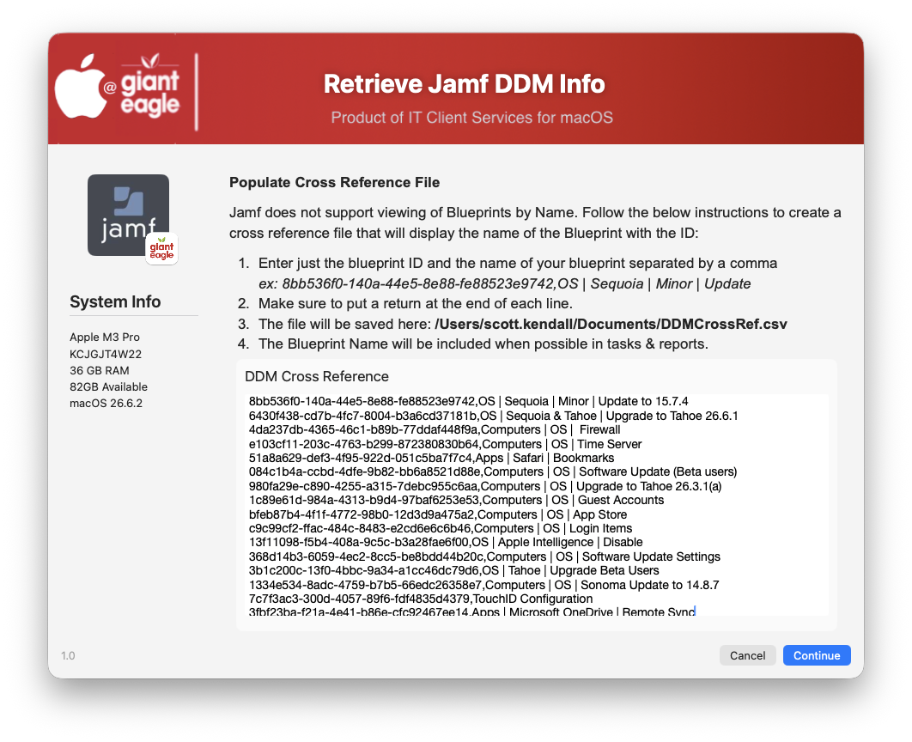

# GetDDMInfo #

A comprehensive macOS utility for Jamf Pro administrators to retrieve, analyze, and report on Declarative Device Management (DDM) status across managed devices.

GetDDMInfo provides a SwiftDialog-powered interface for inspecting DDM deployments, Blueprint status, software update declarations, activation failures, invalid configurations, and device-level DDM information. It supports both individual device analysis and large-scale reporting across Smart Groups, Static Groups, and Blueprint deployments.

## Get DDM Info ##

Apple DDM (Declarative Device Management) is a modern, proactive approach for organizations to manage Apple devices, allowing them to autonomously enforce configurations, updates, and security policies by having devices manage themselves based on server-provided "declarations," improving efficiency, responsiveness, and reliability over traditional methods. It shifts from "server-pull" (traditional MDM) to "device-push" logic, where devices independently check their desired state, apply settings, and report back status, making management faster and more scalable. 

When you set your Blueprint settings...get your scoping down...and then deploy, and you get this:



JAMFs reporting of Blueprint information is lacking on detailed information about deployments & failures.  This script is designed to extract all DDM information from any given machine and display active & failed blueprints as well as pending software update information.  You can view information by Blueprints, Individual System(s) or by groups.  The script takes advantage of macOS multitasking, and is optimized for large environments.  Approximately 1000 systems can be scanned in under 2 minutes.

GetDDMInfo bridges that gap by providing:

* Individual device DDM inspection
* Blueprint deployment analysis
* Smart Group and Static Group reporting
* Force DDM Sync operations
* Software Update failure analysis
* Blueprint cross-reference support
* CSV export capabilities
* Friendly graphical interface using SwiftDialog

## Features ##
#### Device-Level DDM Analysis ####

*Information displayed includes:*

* Device Model
* Current Operating System
* OS Build Number
* Battery Health
* Security Certificates
* DDM Supported Payloads
* DDM Supported Versions
* Active Blueprints
* Failed Blueprints
* Invalid Blueprints
* Inactive Blueprints
* Software Update Status
* Software Update Failures


### Blueprint Scanning ###

Scan all managed devices for a specific Blueprint deployment.



Blueprint scans can identify:
| **Status**|**Description**|
|:--------:|-----|
|Active	| Blueprint is successfully deployed
|Inactive | Blueprint exists but is not actively applied
|Failed | Blueprint deployment reported a failure
|Invalid | Blueprint configuration is invalid
|Mixed | Blueprint appears in multiple deployment states
|Not Found | Blueprint does not exist on the device



## Blueprint scans support: ##

* Full inventory scans
* CSV export
* Display filtering
* Friendly Blueprint names
* Progress tracking


### Smart Group & Static Group Reporting ###
Analyze DDM health across an entire groups (Smart or Static) of devices.



Filter results by:

* Everything
* Failed Only
* Invalid Only
* Inactive Only
* Mixed Only
* No Errors Only


### Force DDM Sync ###

Request an immediate DDM synchronization for a specific device through the Jamf DDM API.

Useful when:

* Validating new deployments
* Troubleshooting Blueprint assignments
* Testing Software Update declarations
* Verifying DDM state reporting


### Blueprint Friendly Names ###

Jamf reports Blueprint UUIDs but does not provide a convenient way to associate names with those identifiers.

GetDDMInfo supports a cross-reference file:

```
UUID,Blueprint Name
8bb536f0-140a-44e5-8e88-fe88523e9742,macOS Sequoia Update
28fc7d80-ff53-4aed-8541-e2458b5dbf5f,Security Baseline
```


Blueprint names will automatically appear throughout reports and device views.

## Software Update Reporting ##

Retrieve DDM software update information including:

Pending Updates
Install Status
Failure Reasons
Failure Timestamps

This provides significantly more visibility than traditional MDM command reporting.

## CSV Export ##

Export analysis results for:

Blueprint Scans
Smart Groups
Static Groups

CSV output includes:
```
System
Management ID
Current OS
Last Update Time
Status
Blueprint Failed IDs
Blueprint Inactive IDs
Blueprint Mixed IDs
Inactive Reason
Blueprint Invalid IDs
Invalid Reason
Software Update Failures
Show more lines
```

## High Performance Design ##

Designed for large Jamf environments.

Features include:

* Parallel worker processing
* Background inventory retrieval
* Thread-safe CSV writing
* Thread-safe SwiftDialog updates
* Inventory pagination
* Low memory usage

This allows scanning thousands of devices significantly faster than traditional sequential processing.

## Robust Error Handling ##

GetDDMInfo includes extensive validation and resiliency features:

### Jamf API Validation ###
* Authentication validation
* HTTP response validation
* JSON validation
* Privilege checking
* Connection testing

### Data Validation ###
* Blueprint UUID validation
* Null value protection
* Missing DDM handling
* Missing Management ID handling

### Runtime Protection ###
* Cleanup traps
* Temporary file management
* Worker failure detection
* Progress synchronization

Jamf Pro Required permissions include:
```
Read Computers
Read Computer Groups
Read DDM Status
Send DDM Sync Commands
```

## Gemini results of what can be extracted from JAMF about DDM: ##

The information you can extract from the Jamf Pro server regarding DDM (Declarative Device Management) contents using the API is granular and device-centric. The API primarily provides status items, declaration identifiers, and raw configuration payloads rather than high-level blueprint definitions.
### Here are the specific types of information you can extract: ###
1. #### Declaration Status Items (Per Device) ####
This is the most common and detailed information available. By querying a specific device's status items (```GET /v1/declarative-device-management/{clientManagementId}/status-items```), you can extract:
* **Active/Inactive Status**: Whether a specific declaration is currently active (```active=true``` or ```active=false```) on the device.
* **Validity Status**: Whether the device successfully parsed the configuration (```valid=valid``` or ```valid=invalid```).
* **Server Tokens**: Hashes used internally by DDM to determine if a configuration has been updated on the server.
* **Error Codes/Reasons**: If a declaration is inactive or failed, the API provides the specific ```code``` (e.g., ```Error.MissingConfigurations```) and a human-readable ```description``` of why it failed to apply.
* **Identifiers** (UUIDs): The unique UUIDs that represent the specific declaration components.
2. #### Raw Declaration Payloads ####
Once you extract a specific declaration identifier (UUID) from the status items above, you can retrieve the actual configuration data using the dss-declarations endpoint (```GET /v1/dss-declarations/{id}```).
This allows you to extract the raw contents of the DDM configuration, which will be in a YAML or JSON format:
* **Configuration Profile Data**: The specific settings you defined (e.g., Wi-Fi SSID and password, passcode requirements).
* **Asset References**: Pointers to other assets stored on the server that the declaration uses.
* **Predicates (Activation Logic)**: The exact conditions the device is checking to determine if a configuration should be active.
3. #### Managed Software Update Plan Declarations ####
If you are using Managed Software Updates, you can list all declarations associated with a specific software update plan ID using ```GET /v1/managed-software-updates-plans/{id}/declarations```. From this, you can extract:
* **Target OS Versions**: The specific OS version the plan is targeting (e.g., ```15.7.2```).
* **Target Date/Time**: When the update is scheduled to run (```target-local-date-time```).

### Summary of What You Can't Easily Get ###

It's important to note that the Jamf API does not offer simple endpoints to:
* List all human-readable Blueprint Names in your system in a single list.
* Get a top-level aggregate "Status of Blueprint X" across all devices in one request.
* Manage or edit the blueprint definitions themselves via API calls (this is done in the GUI).


## History ##

| **Version**|**Notes**|
|:--------:|-----|
| 0.1 | Initial Release |
| 0.2 | had to add "echo -E $1" before each of the jq commands to strip out non-ascii characters (it would cause jq to crash) - Thanks @RedShirt |
|| Script can now perform functions based on SmartGroups
| 0.3 | Put error trap in JAMF API calls to see if returns "INVALID_PRIVILEGE""
| 0.4 | Optimized some loop routines and put in more error trapping.  
|| Add feature to include DDM Software Failures in CSV report
|| Optimized JAMF functions for faster processing
| 0.5 | Added support for both smart & static groups (had to use the Classic API to do this)
||       Added Verbal description of Blueprint activation failures
||      Took advantage of some AI Tools to optimize the "common" section and optimize more JAMF functions
||      Removed the extra verbiage at the end of the Blueprint IDs
||      Added button to open the Blueprint links in your browser
| 0.6 | Add more safety net around the JQ command to make sure it won't error out.
||       More detailed reporting in CSV file
||       Reported if DDM is not enabled on a system.
| 0.7 | Background processing!  Major speed improvement (can process about 1000 records in less than 2 mins)
||      Progress during list items to show actual progress
| 0.8 | Preliminary support for blueprints
|| Several GUI enhancements, including verbage and typos
|| Ability to choose export location for Individual systems
|| Report on more DDM fields
| 0.9 | Got the scan for blueprints feature working (fully multitasking aware)
||       Added option to show success and/or failed on blueprint scan
||       Made minor GUI changes
||       Show dialog notification during long inventory retrievals
| 1.0RC1 | Added more DDM reporting details (current Model #, Current OS, Security Certificates)
||       More JQ error trapping
| 1.0RC2 | more JQ error trapping
||       Added Current OS to CSV reports
||       Moved JAMF Token process inside of main loop to make sure it gets renewed after each selection
||       Added BP Name (optional) so you can name your CSV file
||       Cleaned up the output TXT file for individual systems
| 1.0RC3 | Added more JAMF error trapping
||       Add option to Force Sync DDM commands
||       Converted the output of the DDM Supported Payloads into a more readable format
| 1.0RC4 | Fixed reporting for blueprint not found when scanning for blueprint IDs
||       Add invalid blueprint information to system display and CSV output file
||      Significant rework of logic to determine valid, invalid or unknown deployments
| 1.0RC5 | Fixed issue of failed blueprints not returning correct results when doing a blueprint scan
||       Added option for cross reference file so you can associate Blueprint IDs to Names and it will show the name results during scans
| 1.0RC6 | Added extensive logging and comments
||       Added centralized cleanup traps
||       Added thread-safe CSV writes
||       Added thread-safe SwiftDialog command writes
||       Added background worker failure tracking
||       Added reliable dialog process waiting
||       Added HTTP and JSON validation for DDM API calls
||       Added Force Sync support
||       Added Blueprint friendly-name cross-reference support
||       Added Failed, Invalid, Active, Inactive, Conditional, and Not Found result classifications
||       Added result-specific Blueprint filtering
||       Added display-only-matching behavior
||       Added consistent CSV and display classifications
||       Added CSV field escaping
||       Improved Jamf group dropdown construction
||       Corrected initial SwiftDialog list-item status values
||       Prevented empty progress commands during list updates
||       Improved handling of missing DDM data and management IDs
| 1.0 | Production release
||       Finalized Blueprint Active, Inactive, Mixed, Failed, Invalid, and Not Found classifications
||       Finalized Blueprint and group filtering
||       Finalized thread-safe CSV and SwiftDialog output
||       Finalized result counters, API validation, cleanup, and error handling