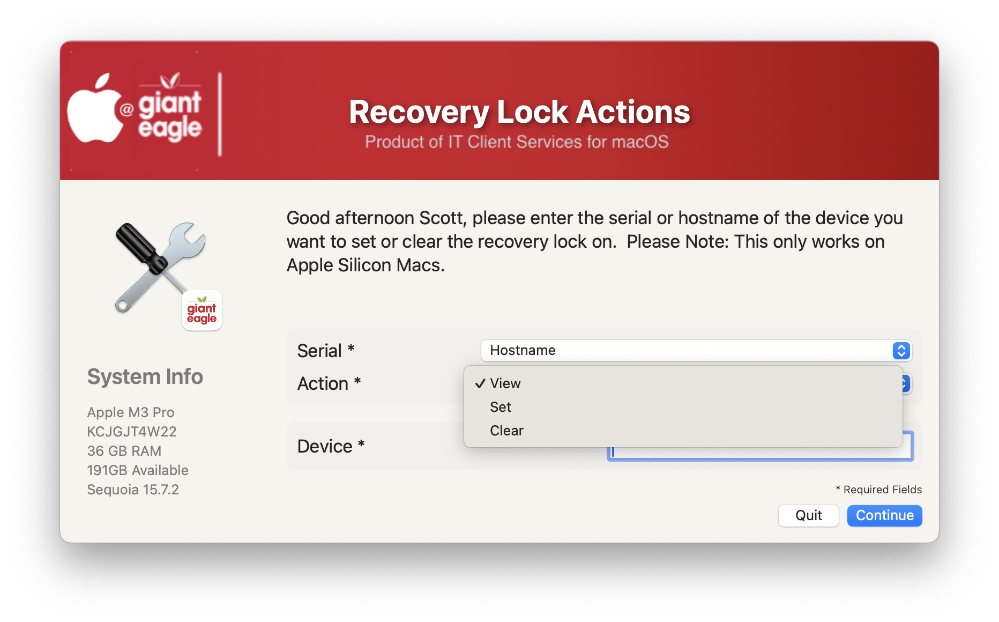
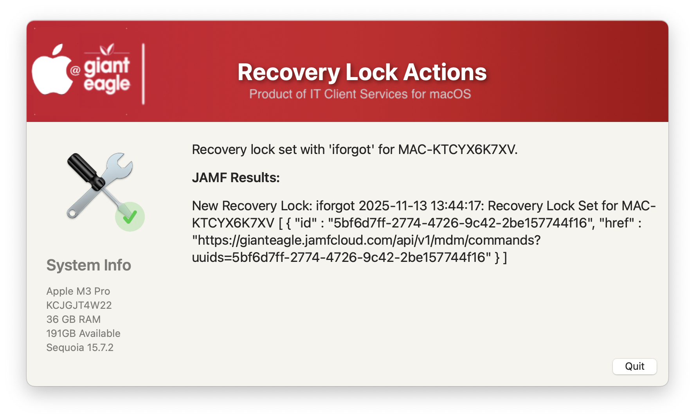
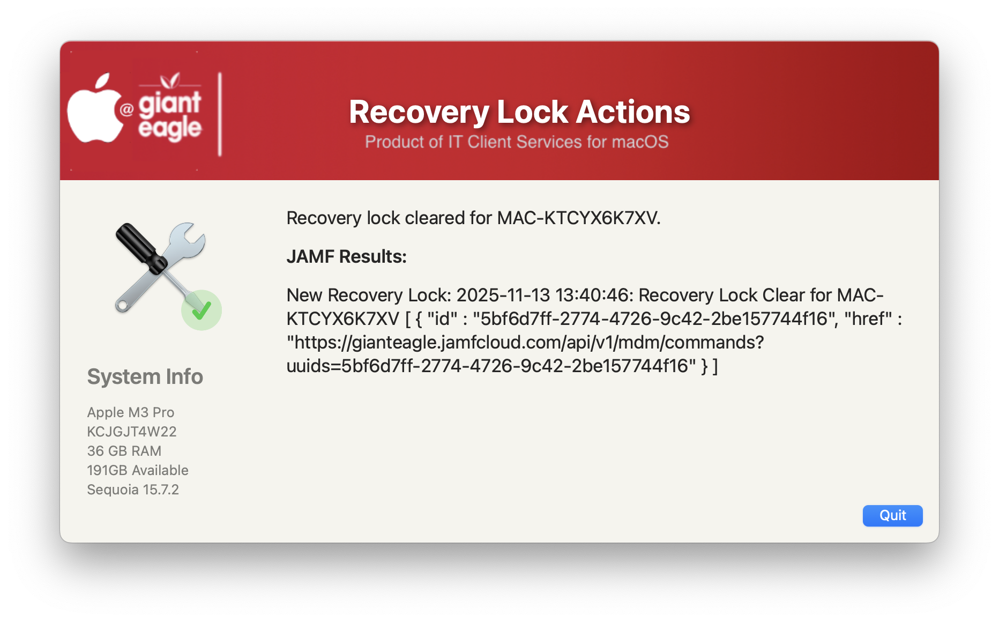
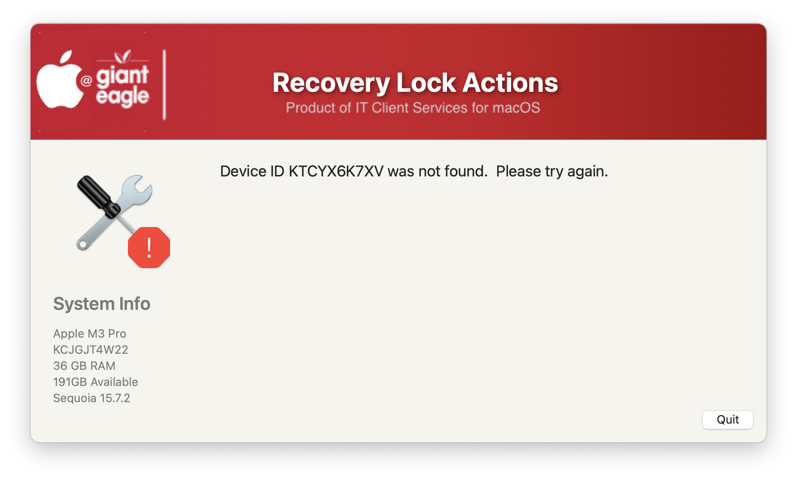
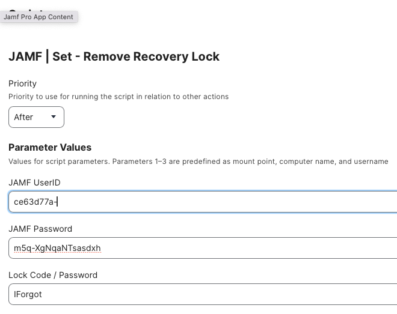

## Set / Clear Recovery Lock

Nice GUI method of setting or clearing the recovery lock.  *This only works for Apple Silicon Macs*.  It prevents the users from going into the recovery mode and changing options or reinstalling the OS

Initial Welcome screen



Successful lock for device.



Successful clear for device



Error screen for no device found



Details of JAMF Parameter(s)



If you are using the Modern JAMF API credentials, you need to set:

* ```View MDM command information in Jamf Pro API```
* ```View Recovery Lock```

Kudos to Karthikeyan Marappan for coming up with the concept.  I just put a nice GUI frontend to it.  
Original source: https://gist.github.com/karthikeyan-mac/185bf8319fa9560f300ed26553a7a54d

## History ##

##### _1.0 - Initial Commit_
##### _1.1 - Remove the MAC_HADWARE_CLASS item as it was misspelled and not used anymore..._
##### _1.2 - Reworked top section for better idea of what can be modified_
##### _1.3 - Verified working agains JAMF API 11.20_
##### _1.4 - Fixed invalid function call to invalidate JAMF token_
##### _1.5 - Added option to view recovery password_
#####        _new APIs for set/clear recovery Lock_
#####        _Show http results after set/clear command_
