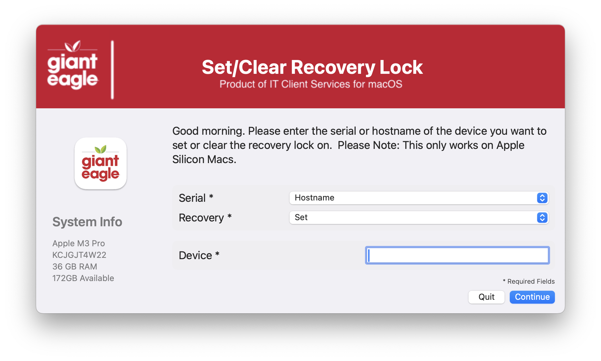
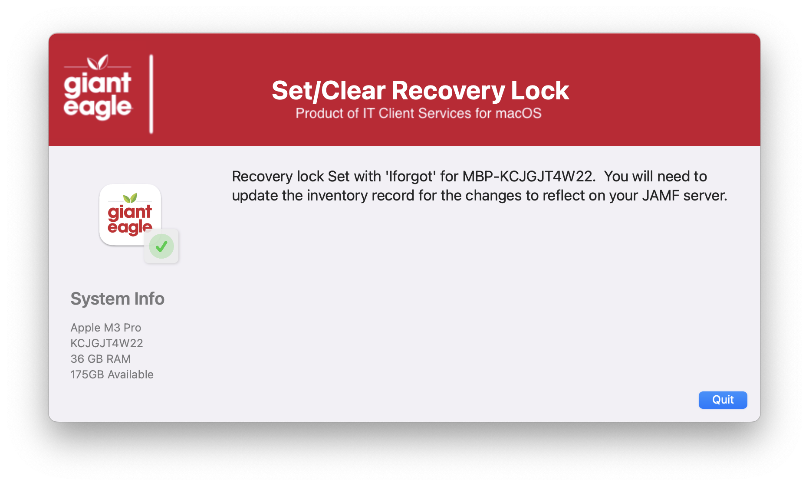
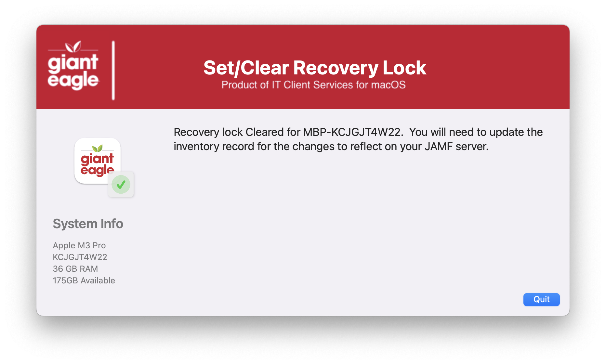
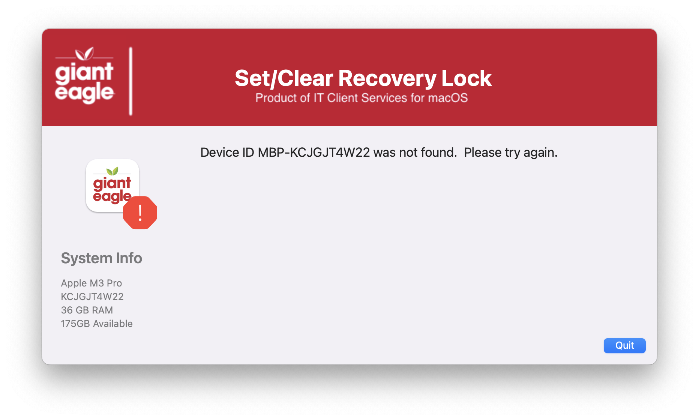
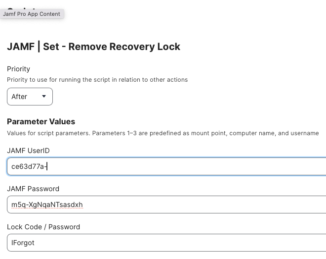

## Set / Clear Recovery Lock

Nice GUI method of setting or clearing the recovery lock.  *This only works for Apple Silicon Macs*.  It prevents the users from going into the recovery mode and changing options or reinstalling the OS

Initial Welcome screen

Successful lock for device.

Successful clear for device

Error screen for no device found

Details of JAMF Parameter(s)

If you are using the Modern JAMF API credentials, you need to set:

* View MDM command information in Jamf Pro API

Kudos to Karthikeyan Marappan for coming up with the concept.  I just put a nice GUI frontend to it.  
Original source: https://gist.github.com/karthikeyan-mac/185bf8319fa9560f300ed26553a7a54d

##### _v1.0 - Initial Commit_

