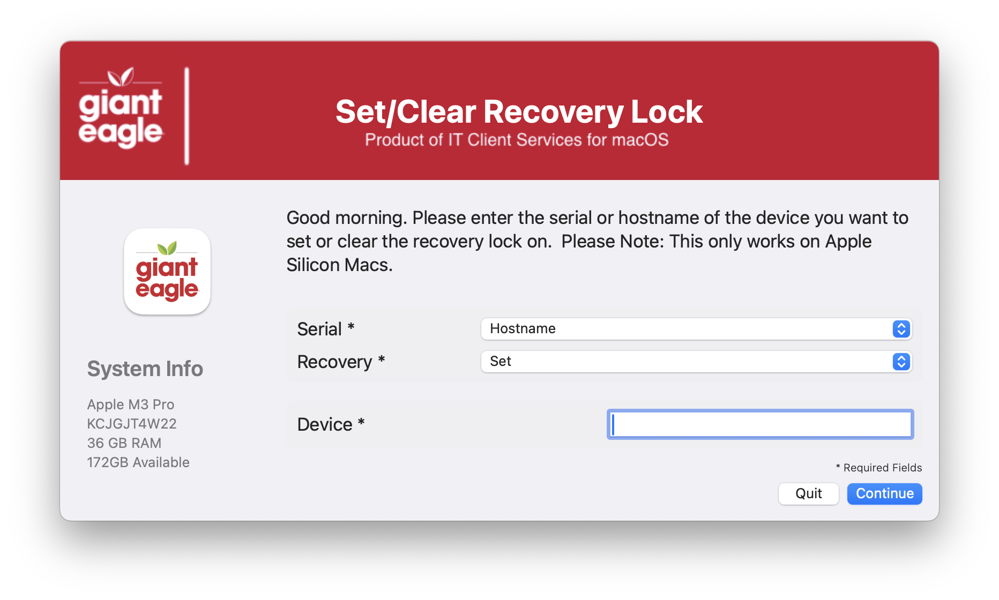
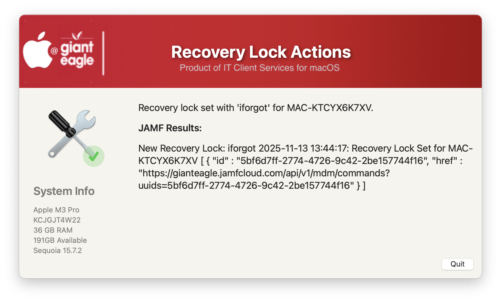
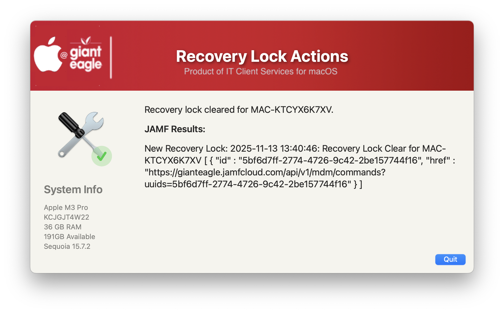
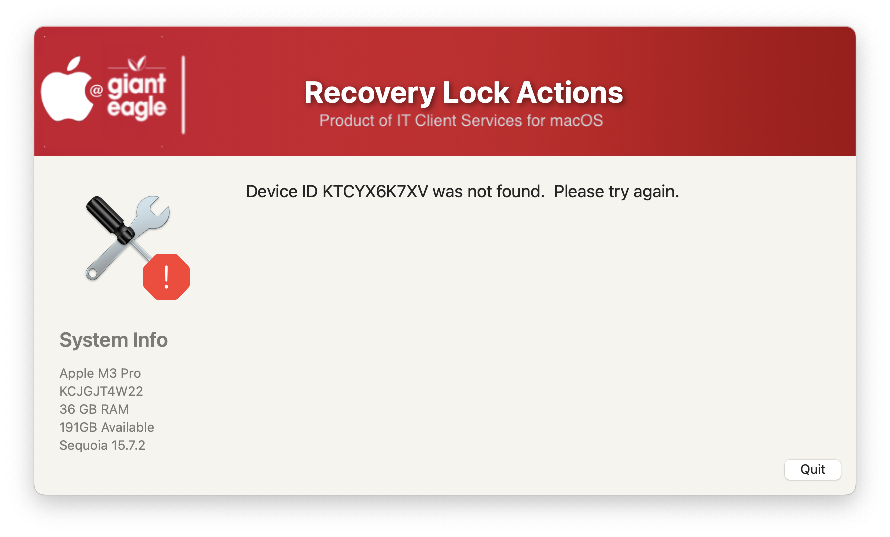
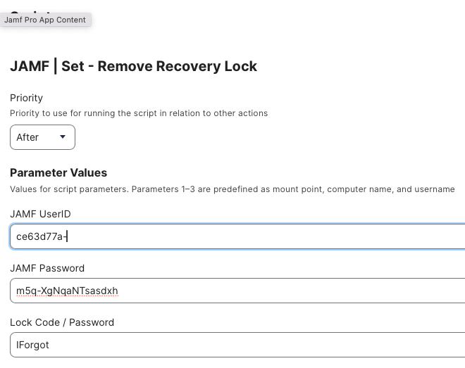

## Set / Clear Recovery Lock

Nice GUI method of setting or clearing the recovery lock.  *This only works for Apple Silicon Macs*.  It prevents the users from going into the recovery mode and changing options or reinstalling the OS

Initial Welcome screen



Successful lock for device.



Successful clear for device



Error screen for no device found



Details of JAMF Parameter(s)



If you are using the Modern JAMF API credentials, you need to set:

* ```View MDM command information in Jamf Pro API```
* ```View Recovery Lock```

Kudos to Karthikeyan Marappan for coming up with the concept.  I just put a nice GUI frontend to it.  
Original source: https://gist.github.com/karthikeyan-mac/185bf8319fa9560f300ed26553a7a54d

## History ##

| **Version**|**Notes**|
|:--------:|-----|
| 1.0 | Initial
| 1.1 | Remove the MAC_HADWARE_CLASS item as it was misspelled and not used anymore...
| 1.2 | Reworked top section for better idea of what can be modified
||       renamed all JAMF functions to begin with JAMF_
| 1.3 | Verified working against JAMF API 11.20
||       Added option to detect which SS/SS+ we are using and grab the appropriate icon
||       Now works with JAMF Client/Secret or Username/password authentication
||       Change variable declare section around for better readability
||       Bumped Swift Dialog to v2.5.0
| 1.4 | Fixed invalid function call to invalidate JAMF token
||       Fixed determination of which SS/SS+ the script should be using
||      Added function to check and make sure the JAMF credentials are passed
||      Renamed utility to JAMFRecoveryLock.sh
| 1.5 | Added option to view recovery password
||       new APIs for set/clear recovery Lock
||       Show http results after set/clear command
| 1.6 | Had to increase window height for Tahoe & SD v3.0
| 1.7 | Changed JAMF 'policy -trigger' to 'JAMF policy -event'
||       Optimized "Common" section for better performance
||       Fixed variable names in the defaults file section
