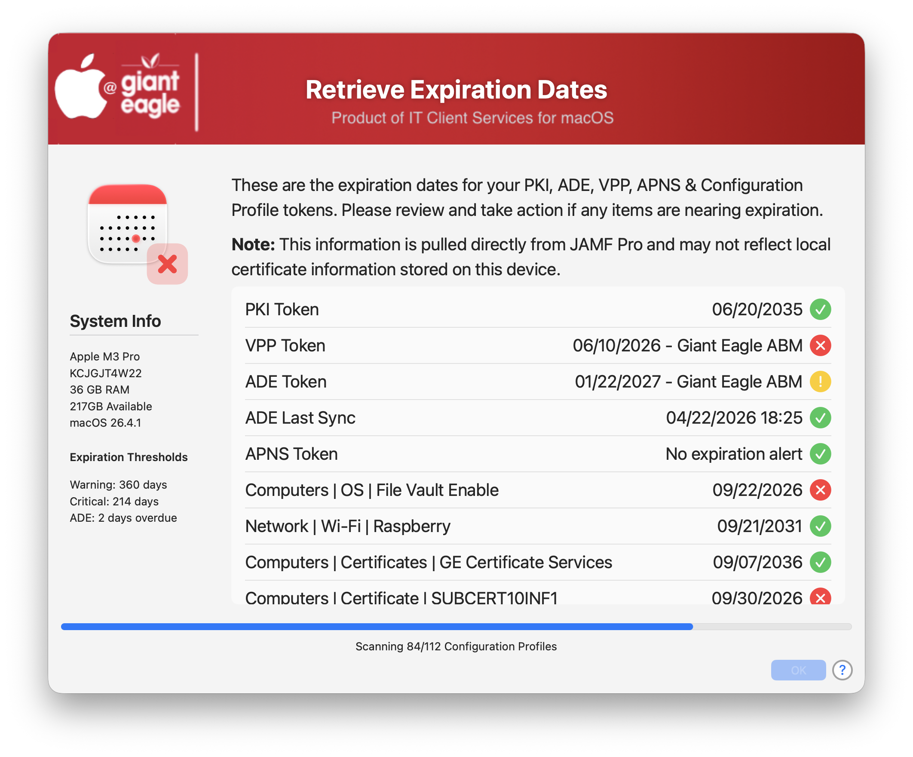
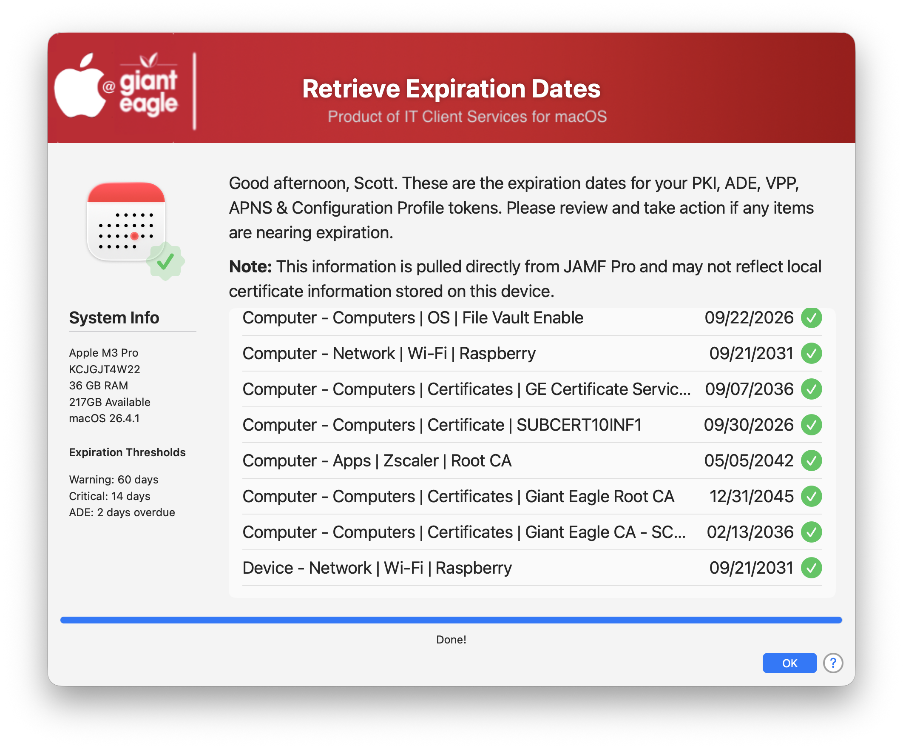

## JAMF Retrieve Expiration Dates

JAMF has alot of service tokens that need to be tracked & renewed.  To find all of these tokens you have to navigate around to various system settings or computer & device configuration profiles.  

I created this utility to show you all of your tokens with expiration dates in a single, concise interface with a visual indicator of what tokens are about to expire.  

You can view items such as

* Volume Purchase Plan (VPP)
* Automated Device Enrollment (ADE)
* JAMF Access Token (PKI)
* Apple Push Notification Service (APNS)
* Computer Config Profiles with cert dates
* Device Config Profiles with cert dates

You can set custom thresholds for your warnings (Warning & Critical) and also set a warning if your ADE Sync is not working.

```
THRESHOLD_DAYS_WARNING=60
THRESHOLD_DAYS_CRITICAL=14
ADE_SYNC_WARNING_THRESHOLD=2
USE_JAMF_CLI=false 
```

### JAMF API ###

You can either use the ```jamf-cli``` method or the standard API calls.  If you choose to use the API calls, you need to set the following API roles:

```
READ COMPUTER
READ DEVICES
READ PUSH CERTIFICATIONS
READ iOS CONFIGURATION PROFILES
READ MACOS CONFIGURATION PROFILES
READ VPP ASSIGNMENTS
```

If you are using the ```jamf-cli``` method, please make sure to setup your environment before calling the script.  I don't have the the authentication setup for it (yet).

>If you know of more tokens that can be retrieved from the server that I might have missed, please let me know and I will be more than happy to get them integrated.

(Just trying to make the admins life a little easier!)

### Screenshots ###

Screen showing failed items



Screen show all passed



## History ##

| **Version**|**Notes**|
|:--------:|-----|
| 1.0 | Initial
