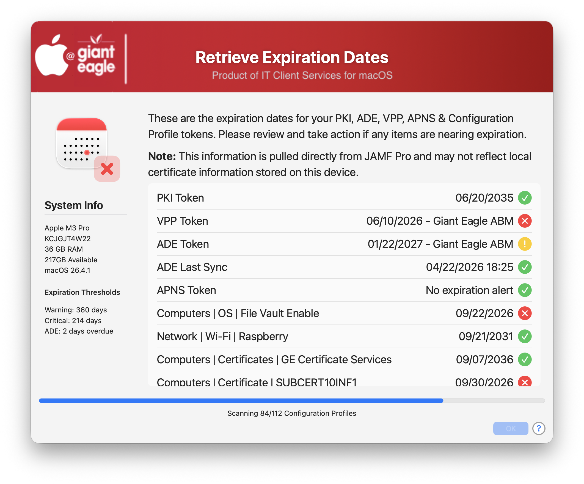
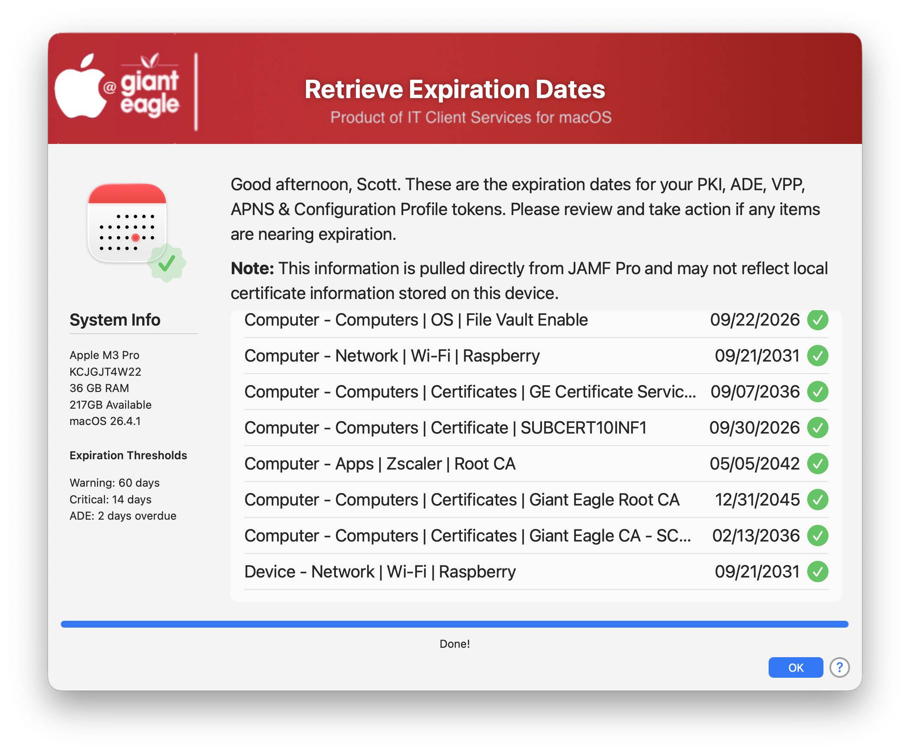
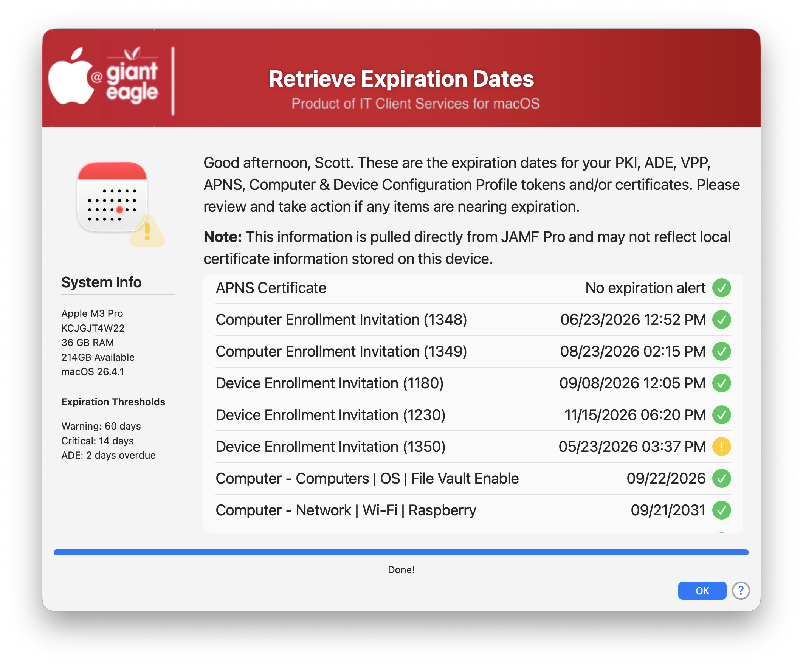

## JAMF Retrieve Expiration Dates

JAMF has alot of service tokens that need to be tracked & renewed.  To find all of these tokens you have to navigate around to various system settings or computer & device configuration profiles.  

I created this utility to show you all of your tokens with expiration dates in a single, concise interface with a visual indicator of what tokens are about to expire.  

You can view items such as

* Volume Purchase Plan (VPP)
* Automated Device Enrollment (ADE)
* JAMF Access Token (PKI)
* Apple Push Notification Service (APNS)
* Computer Config Profiles with cert dates
* Device Config Profiles with cert dates
* Computer & Device Enrollment Invitations (UDE)

New in Version 2.0:

✅ OAuth Client Credentials and Classic API authentication support

✅ Support for checking alternate Jamf Pro instances, not just the primary server

✅ Automatic API token management and renewal during long-running scans

✅ Enrollment Invitation expiration monitoring for both computers and mobile devices

✅ Enhanced Configuration Profile certificate scanning

✅ Centralized date parsing and expiration processing

✅ Operational health monitoring and configurable warning thresholds

✅ Improved SwiftDialog experience with better progress reporting and status indicators

✅ Comprehensive API validation, error handling, diagnostics, and recovery logic

✅ Improved security through protected temporary files, cleanup routines, and safer credential handling

✅ Significant reliability, performance, and production-readiness improvements

The goal remains simple: help Jamf administrators identify expiring services, certificates, tokens, configuration profiles, and enrollment assets before they become outages.  

**Sometimes the most important improvements are the ones users never see.**

Version 2.0 represents a major investment in stability, maintainability, and resilience behind the scenes.

----------

You can set custom thresholds for your warnings (Warning & Critical) and also set a warning if your ADE Sync is not working.

```
THRESHOLD_DAYS_WARNING=60
THRESHOLD_DAYS_CRITICAL=14
ADE_SYNC_WARNING_THRESHOLD=2
USE_JAMF_CLI=false 
```

### JAMF API ###

If you are using the JAMF API method for connection, you will need the following roles:

```
Read VPP Assignment
Read macOS Configuration Profiles
Read Push Certificates
Read iOS Configuration Profiles
Read Mobile Device Enrollment Invitations
Read VPP Invitations
Read PKI
Read Device Enrollment Program Instances
Read Computer Enrollment Invitations
Read Enrollment Profiles
Read Enrollment Customizations
Read Volume Purchasing Locations
```

(Just trying to make the admins life a little easier!)

>If you know of more tokens that can be retrieved from the server that I might have missed, please let me know and I will be more than happy to get them integrated.


### Examples ###

Screen showing failed items



Screen show all passed



NEW in v1.3 - Screens of Computer & Mobile Device Enrollments



## History ##

| **Version**|**Notes**|
|:--------:|-----|
| 1.0 | Initial
| 1.1 | Minor wording change from APNS Token to APNS Certificate, Also added some additional verbiage to the welcome message to clarify tokens and/or certificates
| 1.2 | Removed extraneous "echo" statements that were used for testing and debugging purposes
||       Change APNS Sync date to show date & time in 12 hour format with AM/PM
||       Made window resizable and moveable to accommodate for longer lists of expiring items
||       Optimized the API calls to reduce the number of calls being made to the server and speed up the retrieval process
||       Fixed issue of the jamf_cli for devices calling the incorrect API endpoints
| 1.3 | Added check for Computer & Device Invitations and retrieval of their expiration dates
| 2.0 | Major "under the hood" production improvements
|| Added OAuth and Classic API authentication support
|| Added support for different JAMF instances (not just primary)
|| Added automatic token management and renewal
|| Added enrollment invitation expiration monitoring
|| Added centralized date parsing and expiration processing
|| Added comprehensive API validation and error handling
|| Added secure temporary-file management and cleanup
|| Enhanced configuration profile certificate scanning
|| Added operational health monitoring and threshold alerts
|| Improved SwiftDialog user experience and progress reporting
|| Expanded logging, diagnostics, and recovery handling
|| Significant security, reliability, and performance improvements
