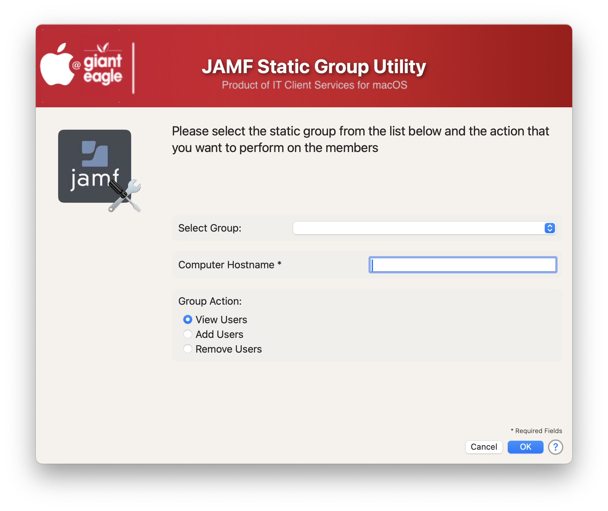
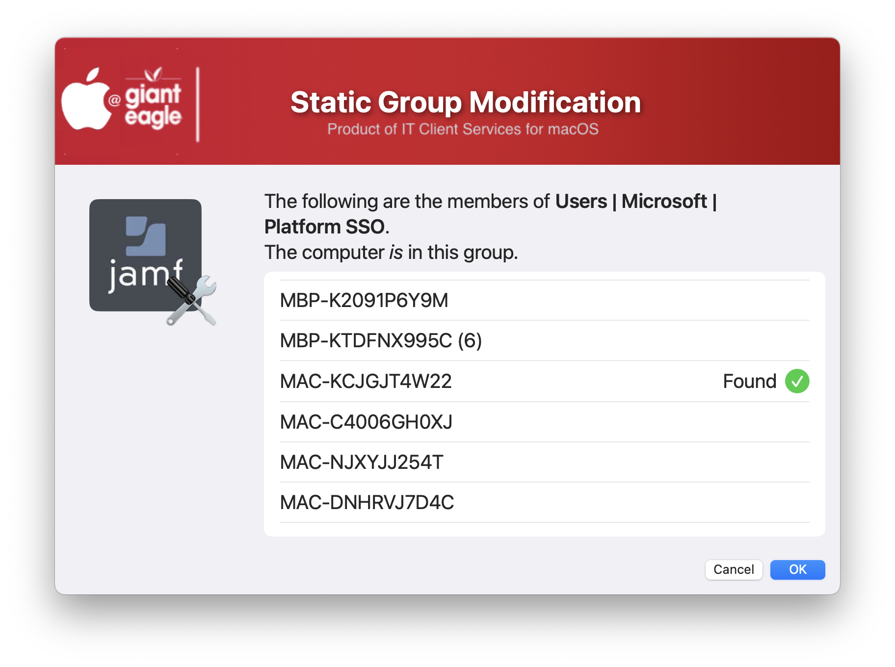
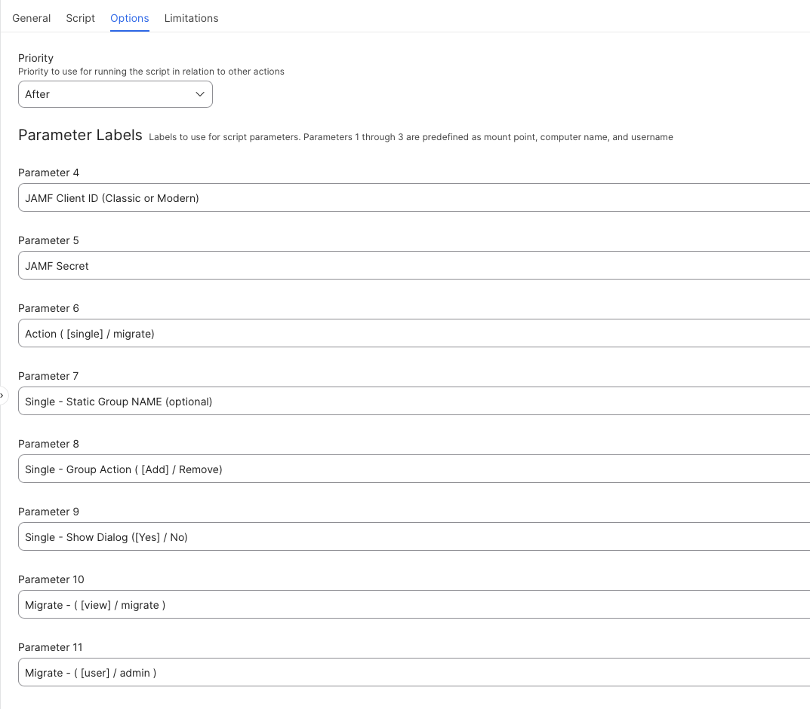

## JAMF Static Group Utility

This script is designed to view, add or remove users from Static Groups without the need for going into the JAMF server.  It can be run one of two ways: 

* You can run it without passing in the group names, in which case the user can select the static group and add/delete membership of any group
* You can pass in a specific Static group NAME and the user can only add/delete membership into that particular group.

If you do not pass in the group name, the utility will prompt you for which group to work on.

If you do pass in the group name (not the ID) it will not prompt the user to select a group.

The reults of viewing membership and if your selected Hostname is in the membership list.

JAMF Script Parameter Screen

If you are using the Modern JAMF API credentials, you need to set:

* Read Static Computer Groups

## History ##

##### 1.0 - Inital Commit #####
##### 1.1 - Add function to verify passed credentials #####
