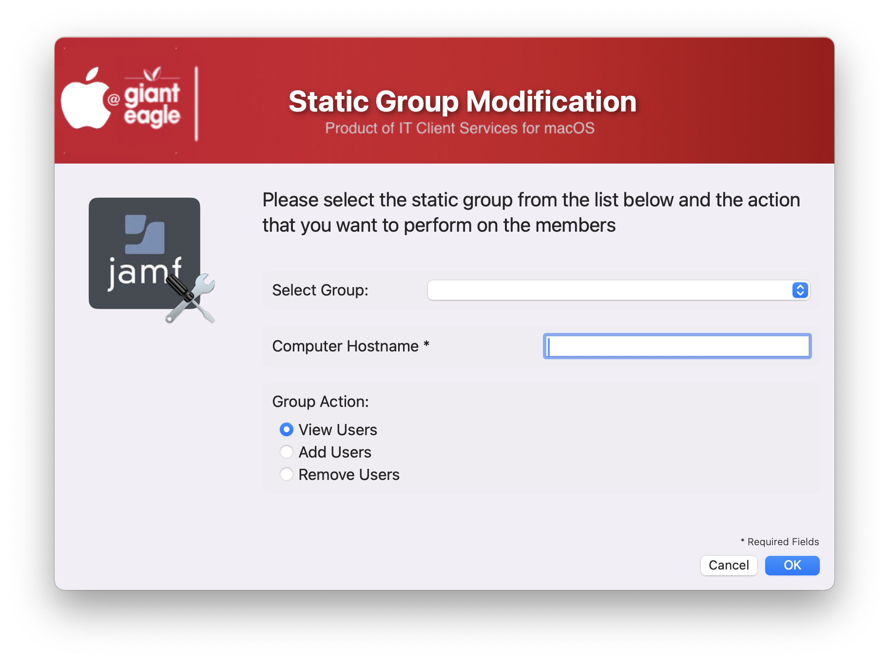
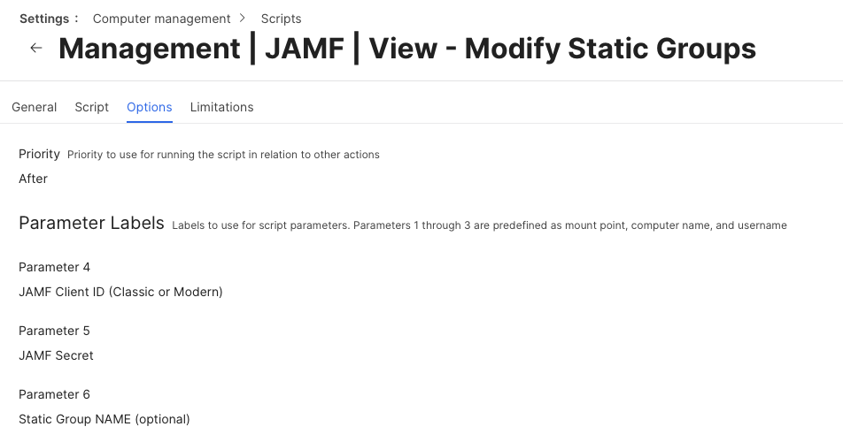

## JAMF Static Group Utility

This script is designed to view, add or remove users from Static Groups without the need for going into the JAMF server. It can also be used to do a "mass migration/import" of systems between static groups.

### Single Group / add-remove-view method ###

It can be run one of three ways: 

* You can run it without passing in the group names, in which case the user can select the static group and add/delete membership of any group
* You can pass in a specific Static group NAME and the user can only add/delete membership into that particular group.
* If you pass in both the group name and the group action, you can do a commandline action on the group without having to show the dialog window.


If you do not pass in the group name, the utility will prompt you for which group to work on.



If you do pass in the group name (not the ID) it will not prompt the user to select a group.


The results of viewing membership and if your selected Hostname is in the membership list.


## Command line Method ##

If you do parameter passing into the script with the following info it will bypass the GUI dialog box and perform the requested action on the group (Works great in Self service to allow a user to remove themselves from a particular group for example).

1.  Pass in the group NAME
2.  Pass in the action to take (Add or Remove)
3.  Set the parameter to Turn off the dialog display window 

Example:

```xml
sudo ./JAMFStaticGroupUtility.sh "" "" "" "<JAMF Client>>" "<JAMF Secret>>" "Users | Authorized | Xcode" "Add" "No"
```

### Mass migration / import method ###

If you choose to do a migration of systems between computer groups, this can be done in one of two ways

1.  Let the end user do their own migration:  They will only see the systems assigned to them and can only migrate between those systems:


2.  The "admin" mode allows you to see all static groups on the server and migrate systems between any groups

Both methods will show the group membership of the old system before migration and verify that everything is correct before proceeding:


The results screen after the process has run


JAMF Script Parameter Screen



If you are using the Modern JAMF API credentials, you need to set:

* Read Static Computer Groups
* Update Static Computer Groups

## History ##

##### 1.0 - Inital Commit #####
##### 1.1 - Add function to verify passed credentials #####
##### 1.2 - Add options to pass in group Action and to not show GUI window ####
##### 1.3 - Code cleanup
#####       Added feature to read in defaults file
#####       removed unnecessary variables.
#####       Fixed typos
##### 2.0 - Add option to do a migration/import of group membership from one computer to another
