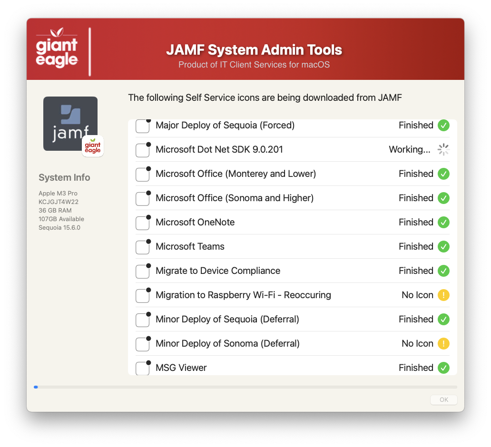
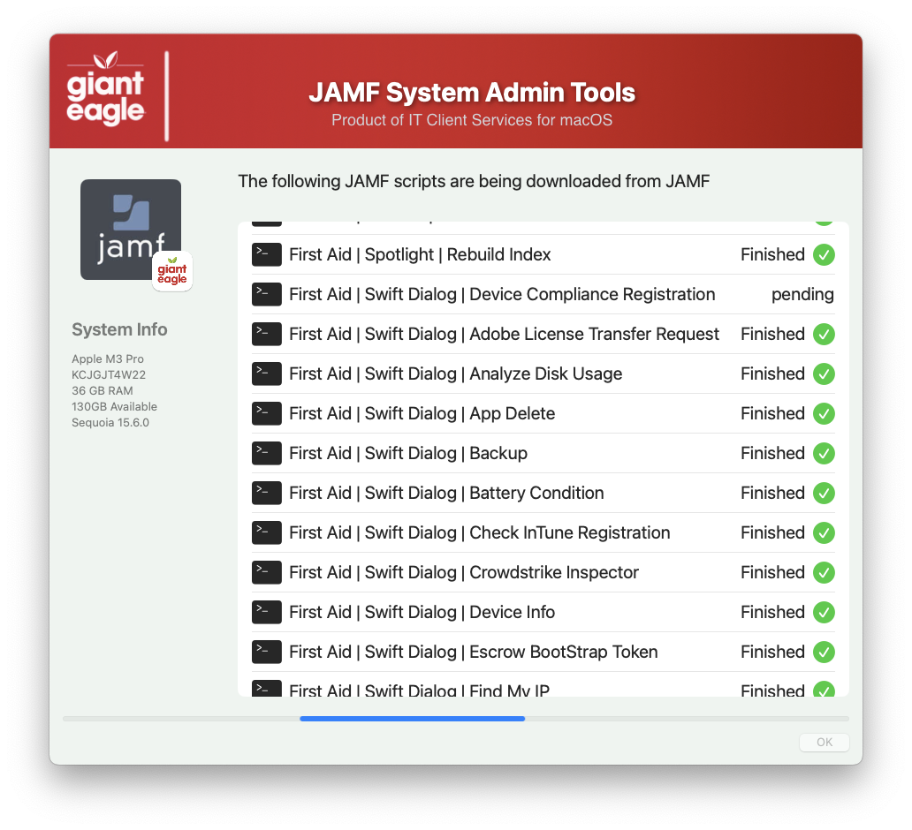

## JAMF System Utilities    

This script is designed to backup/extract several items from your JAMF server.  Why do you want to do this?

1.  Make a backup of your scripts, configurations & icons in case your existing backup files is missing/corrupted (or you don't have one!)
2.  You inhereited a JAMF server from another person, and this can do a "brain dump" so you can review the settings.
3.  Why not?  It is another example of what you can do with API scripts..

The following items are available to be backed up:

--- Computer Based Actions ---

1.  Backup Computer Policies - Export all of the computer policies
2.  Computer Extension Attributes - Export all of the computer extension attributes
3.  Configuration Profiles - Export all of the configuration profiles to .mobileconfig files

4.  Smart / Static Computer Groups - Export all of the members of a smart / static computer groups:
   - Smart Computer Groups will export the paramaters and criteria to a .txt file
   - Static Computer Groups will export the members to a .txt file
5.  Failed MDM Commands - Export systems that have failed MDM commands so you can review them and optionally clear the failures
6.  Compare Two Configuation Profiles - Useful to see exact the differences between the two


--- User Based Actions ---

7.  Export Emails to VCF - Export all of the email addresses to a VCF file, which can be imported into Contacts.app or other applications. 
   - Export VCF cards of the members of a Smart / Static Computer Group.
   - Compose an email to the members of a Smart / Static Computer Group.
8.  Application Usage - Export log history from a given time period from any group
9.  Export list of users with multiple systems assigned to them

--- System Based Actions ---

10. Self Service Icons - Great to have a backup when JAMF starts showing generic icons in Self Service.
11. System Scripts - Everything that is stored in Settings > Scripts

This script is fully multitasking, so it will execute each task pretty quickly.  It will create the folder structure for you and then download the items to the appropriate folders. 

**File Formats**

1. Icons have a .png extension.
2. Scripts have a .sh extension.
3. Computer Extension Attributes have a .sh extension.
4. Computer Poiicies will have a .xml extension
5. Comparison fils will have a .txt extension
6. Configuration Profiles have a .mobileconfig extension.
7. Emails have a .vcf extension.
8. Smart / Static Computer Groups have a .txt extension.
9. Applicaiton Usage will have a .csv extension

**Folder Structure**

The subfolder locations can be customized by editing the ```function check_directories```

** JAMF Pro OAuth API Support**

When creating the roles, you can now use the OAuth API to create the roles.  This is useful if you are using JAMF Pro 10.32 or later, and have enabled OAuth API access.  You need to have at least these permissions:

- Read access to Computer Inventory Collection
- View MDM Profile command information in Jamf Pro API
- Read access to Computers
- Read access to Smart Computer Groups
- Read access to Static Computer Groups
- Read access to Scripts
- Read access to User
- Read access to Computer Extension Attributes
- Read access to Policies
- Read access to macOS Configuration Profiles
- Send MDM command information in Jamf Pro API

------------------------------------

Welcome Screen


Backup SS Icons Process


Export (and clear) Failed MDM Commands Process


Backup System Scripts Process


Compare Two System Policies


Backup Computer Extension Attributes Process


Backup Configuration Profiles Process


VCF (Emails) options


Computer Usage Report


 


If you are going to use the Token based API roles, you need to set these roles

JAMF Roles


#### 1.0 - Initial
#### 2.0 - Added options to export Smart /Static groups, / export VCF cards for specific groups / send email to specific groups / added support for JAMF Pro OAuth API
#### 2.1 - Added variable EMAIL_APP to allow users to choose which email app to use (have to use the bundle identifier)
#### 2.2 - Added option to export Application Usage
#### 2.3 - Fixed error logging and stored the error log in working directory
#### 2.4 - Fixed a typo in line #1233..changed "frst" to "first" / Delete the error log from previous runs before script starts / Changed checkbox style to switch so the list is now scrollable / Better error log report during failures
#### 2.5 - used modern API for computer EAs
#### 2.6 - Added option for export of multiple users per system / Added option for export of Computer Policie
#### 2.7 - Added option to compare two configuration profiles / Reordered items in Home screen