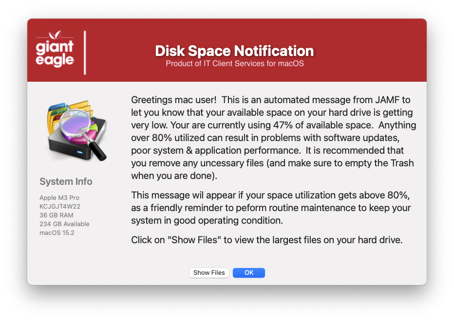
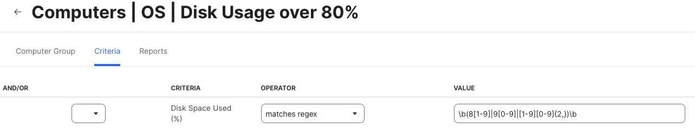

## Low Disk Space

Nice GUI alerting the user that their available disk space is below a certain threshold



An example of the smartgroup that can be setup for available disk space over 80%



and the Extended Attribute that creates the 'Disk Space Used %' field of each computer

```
#!/bin/sh
#https://www.jamf.com/jamf-nation/discussions/12546/boot-volume-free-space-ea

DU=$(df -h /Users | awk 'END{ print $(NF-4) }' | tr -d '%' )

# print the reuslts padding with leading 0

echo "<result>$(printf "%02d\n" $DU)</result>" 
```

#### 1.0 - Initial 
#### 1.1 - Code cleanup to be more consistant with all apps
#### 1.2 - Remove the MAC_HADWARE_CLASS item as it was misspelled and not used anymore...
#### 1.3 - Code cleanup
####       Added feature to read in defaults file
####       Fixed Show Files option to call correct trigger
####       removed unnecessary variables.
####       Fixed typos

