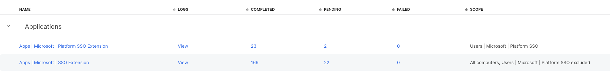
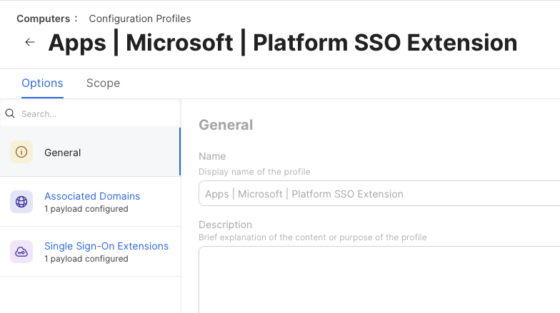
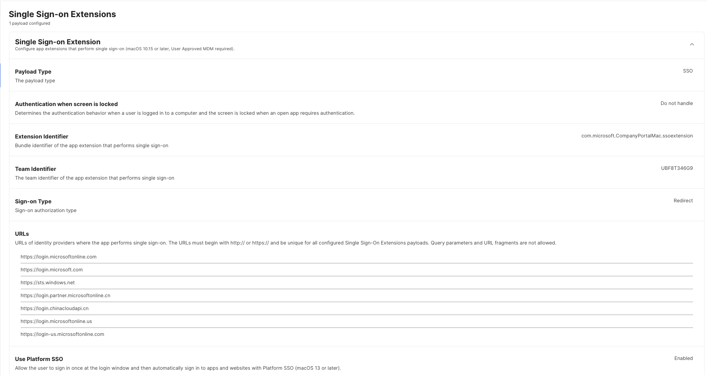
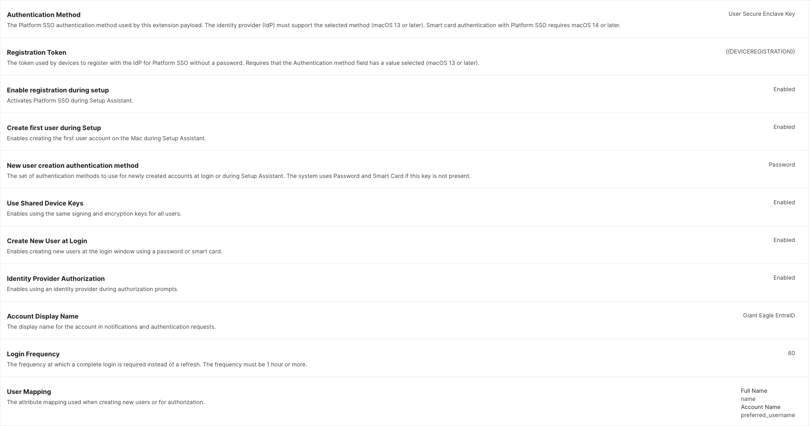
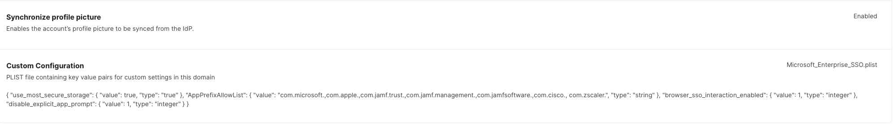

## Plaform SSO Repository ##

This section is designed to accomodate everything Micdrosoft Platform SSO related.  My goal is to try and consolidate everything that an admin needs to be aware of when migrating users to Platform SSO for macOS Sequoia and higher.  I am hoping for other contributors in this repo to make this a central repository for everything related to this extension.  I will be posting the information that I have concerning JAMF MDM, but others are welcome to post about coniguration files for other MDMs.

### JAMF Configuration ###

In order to prepare for Platform SSO deployment, you must perform the following:

* Deploy Microsoft Company Portal
* Configure ADE for Simplified Setup
* Deliver the PlatformSSO Configuration Profile
* Remove any existing SSO Extension Profile
* Enable access to the System Settings -> Users & Groups.  Inside of there are options to repair the SSO extension for users
* Make sure touchID is enabled for users if you are using the Secure Enclave for pSSO

#### Company Portal ####

* You need to install v5.2404.0 or newer in your prestage enrollment (for new enrollments) or install via policy (to existing users).  Company Portal can be downloaded [here](https://go.microsoft.com/fwlink/?linkid=853070)

JAMF Docs
* Platform SSO can be found [here](https://learn.jamf.com/en-US/bundle/technical-articles/page/Platform_SSO_for_Microsoft_Entra_ID.html)
* Configuration Profiles can be found [here](https://learn.jamf.com/en-US/bundle/technical-articles/page/Platform_SSO_for_Microsoft_Entra_ID.html#ariaid-title9)

#### Configuration Profile ####

You need to have a configuration profile for the Platform SSO that can be deployed.  *IMPORTANT!*  You CANNOT have both SSO Extension and Platform SSO Extension deployed to all users.  The best way to do this is to create groupings and deploy the pSSO to the users in the group, while simultenously excluding them from the SSO Extension group.  Screenshot for exxample:

When setting up the Configuration Profile, you can use either the Microsoft [docs](https://learn.microsoft.com/en-us/intune/intune-service/configuration/use-enterprise-sso-plug-in-macos-with-intune?tabs=prereq-jamf-pro%2Ccreate-profile-jamf-pro) or JAMF [docs](https://learn.jamf.com/en-US/bundle/technical-articles/page/Platform_SSO_for_Microsoft_Entra_ID.html#ariaid-title9).  I have included screenshots of my setup for easier reference:

Please note: you must configure an Associate Domain payload, but it does NOT need to have anything in it, just conigure it... 

Microsoft Links:
[Company Portal](https://learn.microsoft.com/en-us/intune/intune-service/apps/apps-company-portal-macos)