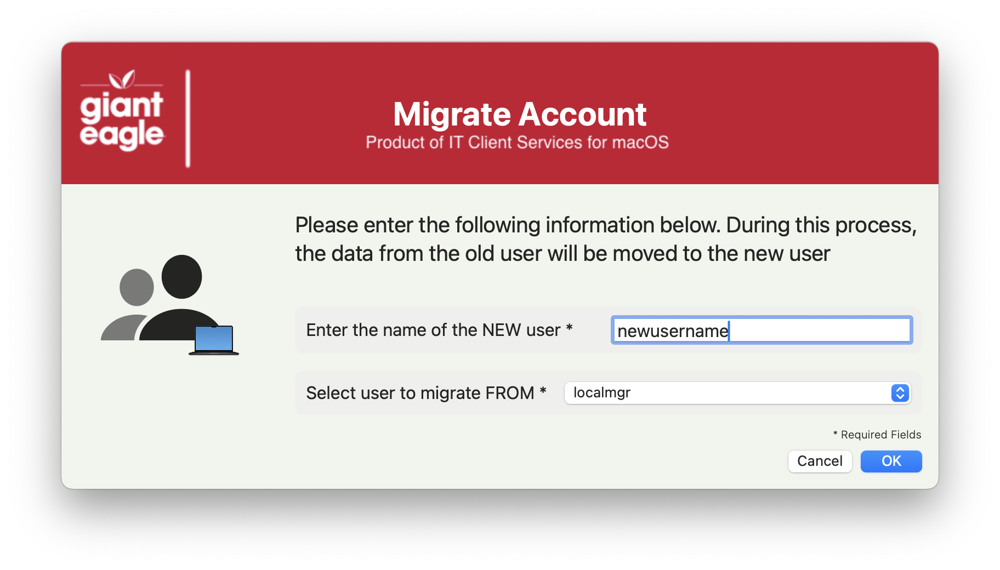
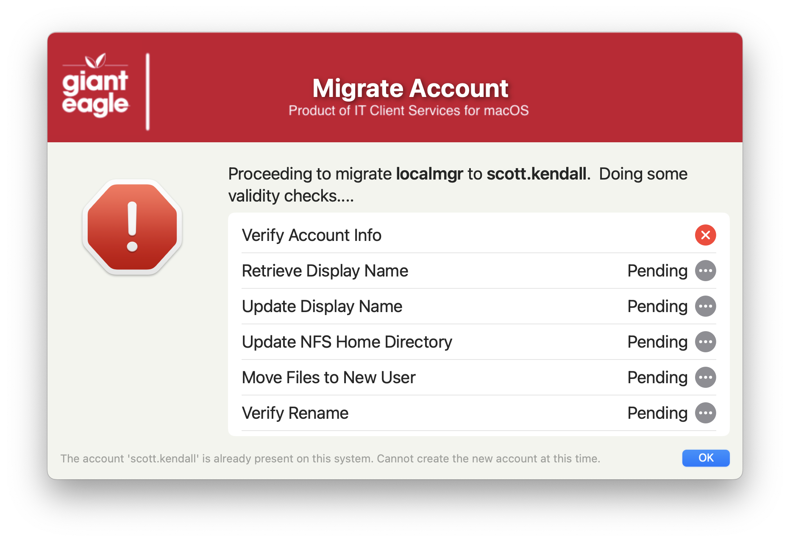
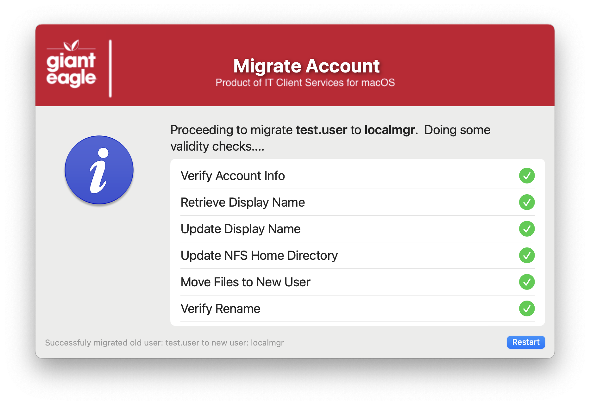

## MigrateUserAccount

This script is designed to do (basically) a "rename" of the users home folder, but it isn't as simple as just a simple rename.  It actually creates a new account and migrates the data to the new account to make sure that it follows the Apple process for creating accounts, which will allow the use FileVault if necessary.

**This migration process cannot be done on the current logged in user!**

Initial Welcome Screen

Various sanity checks & errors

Successful transfer of user accounts (restart is necessary if successful)

#### 1.0 - Initial
#### 1.1 - Code cleanup to be more consistent with all apps
#### 1.2 - changed the 'create_welcome_dialog' function to use JSON output and parse info differently
#### 1.3 - Code cleanup
####       Added feature to read in defaults file
####       removed unnecessary variables.
####       Fixed typos

