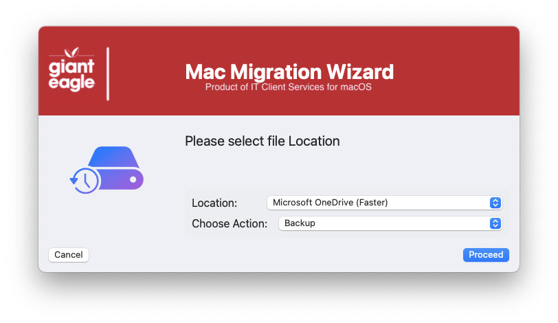
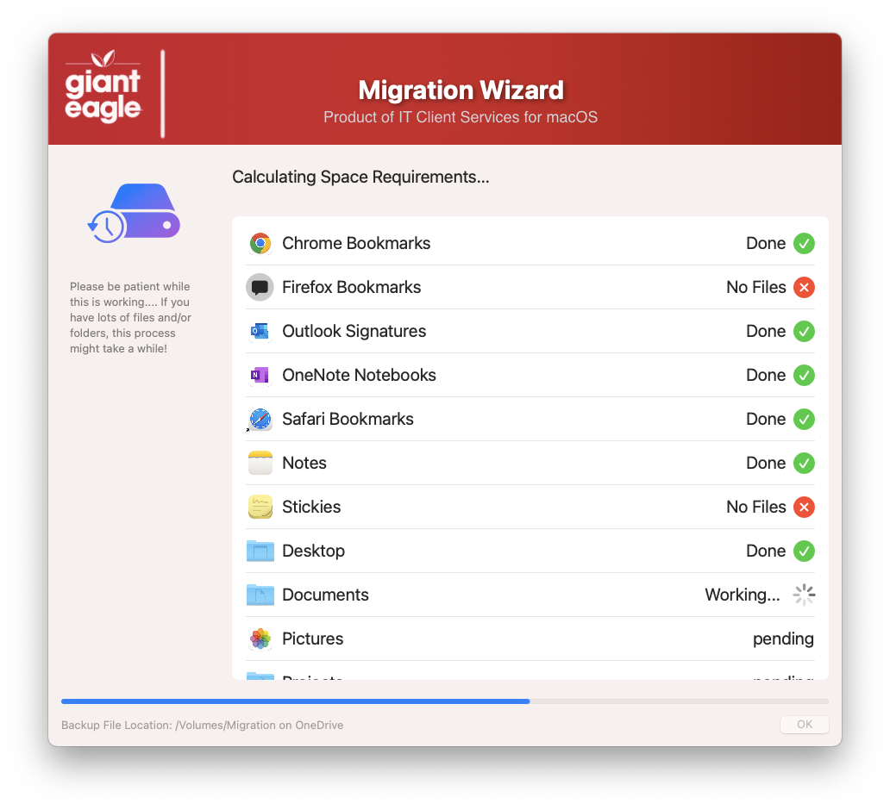
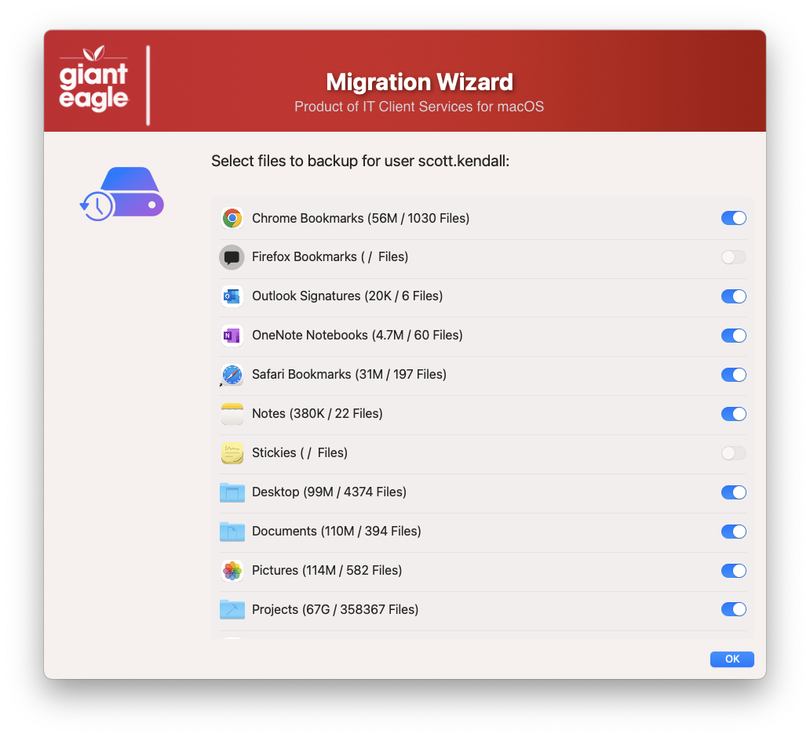
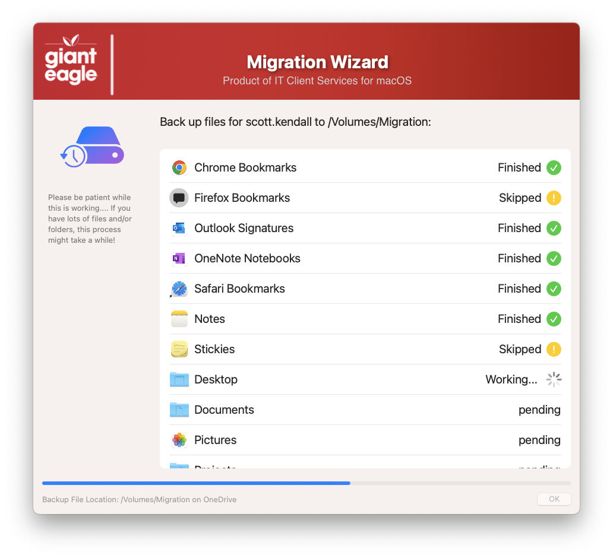

## Migration Wizard

In our environment we disable users from being admins, so that also means that you cannot run Apple's Migration Assistant either, so I had to come up with a solution that would work for non-admin users.









Adding or removing items from the migration list is relatively simple.  Edit the JSON blob (starting at line 996), and add your info in there.  Sample code block:

```{
"app" : "Chrome Bookmarks",   
"path" : "'${USER_DIR}'/Library/Application Support/Google/Chrome/",
"MigrationDir" : "/Google",
"icon" : "/Applications/Google Chrome.app",
"size" : "0",
"files" : "0",
"ignore" : "Services",
"choice" : ""},
```

Breakdown of the JSON code block:

app: -  *verbal description of what is displayed in the GUI window.*  
path: - *exact subfolder path of the files to be backed up or restored.*  
MigrationDir: - *The tar filename to store the compressed files to.*  
icon: - *icon that you want to show in the GUI window.*  
size: - *set it to 0 - The script will fill this info in.*    
files: - *set it to 0 - The script will fill this info in.*  
ignore: - *the name of the directory to ignore during the backup (ie. cache)*  
choice: - *leave blank - This stores what the user wants to backup or restore*  

This script can support "legacy" networks (SMB) or OneDrive mount points.  If you select OneDrive, it will make sure that OneDrive is installed and running on your local mac.

I put in the logic to use the tar command, but can very easily be adapted to use rsync if necessary.

NOTE: This app makes heavy use of jq binary and it will detect if it is installed or not.  You should create a JAMF policy that can be triggered from this script to install jq if it is not aleady installed (macOS Sonoma or below).


#### 1.0 - Initial code
#### 2.0 - rewrite using JSON blobs for all data content
#### 2.1 - Add support to install JQ if it is missing
#### 2.2 - Code cleanup
####       Added feature to read in defaults file
####       removed unnecessary variables.
####       Fixed typos

