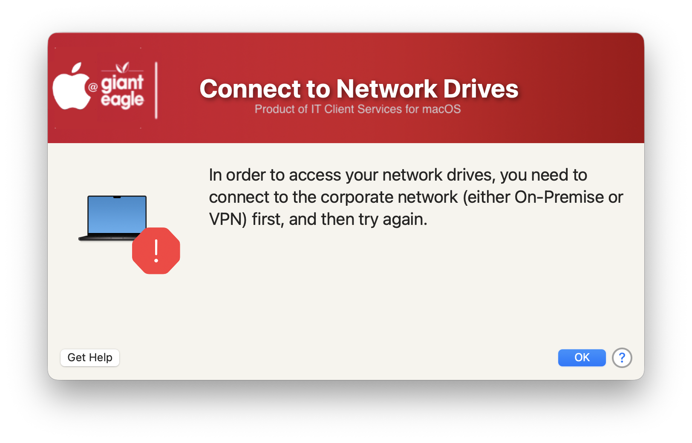
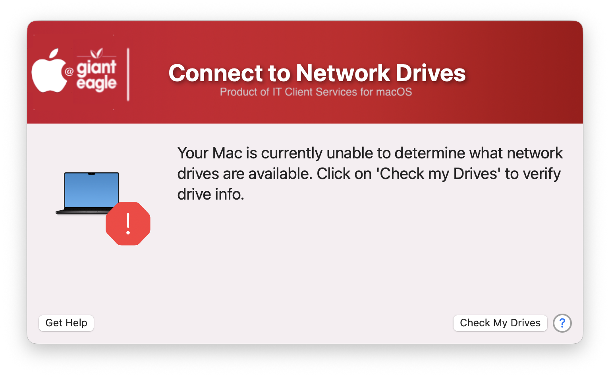

## Mount Network Drives

I wrote a little utility to help with the users in connecting to their network drives.  This script will test to make sure that the user is On-Prem or connected via VPN and use the Finder to mount their network drives.  This script is designed to work in tandem with my inTunes-Groups script that will determine which drives the user has access to as defined by their Entra groups and then will create a custom Plist file that contains all of their drive mappings.

If the user is not OnPrem or on VPN, they will get this:


If the plist file is missing or the keys are not intact, then they will receive this error:



There is an option in the script (Check My Drives) to have the user run a JAMF policy that will reconstruct and/or repair the missing configuration file.  That policy can be found here: https://github.com/ScottEKendall/JAMF-Pro-System-Scripts/blob/main/Maintenance%20-%20InTune%20-%20Groups.sh. 

The custom Plist file is stored in the user's ~/Library/Application Support/<filename.plist> and needs to have the following structure (keys)

```
<?xml version="1.0" encoding="UTF-8"?>
<!DOCTYPE plist PUBLIC "-//Apple//DTD PLIST 1.0//EN" "http://www.apple.com/DTDs/PropertyList-1.0.dtd">
<plist version="1.0">
<dict>
        <key>DriveMappings</key>
        <array>
                <string>smb://<unc path to server></string>
                <string>smb://<unc path to server></string>
        </array>
        <key>EntraAdminRights</key>
        <string>Yes</string>
        <key>EntraGroups</key>
        <array>
                <string><GroupName></string>
        </array>
        <key>PasswordAge</key>
        <string>131</string>
        <key>PasswordLastChanged</key>
        <string>2025-08-13T18:16:13Z</string>
</dict>
</plist>
```

The script that creates this Plist file can be found here: https://github.com/ScottEKendall/JAMF-Pro-System-Scripts/blob/main/Maintenance%20-%20InTune%20-%20Groups.sh.  These two scripts are designed to work in tandem.  The InTune Groups script will create (or repair) the plist file and this script will read the contents of the plist file to know what drives to mount. 

> NOTE: I run the inTune Group script once a week to see if there are any group / drive changes for the user.

I know that you can use the built-in JAMF DS attribute mapping for Entra Groups, I wrote the inTune Group script before that feature existed, so you can use either method.

#### 1.0 - Initial
#### 1.1 - Add more checking against the plist file...make sure it is intact and correct keys are present
