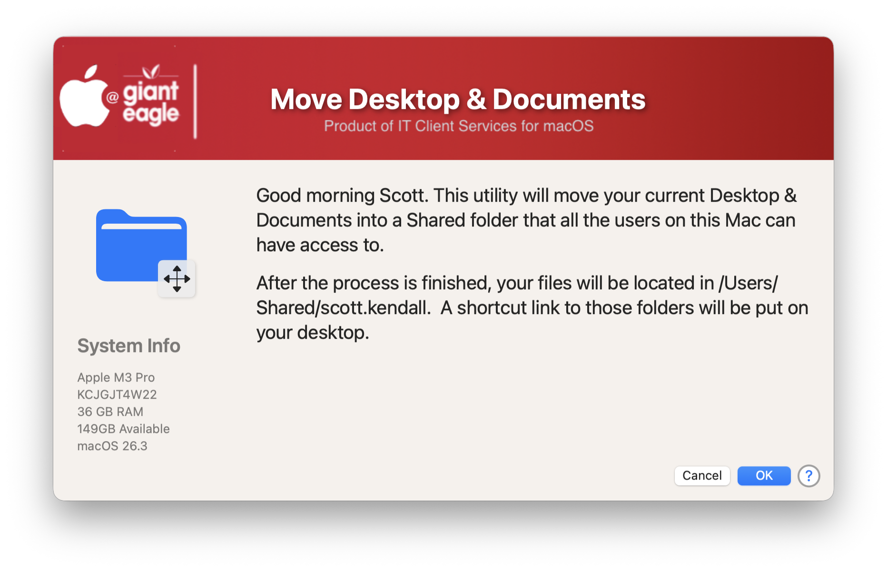

## Move Desktop & Documents ##

We have several multi-user macs in our environment, and we need to make sure that documents from all users are in a common location so that everyone can have access to them.  This script will copy the currently logged in user's Desktop & Documents into /Users/Shared, verify that they are copied successfully, and then make an alias to their migrated documents.

## History ##

| **Version**|**Notes**|
|:--------:|-----|
| 1.0 | Initial Release |

